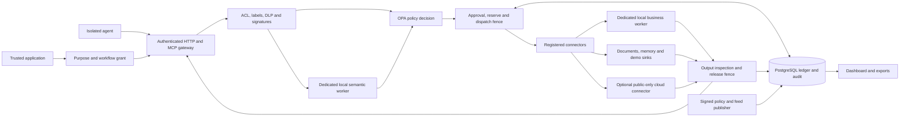

# Architecture and enforcement boundaries

Team: DEFOZO SOFTWARE HOUSE. Author: Michał Kiełtyka.

The broker is the decision boundary. `tools/list` is discovery, not authorization;
every `tools/call` and `resources/read` re-enters the broker. The official MCP SDK
parses the protocol while ActionGate enforces the actor and workflow scope.
Unsupported sampling, elicitation and dynamic prompts are explicitly denied.

The trusted application creates a workflow from authenticated identity. Agent
tokens carry an authenticated principal bound to one exact run and a shared root
binding. Delegation intersects the parent's document and tool grants and shares
its restrictions and resource accounts. A child cannot borrow its parent's or
sibling's grant. Revoked trees cannot create fresh authority. The root's configured
step limit also bounds the number of delegated runs. A prompt cannot
select a tenant, invent a role or downgrade a label. Confidentiality and untrusted
provenance are independent: public text can be hostile, and redaction does not
declassify a confidential document.

The complete input, including history, system messages and tool descriptions,
passes recipient and content controls. Deterministic denial happens before guard
inference. Other operations reserve guard resources before analysis. A model
verdict may tighten the content decision but cannot relax grants or budgets.
The model produces a single category in a strict four-key JSON response. The
public benign/suspicious/unknown value is the signed, fixed projection of that
category, with mandatory category/risk/evidence consistency. This avoids two
contradictory model classifications; it does not repair an incorrect model result
with a later keyword override. See the semantic contract in `configuration.md`.

Output DLP treats only proven server-assigned storage identifiers and the exact
controlled connector operation reference as metadata. An internal receipt type
binds local identifiers to the actual write. Ordinary model or upstream JSON
cannot mark itself trusted. DLP scans every caller-controlled key, content field
and other result field, then the complete restored receipt passes semantic
inspection and the release checks. This is not a UUID-pattern allowlist. A
regression uses a real generated UUID whose `02529806` prefix matches the phone
recognizer, while the same value in user content still requires redaction.

Long inputs are covered by overlapping token windows without silently dropping
the end of the text. After all source windows have complete judgments, a separate
AI call assesses their validated findings against the trusted workflow purpose
and proposed effect. Its evidence is marked as derived goal/action context,
separately from literal source evidence. The additional call is included in token
and slot reservations. Oversized derived context, a failed window or an incomplete
final assessment makes the complete inspection unknown.

JSON and YAML admission reject duplicate keys, invalid Unicode, non-finite numbers
and excessive depth before canonical signing or typed validation. A signed feed
still passes the bounded data-only rule grammar. A signature never authorizes
executable content or an unrestricted regular expression.

Approval stores the exact canonical payload hash and policy generation. After
approval the broker re-evaluates current configuration and permissions. It checks
the approval decision, payload, generation and expiry using the database clock,
then repeats these checks under the state lock immediately before dispatch.
This also applies when a semantic review is satisfied and OPA returns allow on
the approved retry. An execution grant is a
one-use database record, bound to the authenticated connector, operation, tenant,
arguments, recipient and generation. An idempotency conflict cannot silently
change arguments. Dispatch, policy updates, labels and revocation use database
fences. External network work runs outside short database transactions.

Each synchronous broker transaction runs as one worker-thread phase, with its
Session created, used and closed in that phase. Waiting for a database lock does
not block the HTTP event loop. The workflow's advisory lease remains held across
phases and its connection is used sequentially. Disconnecting the caller does
not cancel admitted work or abandon accounting; the retained execution task
finishes inspection and settlement. Internal cancellation drains the active DB
worker before the lease is released.

The output is inspected before publication. Chat streaming replays an inspected
buffer; it never exposes an unchecked prefix. A failed output scan does not undo
an upstream effect or incurred cost. An uncertain dispatch retains its resource
commitment until a connector receipt or other authoritative evidence resolves it.

Two gateway replicas share PostgreSQL, policy generations, operation records and
budget accounts. Each has its own OPA endpoint. Separate guarded and business
workers avoid treating a timeout as proof of stopped inference. Their supervisors
own fixed process groups rather than an arbitrary container-launch API.

The public projection copies only registry fields selected by trusted intent
before confidential analysis. It is not a general-purpose declassifier and cannot
accept arbitrary model output. The public and internal sinks are synthetic
receivers; they do not send external messages or perform payments.
