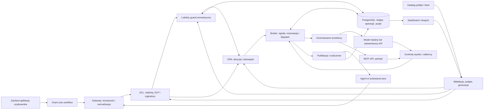

# ActionGate: końcowy plan rozwiązania AI Control Layer

Wybrany wariant: **B**, uzupełniony mechanizmami z A, C i D wskazanymi poniżej. Data: 3 października 2026. Dokument jest samodzielną specyfikacją do implementacji. Nie opisuje istniejącego produktu, wykonanych testów ani zmierzonej skuteczności.

## 1. Decyzja i wartość produktu

ActionGate kontroluje konkretne działania agentów: kto, w czyim imieniu, w jakim celu, na jakich danych, z jakimi argumentami i w jakim budżecie może wykonać operację. Łączy gateway modeli, broker narzędzi MCP/API, kontrolę pamięci, centralne polityki, lokalną analizę semantyczną i audyt. Agent otrzymuje wynik dopiero po kontroli właściwej dla odbiorcy.

Główna obietnica podlegająca testom: **błąd detektora prompt injection nie przyznaje agentowi dodatkowych uprawnień, prawa do ujawnienia danych ani dodatkowego budżetu**. Użytkownik nadal może ukończyć legalny proces. Administrator widzi przyczynę odmowy i może sprawdzić skutki proponowanej zmiany polityki bez wykonywania ponownie działań biznesowych.

Podstawą pozostaje B: zaufany grant celu workflow, broker dokładnie określonych działań, dziedziczenie ograniczeń danych, rezerwacje zasobów oraz powiązanie decyzji z dowodem. Uzupełnienia:

- Z D: jednorazowe uprawnienie jako rekord w bazie, spójne generacje całego zestawu kontroli, rezerwa na kontrolę wyjścia i nadzorowanie lokalnych workerów.
- Z C: osobne wymiary poufności i pochodzenia, monotoniczna etykieta kontekstu wykonania, synchronizacja odczytów z publikacją i kontrolowane udostępnianie publicznych pól.
- Z A: preflight pełnego kontekstu modelu, czytelne poziomy testów i macierz wymaganie-kontrola-dowód.

Zakres obejmuje wszystkie wymagane rezultaty. Kolejność prac wynika z zależności technicznych. Nie ogranicza funkcji na podstawie czasu wydarzenia ani liczby osób. Nie wprowadzamy kompilatora dowolnych grafów i obowiązkowej migracji agentów do runtime FlowLock z C: podstawowym produktem jest warstwa łatwa do dołączenia do istniejących klientów, a potrzebne ograniczenia przepływu egzekwujemy w brokerze i kontrolowanym środowisku uruchomieniowym.

## 2. Podstawa i kryteria odbioru

Źródła zakresu: [TASK.json](TASK.json), [MATERIALS.md](MATERIALS.md), [szczegółowy brief](materials/786a9bb4a858f98d.pdf.txt), [regulamin](materials/31a3fb1537ac1d02.pdf.txt) oraz [manifest materiałów](materials/manifest.json). Przeczytano pełne [A](proposals/A/PLAN.md), [B](proposals/B/PLAN.md), [C](proposals/C/PLAN.md), [D](proposals/D/PLAN.md) wskazane w [proposals/README.md](proposals/README.md) i przekazane [SUMMARIES.md](proposals/C/SUMMARIES.md). Litery wariantów w tym planie odnoszą się do katalogów A-D; historyczne etykiety wewnątrz SUMMARIES nie zmieniają tej identyfikacji.

Deklaracje autorów o wcześniejszych odczytach usług, benchmarkach lub dokumentacji są materiałem do oceny. Nie stanowią potwierdzenia działania naszego środowiska. Nie korzystano z innych katalogów autorów ani ich rozmów. Lokalny SERVICES.md zawiera odnośniki poza tym workspace; plan nie uzależnia realizacji od ich zawartości ani istniejących kont. Sekrety wdrożenia będą pochodziły z psst.

| Kryterium | Waga: brief / regulamin | Dowód w końcowym rozwiązaniu |
| --- | --- | --- |
| Odporność i jakość guardrails | 30% / 30% | Kontrole deterministyczne i prawdziwe AI; niedozwolony skutek nie powstaje także po błędnym werdykcie AI; legalne zadania przechodzą |
| Architektura i wydajność | 20% / 20% | Jasna granica egzekwowania, spójne wersje, krótkie transakcje, pomiary narzutu i zachowania przy przeciążeniu |
| Raportowanie bezpieczeństwa | 20% / 20% | Interaktywny panel, stan ochrony, ślad decyzji, koszty, eksport dla security i agregaty dla management |
| Kompletność self-tests | 15% / 20% | Wykonywalna suita allowed/blocked/redacted, prawdziwy model lokalny, testy awarii, współbieżności i zmian konfiguracji |
| Wdrażalność i skalowanie | 15% / 10% | Przykłady integracji, powtarzalny start na własnym sprzęcie, lokalny profil, wspólny ledger i sprawdzona praca dwóch replik |

Rozbieżności wag nie rozstrzygamy arbitralnie. B wybrano ze względu na wartość w powyższych kategoriach, a nie długość lub oryginalność opisu. Pełne porównanie wyboru zawiera [WYBOR.md](WYBOR.md).

| Wymaganie briefu | Element dostawy | Weryfikacja |
| --- | --- | --- |
| Funkcjonalna warstwa, łatwa integracja, diagram | HTTP modeli, MCP, API akcji, SDK i diagram z rozdziału 4 | Ten sam kontrolowany przepływ przez rzeczywistych klientów |
| Centralne źródło konfiguracji | Katalog YAML, Rego, registry, ceny i zatwierdzony feed składają się na jeden snapshot | Zmiana pliku lub UI, walidacja, aktywacja bez restartu, read-back generacji |
| Rygor, Block/Redact, modele i budżety | Profile strict/balanced/observe, dokumentacja każdego pola | Ta sama próbka reaguje na zmianę konfiguracji |
| Obrona hybrydowa | ACL, DLP, etykiety, sygnatury oraz izolowany lokalny guard | Oddzielne wyniki obu warstw; model faktycznie wpływa na decyzję |
| Budżety komercyjne i lokalne | Ledger kosztów i tokenów, limity kroków, czasu i workerów | Granice limitów, wyścigi, restart, brak usage i faktyczne zatrzymanie pracy |
| Historyczne ataki i zewnętrzne sygnatury | Kontrola importu artefaktów, typed tools, podpisany feed | Bezpieczne regresje, legalne odpowiedniki, aktualizacja zmieniająca decyzję |
| Dashboard i audyt | Overview, Investigate, Policies, Budgets, Test Lab, eksport | Nowe żądanie jury pojawia się wraz z decyzją i rzeczywistym efektem |
| Pełna suita i testowanie ad hoc | Jedna komenda all-local, playground, edycja polityk i feedu | Brak wymaganej zależności nie daje pozornego PASS |
| Własne zasoby i licencje | Pakiet lokalny, lockfiles, manifesty, SBOM i instrukcja | Start na czystym środowisku i praca offline po przygotowaniu |

## 3. Użytkownicy i demonstrator

Deweloper podmienia endpoint modelu, rejestruje narzędzia i przekazuje identyfikator workflow. Administrator polityk zarządza zakresem działań, odbiorcami danych i budżetami. Analityk bezpieczeństwa bada konkretne zdarzenie. Osoba zarządzająca widzi trendy, ukończenie zadań, koszty i niedostępne kontrole. Osobna rola `approver` może zatwierdzać wskazane operacje we własnym zakresie; agent nie posiada tej roli.

Demonstrator analizuje syntetyczne dokumenty dostawców dwóch tenantów. Zaufana aplikacja tworzy grant `supplier_review`: odczyt wskazanych dokumentów, praca lokalna, zapis notatki i raport do wewnętrznego analityka. Opcjonalna publikacja poufnego raportu do wewnętrznej skrzynki `internal_demo_sink` tego samego tenanta wymaga odpowiedniego grantu i zgody na dokładną treść oraz odbiorcę. Osobny `public_demo_sink` przyjmuje wyłącznie zatwierdzoną publiczną projekcję. Nie ma rzeczywistych płatności ani wysyłania wiadomości do osób.

Scenariusz obejmuje:

1. Legalne podsumowanie, zapis do pamięci i raport dla uprawnionego analityka.
2. PII podlegające redakcji, a po zmianie profilu blokadzie.
3. Dokument z pośrednią instrukcją eksportu, próbę odczytu obcego tenanta i zmianę argumentów po zgodzie.
4. Parafrazę lub zakodowany wynik przekazany drugiemu agentowi przez pamięć; etykieta nadal blokuje publicznego odbiorcę.
5. Pętlę i równoległe żądania wyczerpujące budżet.
6. Własne wejście jury, zmianę polityki i feedu, uruchomienie testów oraz eksport dowodu.

Legalny raport poufny trafia do uprawnionego odbiorcy bez obniżania klasy danych. Osobny, zaplanowany przez zaufaną aplikację krok może przygotować publiczny widok pól rejestru, opisany w rozdziale 6. Dzięki temu demonstracja pokazuje również użyteczne udostępnienie danych.

## 4. Architektura i granice zaufania



Zaufane są gateway, broker, publisher polityk, konektory, serwer zasobów, ledger, nadzorca workerów i izolacja hosta. Niezaufane są prompty, dokumenty, model, wyniki i opisy narzędzi oraz kod agenta. Tożsamość, tenant i grant pochodzą z uwierzytelnionego backendu, nigdy z deklaracji w promptcie lub dowolnego nagłówka.

Referencyjne środowisko to Linux z kontenerami. Agent nie ma kluczy upstreamów, sieci do MCP/modeli/bazy, socketu kontenerów ani montowań plików hosta. Może wywołać tylko gateway. Kontenery agenta mają ograniczenia pamięci/procesów, system plików do odczytu i jednorazowy katalog roboczy. Klucze dostawców posiadają wyłącznie właściwe konektory. Zewnętrzny egress korzysta z zatwierdzonego registry hostów i metod; samo ustawienie base_url w SDK nie zapewnia tej granicy.

Logi agenta, błędy, SSE i widoki panelu są również kanałami ujawniania. Surowe stdout nie trafia do publicznego odbiorcy; pozostaje w chronionym kontekście diagnostycznym albo jest wyłączone. Model guardu nie ma narzędzi, pamięci między tenantami ani dostępu do Internetu. Nadzorca lokalnych workerów ma tylko operacje na ustalonych instancjach, bez API do dowolnego uruchamiania kontenerów. Gateway i agent nie otrzymują socketu Docker.

Gwarancje dotyczą kontrolowanych kanałów i rejestrowanych danych. Nie obejmują przejęcia hosta lub administratora, arbitralnych kanałów sprzętowych/czasowych, prawdziwości odpowiedzi LLM ani podatnej usługi uruchomionej poza warstwą. Izolacja kontenerowa wymaga testu konfiguracji; nie jest deklaracją odporności na każdy exploit kernela. Dołączenie samego SDK do agenta z otwartą siecią daje jedynie integrację, co dokumentacja rozróżnia.

## 5. Kontrakty integracji i wykonanie akcji

### 5.1. Interfejsy

- `POST /v1/chat/completions`: udokumentowany podzbiór tekstowego Chat Completions, allowlista modeli, pełne tool calls i buforowany stream. Nieobsługiwane pola/modalności są odrzucane; pełnej zgodności z dowolnym dostawcą nie deklarujemy.
- `/mcp`: Streamable HTTP, serwer dla klienta i klient dla zarejestrowanych upstreamów. Handlery `tools/list`, `tools/call`, `resources/read` oraz zatwierdzone `prompts/get`. Stdio tylko dla przypiętych procesów. Inne metody, w tym sampling/elicitation bez implementacji kontroli, otrzymują jawną odmowę.
- `POST /runs`, `POST /actions`, `GET /actions/{id}`: grant zaufanej aplikacji, typowana akcja oraz stan jej realizacji. Delegacja tylko zawęża zakres i zachowuje wspólny budżet oraz ograniczenia kontekstu.
- Oddzielone API administracyjne: wersje polityk/feedu, symulacja zmian, zgody, metryki i eksport. Role sprawdzane po stronie serwera dla każdego żądania.
- Przykłady klientów Python i TypeScript oraz istniejącego klienta LLM po zmianie endpointu. SDK nie zawiera logiki nadającej uprawnienia.

Operacja zawiera identyfikatory tenanta, aktora, workloadu, run/drzewa, intencji, narzędzia i zasobu; kanoniczny payload; klasyfikację i `label_version`; `policy_generation`; wersję feedu, definicji narzędzia, modelu i cennika; klucz idempotencji. Identyfikatory bezpieczeństwa nadaje lub weryfikuje backend. Konflikt tego samego klucza idempotencji z innym payloadem daje błąd.

Decyzja ma `allow`, `redact`, `block` lub `require_approval`, `rule_ids`, etap, bezpieczny powód i wersje. Osobno raportujemy status wykonania oraz status rozliczenia. Odmowa przed dispatch oznacza brak wywołania upstreamu; blokada wyjścia nie cofa wykonanego skutku ani kosztu.

### 5.2. Kolejność i atomowość

1. Sprawdzić schemat, rozmiar, tożsamość, issuer/audience, czas tokenu, scope, grant workflow, rate limit i pojemność kolejki. Odrzucić pola podszywające się pod uprawnienia.
2. Przypiąć spójny snapshot kontroli. Ustalić uprawnienia do danych przed retrieval oraz klasę całego payloadu i odbiorcy. Sprawdzić ACL, etykiety, modele, registry narzędzi, DLP i sygnatury.
3. Jeżeli deterministyczna kontrola blokuje akcję, zakończyć ją bez kosztu modelu guardu. W pozostałych przypadkach zarezerwować zasoby wymaganej analizy semantycznej, wykonać ją i rozliczyć także dla późniejszej odmowy.
4. Złożyć decyzję OPA. AI nie uchyla ACL, zasad przepływu ani limitów. Redakcja tylko dozwolonych pól tworzy nowy payload i wymaga ponownej walidacji. Odbiorca, rachunek, kwota, ścieżka i podobne parametry skutku nie są potajemnie zmieniane.
5. Jeśli potrzebna jest zgoda, zapisać `waiting_approval`, pokazać osobie uprawnionej dokładną operację i jej hash. Oczekiwanie nie trzyma transakcji ani rezerwacji wykonania. Po zgodzie całość podlega bieżącej kontroli; zgoda nie odtajnia danych i nie zwiększa uprawnień.
6. Zarezerwować koszt wykonania oraz maksymalny koszt obowiązkowej kontroli wyjścia i dostęp do jej ograniczonej kolejki. Utworzyć rekord jednorazowego grantu związany z payloadem, definicją narzędzia, odbiorcą, aktorem, tenantem, intencją, TTL i rezerwacją. Losowy identyfikator rekordu nie jest samodzielnym bearer tokenem: wykorzystuje go uwierzytelniony konektor.
7. Konektor w krótkiej transakcji sprawdza aktywną generację, aktualną wersję etykiet i uprawnień, zużywa grant, zapisuje trwały zamiar i stan `dispatched`. Zmiana wersji wymaga ponownej analizy. Aktualizacja polityki i dopuszczenie dispatch korzystają z tego samego porządku blokad/fence w bazie. Ten commit jest punktem dopuszczenia operacji, a nie wcześniejsze kliknięcie zgody. Wywołanie sieciowe następuje poza transakcją.
8. Po wykonaniu przeskanować pełny wynik, podnieść etykiety zanim zobaczy go agent, zweryfikować odbiorcę i ponownie sprawdzić aktualną politykę przed publikacją. Zachować rezerwę na tę kontrolę nawet przy rozłączeniu klienta.
9. Trwale zapisać wynik, rozliczenie i zdarzenie outbox. Uwolnić tylko potwierdzoną niewykorzystaną rezerwę. Wydać dopuszczony wynik, a dashboard aktualizować ze zdarzeń zapisanych w bazie.

Automat operacji: `proposed -> screening -> waiting_approval/ready -> dispatched -> completed/output_blocked/failed/outcome_unknown`. `blocked` przed dispatch i `cancelled` przed rozpoczęciem mają odrębne znaczenie. Rozliczenie używa osobno `reserved`, `settled`, `released`, `usage_unknown`.

Nie ma ogólnej transakcji ACID między bazą i obcym API. Awaria po trwałym dispatch, nawet przed potwierdzeniem wysłania, wymaga uzgodnienia, a nie automatycznej powtórki mutacji. Demo-sink zapewnia idempotencję i odczyt po ID. Inne konektory muszą zadeklarować dostępny kontrakt; nie obiecujemy dla nich exactly-once. Zmiana polityki po dopuszczeniu dispatch nie cofa operacji już rozpoczętej. Próba anulowania jest raportowana oddzielnie od potwierdzonego zatrzymania.

## 6. Ochrona danych i kontrola semantyczna

### 6.1. Poufność, pochodzenie i pamięć

Każdy obiekt ma tenant, właściciela, ACL, cel użycia, wersję, TTL, źródło oraz dwa oddzielne wymiary: poufność `PUBLIC < INTERNAL < CONFIDENTIAL < RESTRICTED` z dodatkowymi compartmentami i zbiór niezaufanych pochodzeń, np. dokument/MCP/LLM. Publiczny dokument może zawierać niezaufaną instrukcję; poufny dokument nie staje się publiczny po redakcji.

Zaufany adapter nadaje początkową klasyfikację. Swobodny upload lub prompt bez zatwierdzonego publicznego pochodzenia jest domyślnie poufny. Całe wejście do modelu, łącznie z system promptem, historią i opisami narzędzi, przechodzi kontrolę odbiorcy. Model chmurowy przyjmuje wyłącznie PUBLIC. Nie stosujemy automatycznego fallbacku z lokalnego przetwarzania do chmury.

Broker przechowuje monotoniczną sumę ograniczeń całego współdzielonego kontekstu run i drzewa delegacji. Podnosi `label_version` przed ujawnieniem nowych danych agentowi. Wszystkie późniejsze wyniki, argumenty, zapisy pamięci, wybory narzędzia i komunikaty dziedziczą tę klasę, także po parafrazie lub kodowaniu. Restart i odczyt pamięci zachowują pochodzenie. Agent nie może utworzyć czystego run przez podmianę ID ani samodzielnie obniżyć etykiety.

Tożsamość workloadu i jego poświadczenie są związane z jednym `root_run_id`. Broker odrzuca odwołanie agenta do innego drzewa; tworzenie niezależnych rootów wymaga tożsamości zaufanej aplikacji. Jeden niezaufany proces nie obsługuje równocześnie publicznego i poufnego niezależnego run. Niezależne wykonania mają oddzielone procesy, konteksty i poświadczenia. Ponowne użycie procesu lub zachowanej historii zachowuje również sumę etykiet; czysty run wymaga zniszczenia poprzedniego kontekstu i nowej instancji bez jego danych. Przekazanie pamięci między instancjami odbywa się przez kontrolowany magazyn z propagacją ograniczeń.

Broker serializuje granice odczytu i ujawnienia współdzielonego kontekstu. Dopuszczenie publikacji wiąże payload, odbiorcę, generację i `label_version`; aktywne ujawnienie musi zakończyć się przed odczytem podnoszącym etykietę. Samo ponowne sprawdzenie etykiety chwilę przed wysyłką nie wystarcza. Po utracie workera nie wygaszamy w ciemno tej blokady: najpierw ustalamy, że kanał został zamknięty, a niepewność zamyka możliwość publicznej publikacji. Niezależne run mogą pracować równolegle.

Udostępnienie publiczne realizuje jedna zaufana funkcja `supplier_public_view_v1`, kopiująca dopuszczone pola z autorytatywnego rejestru. Nie przyjmuje dowolnego tekstu LLM. Wybór rekordów, odbiorca i uruchomienie wynikają z zatwierdzonego żądania przed odczytem poufnych danych. Publiczny krok ma oddzielony budżet i kończy się przed analizą poufną, aby jej wynik, błąd lub wyczerpanie limitu nie decydowały o publikacji. Agent poufny nie może inicjować nowych publicznych kroków. Kontrola ta ogranicza wskazane kanały aplikacyjne; nie deklaruje formalnego dowodu noninterference.

### 6.2. Deterministyczne kontrole

Kontrolować DLP na wejściu, argumentach, wynikach MCP/API, pamięci, odpowiedzi użytkownikowi i eksportach. Rozpoznawać syntetyczne sekrety, klucze, PII oraz PESEL/IBAN z sumami kontrolnymi. Sekrety blokować, PII redagować lub blokować według profilu. Nie deklarować wykrywania każdej tajnej informacji na podstawie regexu lub Presidio.

Registry wiąże narzędzie z nazwą, wersją, opisem, JSON Schema, zasobem, odbiorcą i tożsamością konektora. Zmiana schematu lub opisu wymaga ponownego zatwierdzenia. Kontrola `tools/list` nie zastępuje autoryzacji `tools/call`. Sesja MCP jest związana z tenantem i tożsamością; sprawdzamy host/origin oraz przeznaczenie tokenu. Token klienta nie staje się automatycznie poświadczeniem upstreamu.

Model podaje logiczny identyfikator odbiorcy, nie dowolny URL. Konektory weryfikują DNS/IP, każdy redirect, ścieżki kanoniczne i przeznaczenie połączenia. Wyjątki do usług wewnętrznych są konkretnymi wpisami registry. Brak dowolnego shell, eval, SQL i deserializacji obiektów modelu. Typowane operacje używają schematów i parametryzowanych zapytań. Rozmiar/depth JSON, dekompresja i czas skanerów mają limity.

### 6.3. Rzeczywisty lokalny guard

Kandydat startowy to lokalny Qwen3 4B przez Ollama, w oddzielnym workerze od modelu demonstracyjnego. Dokładne wagi i konfiguracja zostaną przypięte po smoke teście i pomiarze jakości; nazwa modelu nie jest dowodem skutecznego detektora. Dobór mocniejszego lub specjalistycznego lokalnego modelu pozostaje reakcją na wynik ewaluacji, bez usuwania funkcji AI z zakresu.

Guard dostaje oddzielnie zaufany cel, niezaufaną treść, pochodzenie i proponowany efekt. Zwraca walidowany JSON: `verdict` (`benign`, `suspicious`, `unknown`), `risk_level` 0-3, kategorię, odniesienia do fragmentów i krótki powód. Poziom jest skalą operacyjną, nie prawdopodobieństwem. Schemat, zakresy i zgodność fragmentów są sprawdzane poza modelem. Ollama pozwala przekazać JSON Schema przez `format`; nadal potrzebna jest walidacja otrzymanej odpowiedzi. [Dokumentacja Ollama](https://docs.ollama.com/capabilities/structured-outputs).

Analiza obejmuje direct/indirect injection, zmianę celu i odbiorcy, wyniki narzędzi oraz zapis pamięci. Na zbiorze odbiorowym musi istnieć przypadek przepuszczony przez reguły tekstowe, a zatrzymany przez rzeczywistą semantykę. Odwrotny test wymusza błędne benign i potwierdza niezależne działanie twardych kontroli.

Długie wejścia mają kontrolowane okna z nakładką i osobną ocenę cel-akcja. Limit dotyczy całego zserializowanego kontekstu, także instrukcji, historii i schematów. Każde okno i skan wyjścia są budżetowane. Niepełny skan, nieobsługiwany język, timeout, wadliwy JSON lub przekroczony kontekst dają unknown i blokadę wymaganej ścieżki. Żaden profil ochronny nie zamienia awarii wymaganej kontroli w allow. Ludzkie zatwierdzenie dotyczy zdefiniowanych przypadków review, nie fikcyjnego zaliczenia nieodbytego skanu.

### 6.4. Publikacja i strumienie

W strict i balanced buforować pełną odpowiedź oraz argumenty tool call do ustalonego limitu. Przed akceptacją SSE pokazuje tylko bezpieczne metadane postępu. Po kontroli można odtworzyć bufor w formacie stream. Przekroczenie bufora blokuje publikację; nie wypuszcza częściowego prefiksu. Rozdzielamy czas pierwszego statusu, pierwszej treści i całego zadania.

Panel wyświetla treści jako tekst, nie wykonuje HTML, kodu ani automatycznych odwołań do obrazów/URL. CSP, kontrola dostępu i neutralizacja formuł CSV obejmują również ekran audytu. Macierz zagrożeń uwzględnia narzędzia, pamięć, delegację, wycieki i koszty zgodnie z obszarami opisanymi przez [OWASP AI Agent Security](https://cheatsheetseries.owasp.org/cheatsheets/AI_Agent_Security_Cheat_Sheet.html); nie jest to deklaracja certyfikacji.

## 7. Budżety, zasoby i odporność

### 7.1. Księga finansowa i tokenowa

Każda operacja zużywa wszystkie właściwe limity: organizacji/tenanta w okresie, użytkownika, run i drzewa delegacji. Oddzielny podlimit ochrony mieści się w limicie nadrzędnym. Kwoty przechowujemy jako całkowite mikro-USD, zaokrąglając rezerwacje w górę. Okresy wyznacza zegar bazy w UTC. OPA ocenia reguły, lecz mutowalne saldo egzekwuje PostgreSQL.

Warunek przyjęcia: `spent + reserved + new_reservation <= limit` w każdym zakresie. Krótka transakcja blokuje konta w stałym porządku i zapisuje rezerwację, bez trzymania blokad podczas sieci. Unikalność operacji i zapis rozliczenia zapobiegają podwójnemu zwolnieniu lub naliczeniu. Wiele replik korzysta z tej samej księgi.

Przed komercyjnym wywołaniem rezerwujemy górną granicę kosztu całego wejścia, maksymalnego płatnego wyjścia, reasoning i dodatkowych opłat objętych adapterem. Cennik ma dokładne ID modelu, jednostki, datę, źródło i wersję. Tokenizer/narzut oraz znaczenie limitu wyjścia muszą przejść test kontraktu; bez wiarygodnego ograniczenia kosztu model nie jest dopuszczony do twardego budżetu. Nie zakładamy rabatu cache. Nie kopiujemy cen z propozycji jako aktualnych stawek.

`usage` rozlicza już wykonaną operację, a nie zastępuje rezerwacji. Timeout, brak usage, zerwany stream i restart zachowują rezerwę jako niepewną do uzgodnienia. TTL nie zwalnia pieniędzy za potencjalnie wykonaną pracę. Każde rzeczywiste retry ma własną próbę i rezerwację w tym samym budżecie. Dzienny reset nie usuwa zobowiązań rozpoczętych w poprzednim okresie.

Obniżenie limitu poniżej istniejących zobowiązań można zapisać jako nowy limit operacyjny z alarmem `overcommitted`; nie kasuje kosztów, a nowe rezerwacje są odrzucane. Raport i testy odróżniają taki stan od przekroczenia spowodowanego wyścigiem. Nie twierdzimy wtedy, że historyczna suma mieści się w nowym limicie. Oddzielny kill switch zatrzymuje nowe działania i unieważnia niewykorzystane granty.

Gwarancja finansowa obejmuje kontrolowane wywołania przy zweryfikowanym kontrakcie i cenniku. Użycie tego samego klucza poza bramą oraz opłaty spoza kontraktu wymagają limitów konta dostawcy. Jeżeli usage przekroczy rezerwę wbrew kontraktowi, zachowujemy prawdziwy koszt, blokujemy wadliwy adapter i zgłaszamy incydent; nie dopasowujemy danych do oczekiwanego salda.

### 7.2. Koszt ochrony i modeli lokalnych

Każda inferencja guardu, również dla blokowanej próby, okna dokumentu i kontroli wyjścia, ma rezerwację przed startem. Ścieżka guardu nie wywołuje rekurencyjnie samej siebie; jest dostępna wyłącznie kontrolerowi, a pole klienta nie włącza wyjątku. Przed upstreamem rezerwujemy maksymalny skan jego dopuszczonego wyjścia i miejsce w harmonogramie guardu. Brak zasobów na kontrolę wyniku blokuje rozpoczęcie operacji. Rezerwacja kolejki nie jest gwarancją skutecznej analizy: błąd skanu nadal wstrzymuje wydanie wyniku.

Lokalnie egzekwujemy limit wejścia/wyjścia, sumy tokenów, kroków, wywołań narzędzi, głębokości delegacji, powtórzeń, czasu run, równoległości, kolejki, RAM i procesów. Rejestrujemy `inference_slot_seconds`, liczniki tokenów i zmierzone użycie CPU. Czas zajęcia workera nie jest GPU-sekundą. Opcjonalny lokalny koszt USD jest szacunkiem według jawnej stawki, odrębnym od faktury API.

Referencyjny profil CPU ma oddzielne workery modelu biznesowego i guardu, po jednym aktywnym zadaniu w każdym nadzorowanym drzewie procesów/cgroup. Nadzorca mierzy czas, żąda anulowania, a po deadline kończy cały przypisany proces pracy i potwierdza zatrzymanie przed ponownym udostępnieniem slotu. Nie przerywa przy tym drugiego runtime. Raport podaje tolerancję watchdogu i rzeczywisty nadmiar zużycia. Sam timeout HTTP lub limit CPU kontenera nie dowodzi zatrzymania inferencji. GPU jest dodatkowym profilem wymagającym osobnej weryfikacji przerwania i konkurencji o zasoby.

### 7.3. Zachowanie po awarii

| Zdarzenie | Wymagane zachowanie |
| --- | --- |
| Brak OPA lub spójnego snapshotu | Brak nowych dopuszczonych akcji; widoczny błąd dostępności |
| Niedostępna baza | Brak nowych dispatch i publikacji wymagających trwałego zapisu; zachowanie niepewnych rezerwacji |
| DB znika po dispatch | Zaszyfrowany, ograniczony dziennik awaryjny metadanych wyniku, bez surowej treści; uzgodnienie po powrocie bazy; przy pełnym dzienniku wynik pozostaje nieznany i chroniony |
| Guard niedostępny lub błędny | Unknown i blokada wymaganej ścieżki, bez zastępowania prawdziwego AI atrapą |
| Feed niedostępny | Ostatni prawidłowy nieprzeterminowany snapshot; alarm wieku; po wygaśnięciu blokada objętych nim operacji |
| Provider 429/5xx | Ograniczony retry tylko zgodny z kontraktem skutku i nową rezerwacją; brak niezatwierdzonego fallbacku |
| Rozłączenie klienta | Anulowanie według kontraktu, dalsze rozliczenie i kontrola wyniku; brak automatycznego zwolnienia zasobów |
| Utrata workera lub właściciela run | Rekonstrukcja z DB, fencing poprzedniego właściciela, zamknięcie starych kanałów przed wznowieniem publikacji |
| Przeciążenie lub pełna kolejka | Jawne odrzucenie nowej pracy, zachowane zasoby dla kontroli już przyjętych wyników |

## 8. Centralna konfiguracja i aktualizacje

`policy/control.yaml` jest edytowalnym źródłem zasad. Zatwierdzone moduły Rego, registry narzędzi, cenniki i feed to wersjonowane składniki jednej generacji. Panel edytuje tę samą konfigurację przez API. Nie ma osobnych progów w UI. Sekrety i prywatne klucze są poza katalogiem.

Publisher wykonuje: walidacja schematu i powiązań, kompilacja reguł/skanerów, testy polityki, diff, podpis, staging kompletnej generacji, potwierdzenie komponentów, przełączenie aktywnego wskaźnika w DB. Niepoprawna aktualizacja zachowuje ostatnią poprawną konfigurację. Replika bez aktywnej generacji nie przyjmuje nowych akcji.

Generacja obejmuje OPA, skanery, progi i wersję promptu/modelu guardu oraz feed. Każda analiza odnosi się do konkretnej generacji, a odpowiedzi komponentów potwierdzają ją. Stare generacje pozostają dostępne do końca rozpoczętych analiz, lecz dispatch i publikacja wymagają kontroli zgodnej z aktywną generacją. Aktualizacja może wymusić ponowny skan, którego koszt również jest limitowany. Operator widzi desired/staged/active oraz opóźnienie propagacji. OPA zapewnia ładowanie i podpisy bundli; spójność całego pipeline jest dodatkowym protokołem ActionGate, a nie automatyczną własnością OPA. [Dokumentacja bundli OPA](https://www.openpolicyagent.org/docs/management-bundles).

Odwołanie tożsamości, grantu lub kill switch podnosi `revocation_epoch`. Dispatch i release sprawdzają go transakcyjnie razem z generacją i `label_version`. Przywrócenie wcześniejszej treści polityki tworzy nową rewizję; nie cofamy monotonicznego numeru. Test loadera musi sprawdzać prawdziwy podpis, niezależnie od testów logiki Rego.

Poniższy YAML jest projektem kontraktu do implementacji. Liczby to ustawienia startowe do walidacji, a nie wyniki pomiarów. Każde pole otrzyma opis, zakres, wartość domyślną i test. Odwołania do registry, manifestu oraz ceny muszą istnieć; placeholdery nie przechodzą preflight.

```yaml
schema_version: 1
policy_id: actiongate-demo
revision: 1
default_decision: block
active_profile: balanced
profiles:
  strict:
    pii_action: block
    semantic_block_level: 1
    semantic_review_level: null
    semantic_unknown: block
  balanced:
    pii_action: redact
    semantic_block_level: 2
    semantic_review_level: 1
    semantic_unknown: block
  observe:
    restrict_to: synthetic_test_tenant
    effects: test_sinks_only
    advisory_controls: [pii, semantic]
    enforce_identity_labels_budgets: true
identity:
  tenant_source: verified_identity
  grants_source: trusted_application
  delegation: intersect_parent_grant
flow:
  levels: [PUBLIC, INTERNAL, CONFIDENTIAL, RESTRICTED]
  unknown_source: CONFIDENTIAL
  track_untrusted_origins: true
  propagate_run_and_delegation: true
  label_override_by_agent: false
  sinks:
    local_model: {max_label: RESTRICTED, same_tenant: true}
    internal_report: {max_label: CONFIDENTIAL, same_tenant: true}
    internal_demo_sink: {max_label: CONFIDENTIAL, same_tenant: true}
    public_demo_sink: {max_label: PUBLIC}
    cloud_model: {max_label: PUBLIC}
  public_release_function: supplier_public_view_v1
models:
  default: local-business
  registry: model-registry.json
  allowed: [local-business]
  cloud_enabled: false
semantic:
  model_ref: local-guard
  required_on: [untrusted_input, proposed_action, tool_output, memory_write, model_output]
  risk_scale: [0, 1, 2, 3]
  context_tokens: 8192
  max_input_tokens_per_call: 4096
  max_output_tokens: 256
  window_tokens: 2048
  overlap_tokens: 256
  max_windows: 8
  deadline_seconds: 30
  incomplete_scan: block
controls:
  authentication: {enabled: true}
  tenant_isolation: {enabled: true}
  secrets: {enabled: true, action: block}
  pii: {enabled: true, entities: [EMAIL, PHONE, PESEL, IBAN]}
  semantic: {enabled: true}
  historical_attacks: {enabled: true}
tools:
  registry: tool-registry.json
  allowed: [documents.read, memory.read, memory.write, reports.save, reports.publish_demo]
  require_approval: [reports.publish_demo]
  grant_ttl_seconds: 30
budgets:
  currency: USD
  period_timezone: UTC
  tenant_daily_usd_micros: 5000000
  run_usd_micros: 250000
  run_total_tokens: 120000
  guard_subbudget_tokens: 96000
  request_input_tokens: 4096
  request_output_tokens: 1024
  max_steps: 12
  max_tool_calls: 8
  max_retries: 1
  max_delegation_depth: 2
  run_deadline_seconds: 900
  reserve_output_inspection: true
  unknown_usage: retain_reservation
local_resources:
  business_slots: 1
  guard_slots: 1
  max_waiting_jobs: 8
  queue_wait_seconds: 10
  business_call_deadline_seconds: 60
  run_slot_seconds: 600
  guard_subbudget_slot_seconds: 480
  require_confirmed_stop: true
transport:
  max_request_bytes: 262144
  max_response_bytes: 65536
  output_release: after_full_inspection
feed:
  source_ref: approved-threat-feed
  signature_required: true
  reject_rollback: true
  max_age_hours: 24
audit:
  raw_payloads: false
  retention_days: 7
  required_before_dispatch_and_release: true
```

`require_approval` jest dodatkowym warunkiem dla już dozwolonych narzędzi. Suwak rygoru nie pomija losowo części żądań. Observe służy wyłącznie syntetycznej piaskownicy i nie jest oznaczany jako pełna ochrona. Jury może usuwać konfigurowalne kontrole treści, zmieniać progi, reguły, modele i budżety; panel pokazuje rzeczywiście osłabiony zakres. Integralność tożsamości, tenantów i księgi pozostaje jawnie wydzielonym niezmiennikiem platformy.

Cloud overlay wymaga jawnej aktywacji modelu, publicznej klasy całego wejścia, ważnego cennika i działającego konektora. Wariant lokalny nie wymaga żadnego płatnego klucza. Preflight odtwarza legalny demonstrator przy tych limitach; w razie niedopasowania zasobów zmienia się jawna konfiguracja i powtarza odbiór, zamiast cichego obcinania kontekstu lub wyłączenia kontroli.

## 9. Historyczne ataki i feed

Chronimy zarówno wywołania agentów, jak i kontrolowany proces przygotowania artefaktów. `artifact-admission` sprawdza format, źródło, pełny digest, wersję loadera, schemat metadanych i zależności. Proces inferencji otrzymuje zatwierdzone pliki do odczytu; agent nie posiada operacji pull/install ani możliwości włączenia zdalnego kodu.

| Przypadek | Kontrola i bezpieczny test | Granica dowodu |
| --- | --- | --- |
| LangChain serialization injection, CVE-2025-68664 | Zwykły JSON pozostaje danymi; niedozwolone struktury odtwarzania obiektów/sekretów są blokowane na granicy importu. Nieszkodliwy fixture i spy potwierdzają brak wywołania deserializatora; legalny dokument opisujący atak przechodzi. [Advisory maintainerów](https://github.com/langchain-ai/langchain/security/advisories/GHSA-c67j-w6g6-q2cm). | Ochrona przed przekazaniem aktywnej struktury do loadera; nie instalujemy podatnego LangChain |
| SSTI w metadanych modelu llama-cpp-python, CVE-2024-34359 | Manifest podatnego runtime lub niezatwierdzony szablon nie uzyskuje dopuszczenia; poprawny zatwierdzony manifest przechodzi. Test bez wykonywania szablonu. [Advisory maintainerów](https://github.com/abetlen/llama-cpp-python/security/advisories/GHSA-56xg-wfcc-g829). | Kontrola artefaktu/runtime; nie przypisujemy tej podatności automatycznie do Ollama |
| Niebezpieczna deserializacja i podmiana wag | Odrzucenie pickle/joblib, niespójnego digestu, niezaufanego kodu i formatu niezgodnego z deklaracją; pozytywny przypadek zatwierdzonego artefaktu | Brak uruchomienia niebezpiecznego loadera; format wag nie dowodzi bezpieczeństwa każdego parsera |
| Próba wykonania kodu z tool call | Typowany kalkulator z ograniczoną gramatyką; dozwolone działanie liczbowe działa, import/exec/nieznane narzędzie jest odrzucone | Brak wykonania przez chroniony konektor, nie uniwersalna detekcja RCE |

Dwa wskazane advisory sprawdzono w źródłach producentów podczas przygotowania tego planu. W implementacji zapisujemy użyte zakresy wersji, datę pobrania i hash źródła reguły; nie polegamy na samym numerze CVE. Regresje używają inertnych danych i kontrolowanych odbiorców, bez pobierania malware i uruchamiania podatnych usług.

Feed jest ograniczonym formatem danych: schema, monotoniczna rewizja, wydawca, issued/expires, ID reguły, zakres stosowania, pakiet/wersja/digest, selektor, bezpieczny operator, akcja i źródło. Dopuszczone są równość, listy, zakresy wersji i ograniczone RE2; brak wykonywalnego kodu, arbitralnego Rego i pobierania adresów z treści reguły. Importer sprawdza podpis zakotwiczonym kluczem, antyrollback, daty, duplikaty kluczy/ID, limity rozmiaru i kosztu parsowania. Feed może zaostrzać wskazane kontrole, ale nie przyznaje uprawnień ani nie zwiększa budżetu.

Oddzielny serwis demonstracyjny publikuje podpisany snapshot. Jury edytuje dane i publikuje nową rewizję z lokalnym kluczem testowym, obserwując rzeczywistą zmianę decyzji. Usunięcie reguły również jest nową rewizją. Zdalny publisher korzysta z zatwierdzonego HTTPS i oddzielnego klucza; demo nie udaje dostępu do komercyjnego threat intelligence. Odrzucona aktualizacja zachowuje ostatni ważny feed i podaje przyczynę.

## 10. Dashboard, audyt i bezpieczne porównanie polityk

Interfejs oraz opisy wyników dla jury będą po angielsku. Wszystkie ekrany korzystają z tych samych trwałych zdarzeń, bez osobnego licznika demonstracyjnego w przeglądarce.

1. **Overview:** aktywne/wyłączone/niedostępne kontrole, świeżość feedu, rewizje, allowed/redacted/blocked/review, ukończone legalne zadania, koszty, błędy i opóźnienia. Stan ochrony wynika z faktów i ostatnich testów, bez arbitralnego procentu bezpieczeństwa.
2. **Investigate:** oś run, źródła danych i etykiety, cel i proponowana akcja, kontrole, reguła, zgoda, dispatch, release, skutek i rozliczenie. Link do testu i kontrolowanego odbiornika dowodzi, co się wydarzyło. Uprawniony approver widzi dokładny oczekujący efekt i rewizję.
3. **Policies and feeds:** edycja YAML/formularza, diff, walidacja, porównanie decyzji, staging/aktywacja, stan replik i historia. Admin widzi także wpływ wyłączenia kontroli.
4. **Budgets:** spent/reserved/available, zobowiązania niepewne, okres i wersja ceny, tokeny modelu/guardu, lokalne slot-sekundy, limity, kolejka i zatrzymania.
5. **Test Lab:** własne wejście jury, gotowe przykłady, stała komenda testów w wydzielonym tenancie, wyniki i eksport. Przycisk testów nie przyjmuje komendy powłoki. Reset dotyczy wyłącznie przestrzeni demo.

Porównanie polityk uruchamia evaluator bez dostępu do konektorów biznesowych, grantów wykonania ani produkcyjnego ledgeru. Dla zapisanych metadanych można ponownie ocenić tylko reguły, których kompletne wejście zachowano: model, zasób, odbiorca, etykiety lub uprawnienia. HMAC, zredagowany fragment i stary wynik AI nie pozwalają rzetelnie przetestować nowego DLP lub modelu semantycznego. W takich przypadkach wynik to `insufficient_evidence`, z widocznym mianownikiem pokrycia. Pełne porównanie odbywa się na jawnie utrzymywanym korpusie syntetycznym; koszty nowej analizy obciążają osobny budżet testowy. Replay nigdy nie powtarza faktycznych skutków.

Minimalne encje: `principals`, `workflow_grants`, `runs`, `run_contexts`, `objects`, `operations`, `execution_grants`, `human_approvals`, `budget_accounts`, `reservations`, `usage_entries`, `policy_generations`, `feed_versions`, `tool_registry`, `artifact_manifests`, `audit_events`, `outbox`, `test_runs`. Dane użytkowe mają tenant; indeksy i unikalności uwzględniają jego zakres. Grant wykonania, zgoda człowieka i rezerwacja mają osobne automaty stanów.

Treść konieczna do wykonania lub pokazania zgody należy do chronionego magazynu operacji z ACL, szyfrowaniem i krótką retencją. Nie staje się surowym payloadem audytowym ani materiałem replay. Sekret wykryty w odrzuconym wejściu nie jest utrwalany dla wygody diagnostyki. Grant wiąże dokładną zatwierdzoną treść po dopuszczonej redakcji, a nie odtwarzalną kopię odrzuconego wejścia.

Audyt zapisuje event/trace/run/operation ID, pseudonim aktora, tenant, źródło/cel, etykiety, etap decyzji, rule IDs, wersje polityki/feedu/modelu/ceny, status wykonania i rozliczenia, czasy oraz bezpieczny dowód. Nie zapisuje surowych promptów, sekretów, tokenów Authorization ani wewnętrznego toku rozumowania. Do potrzebnej korelacji danych niskiej entropii używamy HMAC z separacją tenantów. Ta sama redakcja dotyczy logów HTTP, OPA, telemetryki i awaryjnego dziennika.

JSONL służy security, CSV agregatów i widok do wydruku management. Dostęp do eksportu ma te same ograniczenia co UI. Outbox zapewnia odtworzenie zdarzeń po reconnect; SSE używa kursora i pokazuje opóźnienie. Audyt bezpieczeństwa nie podlega próbkowaniu trace'ów. Rola aplikacji dopisuje historię bez jej edycji. Łańcuch hashy, podpis i osobno zachowany checkpoint służą wykrywaniu zmian, bez obietnicy nieusuwalności wobec administratora hosta. Retencja jest konfigurowalna, domyślnie 7 dni dla demo.

## 11. Testy i mierzalny odbiór

Rejestr kontroli wiąże `control_id` z wymaganiem, polityką, co najmniej jednym przypadkiem legalnym i jednym blocked/redacted oraz dowodem u odbiorcy. Automatyczny raport wykrywa brak pokrycia. Test przez działający gateway sprawdza nie tylko odpowiedź HTTP, ale stan zasobu, liczbę wywołań i zawartość otrzymaną przez kontrolowany upstream. Każdy test tworzy korelowalny audyt.

| Grupa | Przypadki obowiązkowe | Asercja rezultatu |
| --- | --- | --- |
| Tożsamość, grant i tenant | Poprawny dostęp; zły issuer/audience, wygaśnięcie, podszycie w payloadzie, obcy tenant, szersza delegacja | Legalny odczyt działa; odmowa nie dociera do zasobu |
| DLP | Legalny tekst, PII do redakcji, sekret w wejściu/wyjściu/pamięci, Unicode i podobne nieszkodliwe ciągi | Oczekiwany tekst u odbiorcy; brak sekretu w odpowiedzi, logach, audycie i eksporcie |
| Semantyka | Rzeczywisty model, direct/indirect injection, cytowany atak, parafraza, PL/EN, długi kontekst, błąd JSON, timeout | Oddzielne błędy klasyfikacji, decyzje i ukończenie legalnego zadania; brak cichego skip |
| Niezależność twardych kontroli | Wymuszony błędny benign guardu oraz rzeczywisty przypadek wykrywany tylko przez semantykę | ACL/etykiety/budżet nadal blokują niedozwolony skutek; AI nie jest dekoracją |
| Etykiety i pamięć | Join, restart, zapis/odczyt drugiego agenta, parafraza, Base64, wybór narzędzia zależny od sekretu | Klasa nie maleje; odbiorca publiczny niczego nie otrzymuje; raport wewnętrzny dochodzi |
| Izolacja rootów | Proces z danymi poufnymi próbuje użyć starszego PUBLIC run, obcego poświadczenia lub ponownie wykorzystanego kontekstu | Odmowa zmiany root; zachowany join przy ponownym użyciu; nowa czysta instancja realizuje legalny publiczny run |
| Publiczne udostępnienie | Dozwolone pola źródłowe, niedozwolony tekst LLM, selekcja zależna od sekretu; różne zakończenia analizy poufnej | Publiczna projekcja zgodna z ustalonym żądaniem i niezależna od poufnego wyniku/błędu |
| Wyścig odczyt-publikacja | Kontrolowane bariery przed/po podniesieniu label_version, aktywny kanał, restart właściciela run | Zero bajtów wysłanych z niewłaściwą etykietą; lease nie zwalnia niepewnego wyjścia |
| Zgody, granty i idempotencja | Legalna zgoda, replay, wygaśnięcie, inny payload/odbiorca/schema/aktor | Dokładnie jeden skutek tam, gdzie sink gwarantuje idempotencję; pozostałe próby bez skutku |
| Polityka a dispatch/release | Zmiana generacji i odwołanie praw przed dispatch oraz przed publikacją wyniku | Wygrywający commit określa dopuszczenie; stare wyniki nie omijają aktualnej kontroli publikacji |
| Budżety | Poniżej/równo/powyżej limitu, 50 prób równolegle przez dwie repliki, fan-out, retry, rollover, obniżenie limitu | Brak rezerwacji sprzecznych z limitem przyjęcia; poprawne zobowiązania i jawne overcommitted |
| Niepewny skutek | Awaria między zapisem dispatch a potwierdzeniem API, brak usage, disconnect i restart | Brak automatycznej powtórki mutacji i zwolnienia niepewnego kosztu |
| Koszt ochrony i zasoby lokalne | Brak rezerwy na skan wyniku, kolejka, pętla, deadline, worker nadal pracujący po timeout | Brak upstreamu bez wymaganej rezerwy; zajęty slot do potwierdzonego stop; drugi worker działa |
| MCP i egress | Legalne tools/call i resources/read; zmieniony opis/schema, niedozwolona metoda, SSRF/redirect/DNS, bezpośrednie obejście | Niedozwolony ruch nie dochodzi; izolacja potwierdzona z procesu agenta |
| Artefakty i feed | Pary z rozdziału 9, podpis, rollback, wygaśnięcie, duplikaty, limity parsera, dodanie/usunięcie reguły | Brak wywołania niebezpiecznego loadera; zmiana ważnego feedu zmienia decyzję |
| Stream i awarie | Sekret w ostatnim chunku, niepełny tool call, pełny bufor, brak OPA/DB/guardu, pełny dziennik | Brak niesprawdzonych bajtów, jawny błąd i zachowanie zobowiązań |
| UI, eksport i replay | Role, odseparowanie tenantów, aktualizacja SSE, XSS/CSV, niepełne dane replay | UI i eksport odpowiadają bazie; replay nie wykonuje narzędzi, brak danych jest jawny |

Hypothesis sprawdza sekwencje reserve/dispatch/settle/cancel/retry/restart i monotoniczność etykiet. Testy wyścigów używają prawdziwego PostgreSQL oraz sterowanych barier, a nie wyłącznie sleep lub bazy w pamięci. Ograniczone fuzzowanie obejmuje parsery, Unicode, payloady, feed i ścieżki. Scenariusze nie mogą być rozpoznawane przez produkcyjny silnik po `case_id`.

Poziomy uruchomienia:

- `contract`: reguły, schematy, ledger, automaty, awarie i testy UI z kontrolowanymi upstreamami; szybka diagnostyka nie jest pełnym odbiorem.
- `all-local`: contract plus prawdziwy guard i model biznesowy, MCP, pamięć, dwie repliki gatewaya, izolacja, kontrola workerów, aktualizacje i E2E. To obowiązkowa komenda jury, działająca bez płatnego API po pobraniu artefaktów. Brak modelu lub zależności daje niezerowy kod, nie zielony skip.
- `live-provider`: dodatkowo prawdziwy komercyjny adapter, aktualny cennik, usage, tool calls i rozliczenie na syntetycznych danych z limitem wydatku. Bez klucza ma status `not run`; symulowany koszt w all-local jest wyraźnie oznaczony jako symulacja.
- `benchmark`: powtarzalne pomiary z podanym sprzętem, liczbą prób i wersjami.

Korpus semantyczny ma osobny zestaw kalibracyjny i zamrożony holdout, przykładowo 200 przypadków: po 50 benign i 50 attack w EN oraz PL. To założenie organizacji ewaluacji, nie wymaganie konkursu. Oczekiwane etykiety ustala się niezależnie od badanego modelu. Raport zawiera liczebności, confusion matrix, recall, false-positive rate, skuteczność wykonania niedozwolonej akcji, ukończenie legalnych zadań i zmienność powtórzeń. Wyniki języków i kategorii są oddzielne. Po dostrojeniu na ujawnionych błędach potrzebny jest nowy niezależny holdout; stary zostaje regresją.

Cele projektowe, jeszcze niezmierzone: recall co najmniej 90% i false-positive rate najwyżej 5% na opisanym holdoucie. Niespełnienie wymaga poprawy modelu, promptu lub progów oraz ponownego niezależnego odbioru. Nie wolno usuwać trudnych przypadków ani uznawać celu za wynik. Dla twardych kontroli warunkiem wydania jest przejście wszystkich par testów, zero niedozwolonych skutków w regresjach i poprawne rozliczenie każdego przyjętego działania. Wszystkie przygotowane legalne scenariusze E2E muszą kończyć się właściwym rezultatem.

Benchmark porównuje ten sam upstream bez bramy, bramę deterministyczną i pełną ochronę; wejścia 1/4/16/64 KiB, współbieżność 1/10/50, cold/warm oraz cache on/off. Raportuje p50/p95/p99, throughput, odrzucenia, pamięć/CPU, kolejki, guard, ledger, upstream, czas do treści i koszt na ukończone zadanie. Cel początkowy: narzut deterministyczny p95 <=50 ms dla 4 KiB i 10 klientów na opisanym środowisku, aktywacja konfiguracji <=5 s oraz panel <=1 s od zapisu zdarzenia w lokalnym demo. Pełna semantyka ma osobny pomiar i timeout, bez obietnicy tej samej latencji. Test aktywacji mierzy także repliki i operacje w toku.

Wyniki dostarczamy jako JUnit XML, JSON/HTML, macierz pokrycia, raport jakości i wydajności, manifest wydania oraz przykład audytu. Wyniki niepełne, wcześniejsze, emulowane i live mają odrębne oznaczenia.

## 12. Technologie, konfiguracja i uruchomienie

### 12.1. Wybrany stos

| Element | Decyzja |
| --- | --- |
| Gateway, broker, konektory | Python, FastAPI, Pydantic, HTTPX; async I/O, walidacja z zakazem nieznanych pól, ciężkie skanery poza pętlą I/O |
| Polityki | OPA/Rego jako wewnętrzny proces przy gateway; podpisane kompletne bundle i własny protokół generacji |
| Stan | PostgreSQL, SQLAlchemy, Alembic; jedna księga, audyt, outbox, pamięć i metadane etykiet |
| DLP | Presidio oraz własne recognizery sekretów/PESEL/IBAN; jawne limity czasu i rozmiaru; RE2 dla dopuszczonych reguł feedu |
| Modele | Ollama i lokalny kandydat Qwen3 4B, oddzielne workery agenta i guardu; przypięte wagi, parametry i kontekst po sprawdzeniu |
| Model komercyjny | Jeden adapter Groq jako opcjonalny profil startowy; dokładne ID z dopuszczonego, zweryfikowanego katalogu; brak wymogu płatnego konta dla all-local |
| MCP | Oficjalny Python SDK, przypięta wersja po testach kontraktu; egzekwowanie w jawnych handlerach, bez założenia o stabilności określonej linii wersji |
| UI | React, TypeScript, Vite, Radix UI, TanStack Query/Table, Recharts; graf/łańcuch pochodzenia z rzeczywistych zdarzeń |
| Telemetria i testy | OpenTelemetry, Prometheus client, pytest, Hypothesis, Playwright, Locust oraz testy Rego |
| Pakowanie | Docker Compose, uv.lock, lockfile npm, przypięte obrazy, manifest modeli i SBOM |

Nie uzależniamy rdzenia od zewnętrznej pamięci, dashboardu SaaS, wyszukiwarki lub gated modelu. Dodanie nowego dostawcy musi przejść ten sam kontrakt danych, kosztów, narzędzi i awarii. Przed zamrożeniem zależności sprawdzamy licencje dokładnych bibliotek, obrazów, wag i danych; tworzymy THIRD_PARTY_NOTICES. Nie utożsamiamy licencji runnera z licencją modelu i nie zakładamy `latest`.

### 12.2. Profil referencyjny

Punkt startowy pomiarów: Linux x86_64, 8 wątków CPU, 24 GB RAM i co najmniej 20 GB dysku na usługi, modele i artefakty. To założenie do sprawdzenia, nie potwierdzone minimum. Windows może sterować profilem w WSL2/Linux; testy cgroup, izolacji i zatrzymania procesów muszą przejść na faktycznym runtime. GPU nie jest warunkiem funkcjonalności, ale ma osobny profil pomiarów.

Domyślnie wystawiony jest tylko UI/API pod `127.0.0.1:8080`; pozostałe porty są prywatne. Kontenery: gateway, OPA, PostgreSQL, dashboard, business-worker, guard-worker, demo-tools, feed-server i wąsko uprawniony supervisor. Publisher i testy są odrębnymi zadaniami. Profil dwóch replik służy odbiorowi spójności. Zdalne udostępnienie wymaga TLS, rzeczywistego issuera, kontroli originów i testu z zewnątrz.

| Parametry | Źródło i odbiorca |
| --- | --- |
| POLICY_PATH, TOOL_REGISTRY_PATH, MODEL_MANIFEST_PATH | Publiczne ścieżki konfiguracji, tylko do odczytu dla runtime |
| DATABASE_URL | Rola runtime o ograniczonych prawach; osobne konto migracji i analityki |
| OPA_URL, OLLAMA_AGENT_URL, OLLAMA_GUARD_URL | Zarejestrowane adresy wewnętrzne, niedostępne dla agenta i przeglądarki |
| AUTH_ISSUER, AUTH_AUDIENCE, AUTH_JWKS_URL | Lokalny issuer demo lub organizacyjne uwierzytelnienie; podpisy i zakresy naprawdę weryfikowane |
| POLICY_SIGNING_KEY, FEED_SIGNING_KEY | Wyłącznie właściwy publisher; gateway ma tylko klucze weryfikujące |
| AUDIT_HMAC_KEY, SPOOL_ENCRYPTION_KEY | Oddzielne klucze dla właściwych komponentów, nie dla modeli |
| GROQ_API_KEY | Opcjonalny sekret z psst tylko w konektorze cloud; plan nie potwierdza istnienia wpisu ani działającej inferencji |
| ALLOWED_ORIGINS, PUBLIC_BASE_URL, OTEL_EXPORTER_OTLP_ENDPOINT | Jawne ustawienia środowiska; brak sekretów w zmiennych VITE_* |

Nowe sekrety mają odrębne nazwy z prefiksem ACTIONGATE i są przechowywane w psst. Bootstrap nie nadpisuje istniejących wpisów. Gdy biblioteka wymaga pliku, start tworzy go z magazynu z ograniczonym dostępem i sprząta pliki tymczasowe. Restart zachowuje trwałe klucze i dane, rotacja jest osobną operacją. Paczka jury inicjalizuje własną tożsamość demo i nie zawiera sekretów autora. Skrypty przekazują każdej usłudze tylko potrzebne poświadczenia, bez dumpowania środowiska, build args z sekretami i wspólnego env dla wszystkich kontenerów.

Preflight weryfikuje model, digest, pamięć przy wybranym kontekście, tokenizer, pełne wejście razem z historią i schematami, limit generacji, brak cichego obcinania, JSON guardu, tool calling, usage i watchdog. Sprawdza też gotowość bazy, polityki/feedu i funkcjonalny allow/block. Lista modeli lub sam HTTP health nie zastępuje inferencji. Płatny smoke test jest odrębny i ograniczony budżetem.

### 12.3. Artefakty i komendy do dostarczenia

```text
apps/dashboard/              interfejs i playground
services/gateway/            broker, adaptery i kontrole
services/publisher/          walidacja, podpisy, generacje
services/supervisor/         ograniczone zarządzanie workerami
demo/                       agent, dane, MCP, pamięć i odbiornik
packages/clients/           przykłady Python i TypeScript
policy/                     YAML, schema, Rego, registry, ceny, profile
feeds/                      reguły, źródła i bezpieczne fixtures
models/                     manifesty i instrukcje pobrania
tests/                      contract, local, semantic, E2E, failure, load
scripts/                    bootstrap, start, publish, verify, benchmark
docs/                       README, threat model, konfiguracja, runbook jury
artifacts/                  raporty, SBOM, audyt, PDF zgłoszenia
compose.yaml
.env.example
```

Poniższe komendy są kontraktem przyszłej implementacji. Nie twierdzimy, że skrypty już istnieją. Dostarczyć równoważne wersje PowerShell i shell korzystające z tych samych kontenerów testowych.

```powershell
pwsh -File .\scripts\bootstrap.ps1 -Profile local
pwsh -File .\scripts\start.ps1 -Profile local
pwsh -File .\scripts\doctor.ps1
pwsh -File .\scripts\verify.ps1 -Suite all-local
pwsh -File .\scripts\benchmark.ps1 -Profile local
pwsh -File .\scripts\publish-policy.ps1 -Input .\policy\control.yaml
pwsh -File .\scripts\publish-feed.ps1 -Input .\feeds\demo-rules.json

# Opcjonalny profil z własnym kluczem, zweryfikowanym modelem i cennikiem.
pwsh -File .\scripts\start.ps1 -Profile cloud
pwsh -File .\scripts\verify.ps1 -Suite live-provider
```

Bootstrap pobiera obrazy/wagi, sprawdza manifesty, tworzy lokalne sekrety, migracje i syntetyczny seed. Start korzysta z psst i jawnie mapuje sekrety do komponentów. Po przygotowaniu `all-local` działa bez Internetu i bez cichego pobierania plików. Brak wymaganych danych, limitów lub modelu daje czytelny błąd oraz niezerowy exit code.

`/health/live` potwierdza proces, a `/health/ready` sprawdza spójny snapshot, bazę, ważny feed, registry i wymaganego guardu. Gotowość funkcjonalna jest potwierdzona oddzielnym scenariuszem. Reset demo usuwa tylko wskazaną przestrzeń testową, nie polityki, klucze ani historię innych tenantów. Odtworzenie stanu po restarcie jest częścią odbioru.

## 13. Kolejność realizacji i skalowanie

| Etap | Zakres | Bramka odbiorowa |
| --- | --- | --- |
| 1. Kontrakty i środowisko | Model zagrożeń, macierz kontroli, schematy operacji/polityki/etykiet, manifesty, licencje, preflight modeli | Znane realne możliwości modeli i środowiska; zatwierdzone kontrakty oraz dane testowe |
| 2. Pełny przepływ | Gateway, OPA, tożsamość, grant celu, klient LLM/MCP, narzędzie i audyt | Legalny odczyt/zapis działa; niedozwolony skutek i obejście sieci są zatrzymane |
| 3. Broker i księga | Rekordy grantów, zgody, rezerwacje, idempotencja, niepewne stany, fencing | Testy wyścigów, podmiany parametrów i restartów przechodzą na prawdziwej DB |
| 4. Przepływy i ochrona hybrydowa | Etykiety całego kontekstu, pamięć/delegacja, DLP, guard, release gate i worker supervisor | Poufny raport dociera prawidłowo, wyciek przez drugi agent jest blokowany, AI działa i jest rozliczane |
| 5. Polityki i historyczne ataki | Spójne generacje, hot reload, feed, artifact-admission, publiczna projekcja | Edycja jury zmienia decyzję; wyścigi aktualizacji i błędne importy zachowują ochronę |
| 6. Raportowanie i użyteczność | Dashboard, role, replay, eksport, Test Lab, korelacja i SSE | Każdy ekran odpowiada prawdziwym zdarzeniom; legalne zadania kończą się użytecznym wynikiem |
| 7. Odbiór całości | all-local, live-provider jeśli włączony, benchmark, awarie, clean install, README i PDF | Kompletna macierz dowodów, ujawnione ograniczenia, zamrożone wydanie |

Testy i telemetria powstają wraz z każdą kontrolą. Po zamrożeniu schematów równolegle można rozwijać broker/ledger, guard/etykiety, publisher/feed oraz dashboard/testy. Integracja odbywa się przez jeden kontrakt zdarzeń i generacji. Nie odkładamy testów wyścigów do końca.

Skalowanie: bezstanowe API tam, gdzie pozwala transport, wspólny ledger i granty, lokalne OPA przy replikach, osobna pula guardów oraz partycjonowanie pracy po tenant/run. Jeden właściciel granic I/O run ma fencing token; przejęcie po awarii wymaga odcięcia starego właściciela. Sesje MCP, jeśli używane, są jawnie przypisane i związane z tożsamością. Dodanie repliki nie tworzy nowego budżetu.

Najpierw mierzymy kolejkę guardu i blokady kont budżetowych. Cache semantyczny uwzględnia tenant, cel, pełną treść, proponowaną akcję, etykiety i wersje modelu/promptu/polityki; nie przechowuje ostatecznej zgody, dostępnego salda ani aktualnego ACL. Audyt można partycjonować i eksportować do SIEM. Optymalizacja musi przejść ponownie testy niezmienności ochrony.

## 14. Demonstracja, zgłoszenie i definicja ukończenia

Runbook jury pozwala samodzielnie wykonać następującą sekwencję:

1. Uruchomić legalną analizę i odczytać raport, koszt, aktywną politykę oraz ślad narzędzi.
2. Podać PII, przełączyć redact na block, zobaczyć nową generację i rzeczywistą zmianę wyniku.
3. Dodać instrukcję eksportu do dokumentu; zobaczyć semantyczny sygnał oraz niezależną blokadę skutku. Test z wymuszonym benign potwierdza drugą warstwę.
4. Przekazać parafrazę przez pamięć do drugiego agenta i sprawdzić utrzymanie etykiety. Osobno zobaczyć prawidłowy raport wewnętrzny i zatwierdzoną publiczną projekcję.
5. Zatwierdzić publikację poufnego raportu do `internal_demo_sink` tego samego tenanta, a następnie spróbować podmiany odbiorcy na `public_demo_sink`, innych argumentów i replay; sprawdzić liczbę rzeczywistych skutków. Zgoda nie odtajnia raportu.
6. Uruchomić równoległe żądania i pętlę z małym budżetem, zaobserwować odmowy, zachowane rezerwacje i potwierdzone zatrzymanie workera.
7. Zmienić feed i politykę, podać własny prompt, uruchomić all-local, porównać polityki bez ponawiania działań i wyeksportować konkretny audyt.

UI rozróżnia model lokalny, rzeczywiste API, atrapę testową, wcześniejszy raport i nagranie. Brak Internetu nie wyłącza lokalnej ochrony. Awaryjne nagranie nie jest prezentowane jako działanie live.

Pakiet dostawy: kod i przypięte zależności, Compose i przygotowanie offline, diagram, threat model, polityki z poziomami rygoru, feed ze źródłami, klienci, interaktywny panel, testy i raporty, eksport audytu, runbook, SBOM/licencje i prezentacja. Implementacja komercyjnego adaptera ma testy kontraktowe w all-local; twierdzenie o jego działaniu z rzeczywistym dostawcą wymaga osobnego wyniku live-provider.

Formalności według przekazanych materiałów:

- Zgłoszenie po angielsku zgodnie z TASK.json, choć regulamin dopuszcza też polski. UI, README dla jury, opis, raporty i slajdy przygotować po angielsku; ten plan pozostaje po polsku.
- HackTribe wymaga tytułu, nazwy zespołu, listy 1-6 członków, opisu i PDF maksymalnie 10 slajdów. Nazwy zespołu i osób uzupełnia autor zgłoszenia; nie wymyślamy ich. Repo/demo są materiałami dodatkowymi.
- Regulamin ma dwie fazy oceny i próg co najmniej 50% punktów pierwszego etapu dla otrzymania nagrody. Nie stanowi to progu jakości produktu.
- Literalny zapis okna to 11:00 PM 3 października do 11:00 PM 4 października. Nie zamieniamy PM na AM. Godziny, strefa i moment dopuszczalnego rozpoczęcia prac konkursowych wymagają potwierdzenia z obowiązującym komunikatem organizatora przed użyciem harmonogramu; ta niejasność nie blokuje ukończenia tego planu.
- Przed zgłoszeniem zamrozić commit i sumy artefaktów. Materiały nie dopuszczają uwzględniania zmian po terminie. Plan nie stanowi zgłoszenia ani wysłania wiadomości do organizatora.
- Organizator nie zapewnia sprzętu, danych, API ani subskrypcji. Własne dane syntetyczne i pełny profil lokalny są podstawą odbioru.

Proponowane 10 slajdów: problem i użyteczny proces; kontrakt akcji; architektura/granice; hybrydowe guardrails i pochodzenie; polityki oraz test ad hoc; budżety i niepewne stany; historyczne ataki/feed; dashboard/audyt/replay; testy i zmierzone wyniki; uruchomienie, skalowanie i ograniczenia.

Ukończenie wymaga łącznie: przejścia obowiązkowych kontroli oraz all-local, prawdziwego wpływu AI na decyzje, ukończenia legalnych procesów, braku niedozwolonych skutków w regresjach, zgodnego ledgeru i audytu, obserwowalnej edycji polityk/feedu, clean install, pomiarów oraz kompletnego angielskiego pakietu. Żadna liczba jakości lub wydajności nie może pojawić się w zgłoszeniu jako osiągnięta bez przypisanego raportu.

Najważniejsze ryzyka do zamknięcia podczas realizacji to jakość i latencja guardu, nadmierne blokowanie przez konserwatywne etykiety, poprawność przejęcia run po awarii, kontrakt cen/tokenów dostawcy oraz dostępne zasoby lokalne. Mają przypisane testy i warunki odbioru; nie są podstawą do pomijania wymaganej funkcjonalności.
