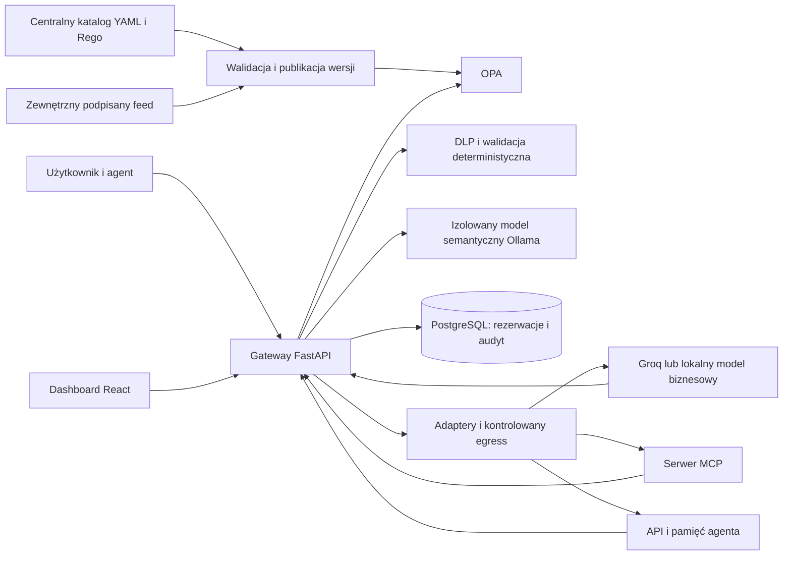

# Plan rozwiązania AI Control Layer

## 1. Cel i podstawa planu

Zbudować warstwę kontroli komunikacji agentów, modeli, narzędzi MCP i API, która przed wykonaniem operacji egzekwuje uprawnienia, chroni dane i rezerwuje zasoby, a po wykonaniu sprawdza odpowiedź oraz zapisuje rozliczenie i audyt. Rezultatem będzie działający gateway, centralna konfiguracja, interaktywny panel i wykonywalny pakiet testów. Demonstracja ma pokazać zarówno legalną pracę agenta, jak i rzeczywiste zatrzymanie niedozwolonych skutków.

Plan jest projektem do wykonania, nie raportem z wdrożenia. Nie uruchamiano integracji ani płatnej inferencji. Zakres wynika z wymagań zadania, bez redukcji według liczby osób lub przypuszczalnego czasu realizacji.

Przeczytane materiały:

- [TASK.json](TASK.json) i [MATERIALS.md](MATERIALS.md).
- [Regulamin](materials/31a3fb1537ac1d02.pdf.txt), trzy strony, oraz [opis i kryteria](materials/786a9bb4a858f98d.pdf.txt), cztery strony. Manifest wskazuje dwa różne dokumenty; dwa odnośniki do regulaminu prowadzą do tego samego pliku.
- [SERVICES.md](SERVICES.md), wskazany wspólny katalog `C:\Users\defoz\Documents\Projects\hackyeah2026-coordinator\SERVICES.md`, plik `.state\services\readiness.json` i helper `Use-Service.ps1` z tego katalogu. Dobór integracji poniżej nastąpił po ich przeczytaniu.
- Oficjalna dokumentacja wybranych komponentów i źródła bezpieczeństwa podlinkowane przy decyzjach projektowych. Stan odczytu: 3 października 2026.

## 2. Wymagania i sposób wykazania ich realizacji

| Wymaganie | Planowana realizacja | Dowód odbioru |
| --- | --- | --- |
| Łatwa integracja z systemami AI | Gateway HTTP, adapter MCP i cienki klient Python; jeden kontrakt decyzji | Ten sam scenariusz działa przez model, MCP i chronione API |
| Architektura hybrydowa | Reguły deterministyczne plus rzeczywista lokalna ocena semantyczna | Oddzielne decyzje i czasy obu warstw; test z prawdziwym modelem kontroli |
| Centralny katalog kontroli | Walidowany YAML, wersjonowane reguły OPA i feed zagrożeń | Zmiana konfiguracji bez restartu, widoczna wersja aktywna i odrzucenie błędnego pliku |
| Różna surowość | Profile `observe`, `balanced`, `strict`; akcje allow, redact, block, require_approval | To samo wejście daje przewidywalne różne wyniki po zmianie profilu |
| Prywatność i dostęp | DLP wejścia/wyjścia, role, zakresy, izolacja tenantów, kontrola pamięci i delegacji | Brak wycieku do upstreamu, logów i innego tenanta; brak niedozwolonego wywołania narzędzia |
| Budżety komercyjne i lokalne | Atomowe rezerwacje kosztu, tokenów, czasu, kroków i równoległości | Test współbieżności, zatrzymanie pętli i oddzielne rozliczenie guardraili |
| Historyczne exploity i zewnętrzne sygnatury | Podpisany feed danych oraz egzekwowanie przy narzędziach i ładowaniu artefaktów | Bezpieczne testy regresyjne, aktualizacja feedu zmienia wynik, podrobiony feed nie działa |
| Panel interaktywny | Playground, aktywne kontrole, zdarzenia, koszty, stan usług i konfiguracji | Juror wpisuje własne żądanie i obserwuje jego faktyczny przebieg |
| Audyt i raporty | Skorelowane zdarzenia, eksport JSONL/CSV, widok zarządczy i analityczny | Eksport odpowiada danym w bazie i nie zawiera surowych sekretów |
| Automatyczne testy | Scenariusze pozytywne, negatywne, awarie, budżety, semantyka i wydajność | Jedna komenda kończy się raportem i niezerowym kodem przy niepowodzeniu |
| Wykonalność | Docker Compose, przypięte zależności i modele, konfiguracja lokalna oraz komercyjna | Uruchomienie na czystym środowisku według README, także offline po przygotowaniu artefaktów |

Główna demonstracja: agent analityczny odczytuje syntetyczny dokument klienta z MCP, sporządza podsumowanie, zapisuje notatkę i proponuje eksport do rejestru demonstracyjnego. Zatrzymujemy próbę dostępu do innego klienta, instrukcję ukrytą w dokumencie, eksport sekretu i pętlę zużywającą budżet. Zatwierdzony eksport zapisuje rekord wyłącznie do lokalnego odbiornika demonstracyjnego. Scenariusz nie wymaga rzeczywistych danych banku ani wysyłania wiadomości do osób.

## 3. Architektura i granice egzekwowania



Gateway jest jedyną drogą do chronionych usług. Agent nie otrzymuje kluczy dostawców, poświadczeń bazy ani bezpośredniej trasy do MCP i modelu. W Compose działa w sieci wewnętrznej; tylko adapter egress ma dostęp do dozwolonych hostów. Samo użycie wrappera SDK nie stanowi granicy bezpieczeństwa. W instalacji organizacyjnej tę samą zasadę wymuszają reguły sieciowe i konta usługowe o minimalnych uprawnieniach.

Panel administracyjny jest logicznie oddzielony od API agenta. Role: `operator` zarządza politykami, `analyst` przegląda audyt, `approver` zatwierdza dozwolone wyjątki, `developer` używa playgroundu w swoim tenantcie. Uwierzytelniony aktor i tenant pochodzą z tokenu, nigdy z tekstu promptu ani dowolnego nagłówka klienta.

Kontrakt integracyjny: `POST /v1/chat/completions` dla udokumentowanego podzbioru tekstowego API z tool calling, `/mcp` dla Streamable HTTP, `POST /v1/actions/{registered_action}` dla chronionych API oraz `/v1/runs` dla przebiegów i delegacji. Klient Python dołącza token gatewaya i korelację, ale nie podejmuje decyzji bezpieczeństwa. Dostarczyć przykłady klienta modelu, klienta MCP i dwóch współpracujących agentów. Nie deklarować pełnej zgodności z każdym API dostawcy; nieobsługiwane opcje mają jawny błąd i test kontraktu.

Chronimy operacje przechodzące przez gateway oraz dostarczony kontrolowany loader artefaktów. Nie deklarujemy naprawiania podatnego zewnętrznego serwera ani ochrony ruchu, który omija bramę. Złośliwy administrator hosta, zatrucie treningu obcego modelu i prawdziwość każdej odpowiedzi modelu pozostają poza gwarancją tej warstwy. W analizie zagrożeń mapujemy m.in. injection, ujawnienie danych, supply chain, zatrucie pamięci, niewłaściwą obsługę wyjścia, nadmierne uprawnienia i nieograniczone zużycie na konkretne kontrole, korzystając z [OWASP GenAI](https://genai.owasp.org/llm-top-10/).

### Przebieg pojedynczej operacji

1. Sprawdzić rozmiar i schemat żądania, token, tenant, zakresy, identyfikator przebiegu i klucz idempotencji. Wymusić rate limit przed kosztownymi kontrolami oraz ograniczyć rozmiar kolejki. Odrzucić nieobsługiwane modalności i pola zamiast przepuszczać je bez inspekcji.
2. Przypisać wersję polityki i feedu. Zastosować allowlistę modelu, narzędzia, zasobu i docelowej usługi oraz twarde limity wejścia.
3. Wykonać DLP, sprawdzenia strukturalne i sygnatury. Redagować tylko pola, których zmiana jest bezpieczna semantycznie. Zmiana odbiorcy, kwoty lub ścieżki wymaga ponownej walidacji, a nie cichej redakcji.
4. Zarezerwować budżet kontroli semantycznej. Oceniać niezaufaną treść i zgodność proponowanej akcji z zadaniem użytkownika; decyzja AI nie może uchylić deterministycznego zakazu.
5. Złożyć wynik wszystkich kontroli. Kolejność priorytetów: `block`, `require_approval`, `redact`, `allow`. Samo zatwierdzenie człowieka nie uchyla izolacji tenantów ani zakazu użycia sekretu.
6. Dla zatwierdzonej operacji ponownie sprawdzić aktualne uprawnienia i odwołania, po czym atomowo zarezerwować zasoby upstreamu i zapisać zamiar wykonania. Nie trzymać transakcji podczas wywołania sieciowego.
7. Wykonać adapter, sprawdzić całą odpowiedź oraz wszystkie propozycje narzędzi, rozliczyć użycie i zapisać wynik. Błąd weryfikacji wyjścia blokuje jego ujawnienie, ale nie cofa kosztu już wykonanej inferencji.
8. Zwrócić wynik z `decision_id`, `trace_id`, wersją polityki i zrozumiałym kodem powodu. Nie ujawniać klientowi sekretów ani pełnych wewnętrznych reguł.

## 4. Technologie, biblioteki i usługi

| Element | Wybór | Uzasadnienie i konfiguracja |
| --- | --- | --- |
| Gateway i API administracyjne | Python 3.12, FastAPI, Pydantic v2, HTTPX, Uvicorn | Jeden stos dla integracji AI, schematów polityki i testów. Asynchroniczne I/O; obliczenia NLP poza event loop |
| Polityki | OPA/Rego v1, jeden katalog YAML kompilowany do danych wersjonowanego pakietu | Gotowy silnik autoryzacji i testów reguł. OPA nie przechowuje mutowalnego salda budżetu; to zadanie bazy. [Bundles OPA](https://www.openpolicyagent.org/docs/management-bundles) |
| Dane, budżety i audyt | PostgreSQL, SQLAlchemy, Alembic | Rezerwacje i audyt transakcyjny bez drugiej bazy liczników. Blokady rekordów umożliwiają ochronę przed współbieżnym przekroczeniem limitu. [Blokady PostgreSQL](https://www.postgresql.org/docs/current/explicit-locking.html) |
| DLP | `presidio-analyzer`, `presidio-anonymizer`, własne recognizery sekretów, PESEL i IBAN | Gotowe wykrywanie i redakcja, uzupełnione walidacją sum kontrolnych oraz testami formatów organizacji. Reguły wzorcowe są oddzielone od opcjonalnego NLP. [Presidio](https://github.com/data-privacy-stack/presidio), [typy encji](https://presidio.dataprivacystack.org/supported_entities/) |
| Semantyczny guardrail | Lokalny Ollama, `qwen3:4b`, odpowiedź według JSON Schema | Brak wymogu płatnego konta, lokalne przetwarzanie wrażliwych treści. Model jest wymienialnym oceniającym, bez narzędzi i uprawnień. Karta wariantu Q4_K_M wskazuje około 2,5 GB wag i Apache 2.0. [Karta modelu](https://ollama.com/library/qwen3:4b), [structured outputs](https://docs.ollama.com/capabilities/structured-outputs) |
| Komercyjny model demonstracyjny | Groq `openai/gpt-oss-120b`, oficjalny SDK `groq` | Wspólny katalog rekomenduje go do szybkich agentów tekstowych. Klucz `GROQ_API_KEY` z psst; endpoint `https://api.groq.com/openai/v1`. Wyłącznie jawnie dopuszczone narzędzia wykonywane przez gateway, bez narzędzi hostowanych poza kontrolą. [Groq](https://console.groq.com/docs/models), [zgodność API](https://console.groq.com/docs/openai) |
| Lokalny model demonstracyjny | Drugi runner Ollama z `qwen3:4b` | Pełna ścieżka offline i rzeczywista demonstracja limitów lokalnych zasobów. Oddzielna pula od kontroli semantycznej. [Tool calling](https://docs.ollama.com/capabilities/tool-calling), [usage](https://docs.ollama.com/api/usage) |
| MCP | Oficjalny Python SDK `mcp` | Gotowe klient/serwer, transport Streamable HTTP i obsługa lifecycle. Dla lokalnego stdio osobny wrapper do zatwierdzonych procesów. [Repozytorium SDK](https://github.com/modelcontextprotocol/python-sdk) |
| Panel | React, TypeScript, Vite, TanStack Query/Table, Recharts | Gotowe zarządzanie danymi, tabele i wykresy; SSE aktualizuje zdarzenia. Statyczny build serwowany pod tym samym originem co gateway |
| Tożsamość i podpisy | PyJWT z `cryptography`, zewnętrzny OIDC/JWKS; lokalny issuer tylko w demo | Walidacja `iss`, `aud`, czasu i dozwolonego algorytmu. Oddzielne klucze tokenów, podpisów feedu i checkpointów audytu |
| Telemetria i testy | OpenTelemetry, `prometheus-client`, pytest, Hypothesis, respx, Playwright, Locust, `opa test` | Gotowe ślady, metryki i testy kontraktów, własności, interfejsu oraz obciążenia |
| Uruchomienie | Docker Compose, `uv.lock`, lockfile npm, przypięte obrazy i modele | Powtarzalne środowisko jury i wdrożenie w organizacji; profil CPU oraz opcjonalne GPU |

Wspólny `readiness.json` z 3 października potwierdza uwierzytelniony odczyt Groq, ale ma `inference_verified: false`. To nie jest dowód działania wybranego modelu. Pierwszy etap implementacji obejmuje rzeczywisty test generacji, narzędzi i pola usage. Helper `Use-Service.ps1` pomaga sprawdzić katalog i prosty chat; streaming, narzędzia i kontrolę błędów integrujemy przez SDK.

Hugging Face z katalogu może służyć do pobrania przypiętych tokenizerów lub dodatkowego klasyfikatora; publiczne pliki nie wymagają sekretu, a opcjonalny `HF_TOKEN_READ_ONLY` przekazujemy tylko procesowi pobierania. Nie potrzebujemy RAG jako usługi, wyszukiwarki, głosu, mediów ani CopilotKit. Convex ma gotowy stan reaktywny, lecz tutaj wspólne transakcje salda i audytu oraz instalacja offline uzasadniają PostgreSQL. LiteLLM może później rozszerzyć katalog dostawców, ale dwa jawne adaptery na początku dają prostszy audyt przepływu i rozliczeń.

Nie wybieramy ProtectAI DeBERTa v2 jako głównej kontroli: [karta](https://huggingface.co/protectai/deberta-v3-base-prompt-injection-v2) oznacza projekt jako zarchiwizowany i ogranicza zastosowanie do angielskiego prompt injection, bez jailbreaków. Meta Prompt Guard 2 jest kandydatem do pomiarów optymalizacyjnych, lecz [wymaga dostępu do repozytorium i licencji Llama](https://huggingface.co/meta-llama/Llama-Prompt-Guard-2-86M). Podmiana lokalnego guardraila nastąpi wyłącznie po porównaniu jakości, opóźnienia, dostępności i warunków redystrybucji.

Przed zamrożeniem zależności wygenerować SBOM i `THIRD_PARTY_NOTICES.md`; sprawdzić licencje dokładnych wersji bibliotek, modeli i danych testowych. Licencja runnera nie zastępuje licencji wag. Nie używać tagów `latest`, zdalnego kodu modeli ani nieznanych paczek w runtime.

## 5. Kontrole bezpieczeństwa

### Tożsamość, delegacja i narzędzia

- Autoryzacja obejmuje jednocześnie użytkownika, agenta, tenant, operację, zasób i cel wywołania. Delegacja agent-agent zachowuje pierwotnego użytkownika, `parent_run_id` i wspólny budżet; zakres potomka jest przecięciem uprawnień rodzica i polityki.
- Każde `tools/call`, `resources/read` i operacja pamięci przechodzi kontrolę. Filtrowane `tools/list` nie zastępuje sprawdzenia wykonania. Opisy narzędzi, schematy i wyniki MCP są niezaufane; zmiana zarejestrowanego schematu wymaga ponownego zatwierdzenia jego hasha.
- Dla HTTP token docelowy jest wystawiony dla konkretnego zasobu. Sesja MCP nie zastępuje tożsamości; wiążemy jej stan z tenantem i aktorem, sprawdzamy Origin i host oraz nie przekazujemy bez walidacji tokenu klienta do upstreamu. Dla stdio rejestrujemy polecenie, obraz i minimalne środowisko procesu. Kierunek opiera się na [zaleceniach bezpieczeństwa MCP](https://modelcontextprotocol.io/specification/draft/basic/security_best_practices); obsługiwaną stabilną wersję protokołu przypinamy z SDK.
- Registry przechowuje dozwolone hosty, metody, ścieżki i schematy JSON. Użytkownik nie podaje dowolnego `base_url`. Sprawdzamy DNS, przekierowania, adresy metadata i loopback, również przy discovery OAuth. Wewnętrzne adresy usług dopuszczamy tylko przez konkretny wpis registry.
- Zapis lub eksport wysokiego ryzyka wymaga zatwierdzenia związanego z hashem parametrów, zasobem, użytkownikiem, wersją polityki i TTL. Zgoda jest jednorazowa; zmiana treści wymaga nowej decyzji. Awaria po wysłaniu operacji nie powoduje automatycznego ponowienia nieidempotentnego skutku.

### DLP, pamięć i wyjście

- Skanować prompt, argumenty narzędzi, wyniki MCP/API, odczyty i zapisy pamięci oraz odpowiedź użytkownikowi. Dane mają pochodzenie i etykietę `public`, `internal`, `confidential` lub `secret`, nadawaną przez zaufany adapter. Brak etykiety nie oznacza `public`.
- Sekrety blokować; PII redagować lub blokować zgodnie z profilem. Rozpoznawanie PESEL i IBAN uzupełnić sumami kontrolnymi, a wzorce kluczy testować także na przykładach nieszkodliwych. Nie przedstawiać regexów ani Presidio jako gwarancji wykrycia dowolnej tajnej informacji.
- Do chmury kierować tylko dane dozwolone przez klasyfikację i politykę. Redakcja PII nie zmienia automatycznie poufnego dokumentu w publiczny. Domyślnie materiały poufne trafiają wyłącznie do lokalnego modelu.
- Pamięć posiada `tenant_id`, właściciela, zakres, etykietę, źródło i TTL. Autoryzacja odbywa się przed zapytaniem i przed zwrotem danych; zapis instrukcji z niezaufanego źródła nie może zmienić systemowej polityki ani tożsamości.
- W profilach ochronnych buforować całą odpowiedź przed wydaniem treści. Wewnętrznie można czytać stream dla anulowania i księgowania. Do klienta wysyłać status pracy oraz zatwierdzony wynik; ewentualne późniejsze odtwarzanie przez SSE jawnie oznaczyć jako buforowane. Samo przesuwne okno nie gwarantuje zatrzymania sekretu podzielonego między chunki.
- Nie wykonywać kodu z odpowiedzi modelu. Renderować tekst z sanitacją, blokować automatyczne pobieranie zewnętrznych obrazów/linków i zabezpieczyć CSV przed formułami. Argumenty narzędzi muszą przejść schemat i politykę także wtedy, gdy pochodzą od wcześniej dopuszczonego modelu.

### Rzeczywista kontrola semantyczna

Lokalny oceniający otrzymuje zaufany opis celu i oddzielne pola niezaufanej treści, źródła oraz proponowanej akcji. Sprawdza próbę zmiany instrukcji, wyłudzenie danych, ukrytą delegację i niezgodność działania z celem. Wymagany schemat: `verdict` (`benign`, `suspicious`, `unknown`), `risk_level` (0-3), kategoria, identyfikatory sprawdzanych fragmentów i krótkie uzasadnienie. Numeryczne poziomy są skalą operacyjną, nie skalibrowanym prawdopodobieństwem.

Używamy lokalnego `/api/chat`, `format` z JSON Schema, walidacji Pydantic, temperatury 0 i limitu wyjścia. `think: false` włączamy po potwierdzeniu wsparcia w `/api/show`, zgodnie z [dokumentacją Ollama](https://docs.ollama.com/capabilities/thinking). Oceniający nie ma narzędzi, sekretów dostawcy ani pamięci między tenantami. Jego wynik również jest niezaufany: sprawdzamy enumy, zakresy i istnienie wskazanych fragmentów.

Błąd schematu, timeout, nieobsługiwany język i zbyt duży kontekst dają `unknown`. Profil `strict` blokuje lub kieruje do uprawnionego review, bez automatycznego allow. Nie obcinamy niewidocznie tekstu. Limitujemy wejście; dla długiego dopuszczonego materiału sprawdzamy wszystkie fragmenty z zakładką i osobno kontekst proponowanej akcji. Limit liczby fragmentów chroni sam guardrail przed DoS. Autoryzacja i budżet pozostają obowiązkowe niezależnie od wyniku modelu.

Model 4B na CPU może wprowadzać zauważalne opóźnienie. Osobna kolejka, ograniczona równoległość i pula zasobów chronią jego dostępność. Weryfikacja jakości obejmie parafrazy, instrukcje cytowane w nieszkodliwym artykule i ataki na samego oceniającego. UI i zgłoszenie będą po angielsku; wyniki EN i PL raportujemy oddzielnie, bez obietnicy skuteczności językowej na podstawie samej karty modelu.

### Historyczne ataki i feed zagrożeń

Feed JSON zawiera `schema_version`, monotoniczną wersję, `issued_at`, `expires_at`, źródło/advisory, identyfikatory reguł, zakres komponentów i wersji, ograniczone matchery oraz akcję. Podpis sprawdzamy z zaufanej listy kluczy. Feed nie może zawierać wykonywalnego kodu, szablonów ani dowolnych kosztownych regexów. Matchery używają literalnych wzorców, walidowanych struktur lub RE2 z limitami rozmiaru.

Pokazać trzy rzeczywiste punkty egzekwowania:

1. Próba uruchomienia kodu przez narzędzie: kontrakt typed tool zamiast `eval`, allowlista operacji, brak dowolnej powłoki. Sygnatury pomagają wykryć znane wzorce, ale blokada wynika też z uprawnień i izolacji wykonawcy.
2. Niebezpieczna deserializacja: kontrolowany loader przyjmuje wyłącznie zatwierdzone formaty, np. safetensors/GGUF, z przypiętą wersją i hashem; odrzuca pickle oraz zdalny kod. Aktualizacje bibliotek i obrazów są częścią ochrony parsera.
3. Supply chain modeli i MCP: weryfikacja pochodzenia, digestu, schematu narzędzia i SBOM; blokada podatnych wersji według lokalnie zatwierdzonego feedu. Nie uruchamiamy pobranego obcego kodu, aby sprawdzić, czy jest groźny.

Fixtures regresyjne powiązać z konkretnymi oficjalnymi advisories, podając warunki podatności, chroniony interfejs i ograniczenie testu. Początkowy feed uwzględni CVE-2025-32434 dotyczące `torch.load(weights_only=True)` w PyTorch do 2.5.1 oraz CVE-2026-24747 dotyczące tej ścieżki do 2.9.1. Drugie advisory wskazuje poprawkę od 2.10.0, więc samo minimum 2.6.0 wynikające z pierwszego nie wystarcza. Dowód: odrzucenie manifestu z podatną zależnością oraz brak wywołania loadera dla niedozwolonego checkpointu. To test ochrony granicy ładowania, nie dowód usunięcia podatności ze wszystkich usług. Źródła: [advisory 2025](https://github.com/pytorch/pytorch/security/advisories/GHSA-53q9-r3pm-6pq6), [advisory 2026](https://github.com/pytorch/pytorch/security/advisories/GHSA-63cw-57p8-fm3p).

Używać nieszkodliwych atrap wykonawców i manifestów, bez wdrażania podatnych usług. Feed uruchomić jako niezależny serwis HTTP w demo, z możliwością ręcznej edycji i ponownego podpisania przez jurora lokalnym kluczem demonstracyjnym. W teście command injection sprawdzić również niebezpieczne składniki URL discovery OAuth i brak wywołania powłoki; uzasadnienie daje [poprawka sanitacji URL w mcp-remote](https://github.com/punkpeye/mcp-remote/commit/607b226a356cb61a239ffaba2fb3db1c9dea4bac).

Aktualizacja wymaga walidacji podpisu, schematu, czasu i ochrony przed rollbackiem. Odrzucony feed pozostawia ostatnią poprawną wersję, z widocznym alarmem. Po przekroczeniu `max_stale` blokujemy operacje wymagające aktualnych sygnatur. Test podpisu obejmuje realny loader, nie tylko jednostkowy parser. Dla pakietów OPA stosujemy pełne podpisane snapshoty; [OPA opisuje ich ładowanie i weryfikację](https://www.openpolicyagent.org/docs/management-bundles).

## 6. Budżety i odporność na pętle

Budżety mają zakres organizacji, projektu, użytkownika i przebiegu. Każda operacja zużywa wszystkie właściwe limity. Dziecko agenta nie dostaje nowego salda przez zmianę identyfikatora. Okres rozliczeń, strefa czasu, wersja cennika i sposób liczenia cache są jawne.

- Przed operacją rezerwujemy górne ograniczenie kosztu wejścia, maksymalnego wyjścia i opłat narzędziowych. Tokeny rozumowania i próby ponowienia też mogą być płatne. Adapter musi ustawiać obsługiwany przez dostawcę limit generacji; nieznany model lub brak wiarygodnego ograniczenia kosztu blokuje profil z twardym budżetem.
- Liczenie wejścia uwzględnia historię, schematy narzędzi i narzut serializacji. Gdy dokładny tokenizer nie jest dostępny, używamy udokumentowanego konserwatywnego ograniczenia, nie arbitralnej średniej znaków na token. Rozbieżności pomiaru są metryką i wyzwalają korektę adaptera.
- Warunek przyjęcia: `spent + reserved + new_reservation <= limit`. Kwoty przechowujemy jako całkowite mikro-USD lub dokładny decimal, nie float. Blokujemy rekordy wszystkich zakresów w stałej kolejności w jednej krótkiej transakcji, z unikalnym kluczem operacji.
- Stany rezerwacji: `reserved`, `dispatched`, `settled`, `uncertain`, `released`. Timeout po wysłaniu nie dowodzi braku naliczenia. W takim przypadku zachowujemy konserwatywne obciążenie do rekonsyliacji; sam TTL nie zwalnia niepewnej rezerwacji. Retry ma osobny koszt, a powtórzenie tego samego klucza nie uruchamia ponownie skutku.
- Awaria bazy lub brak trwałego zapisu zamiaru blokuje nowe operacje. Restart wznawia rozliczenie otwartych rezerwacji. Po obniżeniu limitu poniżej bieżącego wykorzystania odrzucamy nowe rezerwacje i pokazujemy istniejące zobowiązania.
- Lokalnie limitujemy tokeny, czas ścienny inferencji, kolejkę, równoległość, kroki i zasoby kontenera. Czas w nanosekundach i liczby tokenów z [Ollama usage](https://docs.ollama.com/api/usage) służą rozliczeniu; nie są automatycznie pomiarem GPU-sekund. Opcjonalny koszt zasobów lokalnych jest oznaczonym szacunkiem według stawki operatora, oddzielnie od fakturowanego API.
- Anulowanie zamyka połączenie i żąda zatrzymania generacji. Dla własnego runnera testujemy rzeczywiste zakończenie procesu pracy; jeśli nadal pracuje, utrzymujemy zajęty slot i stosujemy watchdog. Nie obiecujemy, że rozłączenie zatrzyma naliczanie po stronie komercyjnego API.
- Pętle ograniczamy przez `max_steps`, wspólny deadline, limit delegacji, powtarzających się narzędzi i tokenów. Semantyczne kontrole mają własny podbudżet wliczany również do budżetu nadrzędnego; ich wyczerpanie nie wyłącza ochrony.

Punkt startowy cennika Groq 120B to 0,15 USD za milion tokenów wejścia i 0,60 USD wyjścia, zgodny z odczytanym katalogiem i [dokumentacją dostawcy](https://console.groq.com/docs/models). Przykładowe 2000 tokenów wejścia i 1000 łącznie płatnych tokenów wyjścia kosztuje 0,0009 USD, bez dodatkowych usług. To ilustracja taryfy, nie zmierzony koszt całego przebiegu. Rzeczywista rezerwacja korzysta z maksymalnej dopuszczonej generacji.

## 7. Centralna konfiguracja i jej zmiana podczas demo

Źródłem ustawień jest katalog `policies/`: YAML ustawień, Rego logiki i wersjonowany cennik. Panel edytuje ten sam katalog przez API administracyjne. Kompilator waliduje całość, uruchamia testy polityk i publikuje jeden snapshot. Gateway i OPA korzystają z tej samej rewizji; odpowiedź z niezgodną wersją jest odrzucana. Nie utrzymujemy niezależnych kopii progów w frontendzie.

Poniżej projekt przykładowego pliku. Wartości są założeniami demonstracyjnymi do kalibracji, a nazwy pól kontraktem do zaimplementowania, nie składnią gotowego produktu.

```yaml
schema_version: 1
revision: demo-001
profile: balanced
models:
  allowed: [local-business]
  routes:
    confidential: local-business
    internal: local-business
    public: local-business
  denied_classes: [secret]
  unknown_class: block
controls:
  authentication: {enabled: true, failure: block}
  tenant_isolation: {enabled: true, failure: block}
  secrets: {enabled: true, action: block}
  pii: {enabled: true, action: redact}
  semantic:
    enabled: true
    provider: local-guard
    model: qwen3:4b
    block_risk_at: 2
    unknown_action: require_approval
    timeout_ms: 15000
    max_input_tokens: 8192
    max_output_tokens: 256
  response_release: full_buffer
budgets:
  currency: USD
  period_timezone: UTC
  project_daily_usd: "5.00"
  run_max_usd: "0.05"
  max_input_tokens: 8192
  max_output_tokens: 1024
  run_max_total_tokens: 20000
  max_steps: 12
  max_delegation_depth: 2
  run_deadline_seconds: 180
  local_call_timeout_seconds: 30
  local_max_concurrent: 2
  guard_max_concurrent: 1
  guard_run_max_seconds: 60
tools:
  allowed: [documents.read, notes.write, reports.export_demo]
  approval_required: [reports.export_demo]
memory:
  scope: tenant_and_user
  untrusted_write: quarantine
threat_feed:
  url: http://threat-feed:8090/snapshot.json
  signature_required: true
  trusted_key_id: demo-feed-key
  max_stale_seconds: 3600
audit:
  raw_content: false
  retention_days: 7
```

Przykład jest w całości lokalny. Jawny overlay profilu cloud dodaje `groq-business` do allowlisty, kieruje tam wyłącznie `public` i wymaga klucza oraz wersjonowanego cennika. Nie ma automatycznego przełączenia na chmurę po awarii modelu lokalnego. Adres HTTP feedu dotyczy wyłącznie prywatnej sieci demonstracyjnej; połączenie zdalne wymaga HTTPS i uwierzytelnienia. Sekrety i klucze prywatne nie trafiają do katalogu polityk.

Profile: `balanced` redaguje PII i eskaluje niejednoznaczność; `strict` blokuje PII i `unknown`, obniża próg ryzyka do 1; `observe` zapisuje hipotetyczne decyzje kontroli treści, ale nie wykonuje ich na produkcyjnych zasobach. `observe` jest ograniczony do syntetycznego tenanta i atrap. Uwierzytelnianie, izolacja, limity zasobów i budżety pozostają aktywne. Zmiana surowości nie oznacza losowego pomijania części żądań.

Juror może zmienić regułę, próg, feed albo wyłączyć konkretną kontrolę treści w izolowanej piaskownicy. Panel pokazuje wtedy faktycznie zmniejszony zakres ochrony. Zmiana atomowa: walidacja, test, publikacja, potwierdzenie aktywnej wersji. Cel odbioru: widoczna aktywacja w ciągu 5 sekund w demo. Błąd pozostawia ostatnią poprawną wersję. Każde żądanie zachowuje spójny snapshot, natomiast przed skutkiem sprawdzamy aktualne odwołania i wymagamy ponownej oceny, jeśli polityka się zmieniła.

## 8. Panel, dane i raportowanie

Panel ma pięć widoków:

1. **Overview:** liczba żądań, allow/redact/block/approval, wykorzystanie i rezerwacje budżetu, koszty API, szacowany koszt lokalny, opóźnienia, błędy i przeciążenia. Stan ochrony to lista aktywnych kontroli, świeżość feedu i wyniki ostatnich testów, bez arbitralnego procentu bezpieczeństwa.
2. **Live trace:** cel użytkownika, etapy agent/model/MCP, przyczyna decyzji, czas każdej kontroli i wersje konfiguracji. Domyślnie wyłącznie zredagowane fragmenty danych syntetycznych.
3. **Policies and feeds:** formularz i edytor YAML, różnica zmian, walidacja, aktywacja, rollback do nowej zatwierdzonej rewizji i informacja o odrzuconym feedzie.
4. **Security events:** filtrowanie po tenantcie, regule, kategorii, decyzji i czasie; eksport JSONL/CSV oraz raport testów. Uprawnienia sprawdzane także na endpointach eksportu.
5. **Playground and approvals:** własny prompt i parametry narzędzia, zmiana profilu, porównanie decyzji oraz jednorazowe zatwierdzenie z widocznym skutkiem. Scenariusze gotowe są przykładami, nie specjalnymi ścieżkami w silniku.

Minimalne encje: `tenants`, `principals`, `agent_runs`, `policy_versions`, `feed_versions`, `tool_registry`, `budget_accounts`, `budget_reservations`, `usage_entries`, `decisions`, `audit_events`, `approvals`, `memory_records`. Unikalne klucze idempotencji są zakresowane tenantem i aktorem; znaczniki czasu zapisujemy w UTC.

Audyt zawiera identyfikatory aktorów i korelacji, zasób, akcję, wynik, kody reguł, zredagowane dowody, wersję polityki/feedu/modelu, czasy i rozliczenie. Bez surowych promptów, nagłówków Authorization i treści sekretów. Hash treści niskiej entropii nie jest anonimizacją; do korelacji używamy HMAC z separacją tenantów. Logi OPA, HTTP i telemetryki również podlegają redakcji.

Rola aplikacji może dopisywać zdarzenia, nie edytować historii. Łańcuch hashy i okresowo podpisany checkpoint ułatwiają wykrycie manipulacji, ale bez niezależnie przechowywanego checkpointu nie chronią przed administratorem bazy. Eksport do zewnętrznego SIEM/WORM jest ścieżką wdrożeniową; podstawowe demo zachowuje lokalny eksport i weryfikator integralności.

## 9. Testy i kryteria jakości

Każda kontrola dostaje identyfikator powiązany z testami i wymaganiem. Test negatywny sprawdza nie tylko komunikat, lecz także brak wywołania upstreamu lub skutku w odbiorniku. Atrapy dostawców zapisują otrzymane żądania, dzięki czemu można udowodnić redakcję przed przekazaniem danych.

| Grupa | Przypadek dozwolony | Przypadki blokowane i brzegowe |
| --- | --- | --- |
| Tożsamość | Poprawny token i właściwy zakres | Obcy issuer/audience, wygaśnięcie, podszycie w body, delegacja rozszerzająca uprawnienia |
| Tenant i pamięć | Odczyt własnej notatki | IDOR, odczyt innego tenanta, zatrucie pamięci, współdzielony cache |
| DLP | Tekst bez danych i dozwolona redakcja | Sekret na wejściu/wyjściu, Unicode, PII w JSON, sekret podzielony w streamie, brak wycieku do logów |
| Semantyka | Zwykłe zadanie i nieszkodliwy cytat instrukcji | Injection bez znanej sygnatury, parafraza, wynik MCP, próba zmanipulowania oceniającego, timeout i błędny JSON |
| Narzędzia i zgody | Dozwolony odczyt oraz zatwierdzony eksport demo | Nieznane narzędzie, zmiana schematu, inny hash parametrów, replay/wygaśnięcie zgody, SSRF i przekierowanie |
| Budżety | Poprawna rezerwacja i rozliczenie | Dokładna granica, następne wywołanie ponad limit, 50 równoległych prób, restart, przerwany stream, brak usage, retry i koszt guardraila |
| Lokalny model i agent | Krótki przebieg mieszczący się w limitach | Pętla, nadmierna delegacja, timeout, przeciążona kolejka, brak zatrzymania runnera |
| Feed i artefakty | Poprawny podpis i dozwolony manifest | Zły podpis, rollback, przeterminowanie, zmiana digestu, pickle, zdalny kod, wadliwa lub kosztowna reguła |
| Zmiana konfiguracji | Nowy próg wpływa na następne żądanie | Niespójna rewizja, błędny YAML, zmiana podczas działania, awaria OPA i bazy |
| UI i raporty | Live trace i poprawny eksport | XSS, formuły CSV, nieuprawniony eksport, utrata połączenia SSE i ponowne pobranie zdarzeń |

Pakiet obejmuje trzy jawne poziomy, uruchamiane wspólnym `scripts/verify.ps1` lub `scripts/verify.sh`:

- **Contract:** deterministyczne testy, prawdziwe OPA/PostgreSQL, kontrolowane upstreamy i błędy, własności Hypothesis oraz testy UI. Bez kluczy chmurowych.
- **Local integration:** rzeczywisty lokalny model semantyczny, lokalny agent biznesowy i MCP. Brak modelu to niepowodzenie wymaganej części, nie cichy skip. Działa offline po pobraniu modeli i obrazów.
- **Cloud smoke:** jawnie wybierany profil Groq z limitem kosztu, sprawdzający generację, narzędzia, usage i rozliczenie. Brak klucza oznacza `not run` tylko dla tego profilu.

Zbudować oznaczony korpus benign/attack z własnych przykładów i legalnie używalnych publicznych materiałów, z oddzielnym zbiorem kalibracyjnym oraz zamrożonym holdoutem. Raportować recall, false positive rate, skuteczność niedozwolonej akcji end-to-end i wyniki per język/kategoria. Oczekiwane wyniki ustalać niezależnie od badanego modelu. Nie stroić progów na zbiorze odbiorowym i nie ukrywać nieudanych przykładów.

Cele odbioru, do potwierdzenia pomiarem: wszystkie twarde kontrole przechodzą pozytywne i negatywne testy; zero niedozwolonych skutków w regresjach autoryzacji, budżetu i feedu; dla semantyki docelowo recall co najmniej 90% i false positive rate najwyżej 5% na jawnie opisanym holdoucie. Niespełnienie celu semantycznego wymaga zmiany modelu/progów i ponownego niezależnego odbioru, nie deklaracji pełnej ochrony.

Wydajność: porównać bezpośredni upstream, gateway deterministyczny i pełną ochronę dla tych samych danych oraz współbieżności 1/10/50. Pokazać p50/p95/p99, throughput, cold/warm start, czasy bazy/OPA/DLP/AI, długość wejść, CPU/RAM i liczbę odmów przeciążeniowych. Cel dla samej ścieżki deterministycznej to p95 narzutu poniżej 50 ms na środowisku referencyjnym; dla AI podać zmierzony wynik i skonfigurowany timeout, bez obietnicy podobnej latencji. Warunek odbioru pełnej ścieżki: ograniczona kolejka i poprawne odrzucanie obciążenia bez utraty egzekwowania.

Wyniki zapisujemy jako JUnit XML, JSON/HTML, raport pokrycia kontroli oraz wersje środowiska. OPA testuje logikę Rego; weryfikację podpisu i aktywację sprawdzamy także przez działający loader. Raport nie zalicza samej odpowiedzi HTTP 200 jako sukcesu kontroli.

## 10. Konfiguracja i uruchomienie

Do przygotowania: `compose.yaml`, `.env.example` bez sekretów, `policies/`, `feeds/`, `models.lock`, migracje, syntetyczne dane, skrypty bootstrap/verify i angielski README. Proponowane środowisko referencyjne do pierwszych pomiarów: Linux albo Docker Desktop z WSL2, 8 rdzeni CPU, 24 GB RAM, 20 GB wolnego dysku; GPU opcjonalne. To założenie, nie potwierdzony wymóg minimalny. Preflight zmierzy dostępne zasoby i sprawdzi oba runnery przy planowanym kontekście.

| Ustawienie | Wartość lub sposób dostarczenia |
| --- | --- |
| `APP_PROFILE`, `POLICY_PATH` | `local`, `/app/policies/demo.yaml`; profil zdalny wymaga jawnego włączenia |
| `DATABASE_URL` | PostgreSQL w prywatnej sieci, odrębne role migracji i aplikacji; hasło z sekretu lokalnego lub psst |
| `OPA_URL` | `http://opa:8181`, bez publikacji portu administracyjnego |
| `GUARD_OLLAMA_URL`, `GUARD_MODEL` | `http://guard-model:11434`, `qwen3:4b`; digest zatwierdzony w `models.lock` |
| `LOCAL_LLM_URL`, `LOCAL_LLM_MODEL` | `http://business-model:11434`, `qwen3:4b`; oddzielna pula zasobów |
| `GUARD_NUM_CTX`, `LOCAL_LLM_NUM_CTX` | Proponowane `16384` dla obu runnerów, jawnie przekazywane jako `options.num_ctx`; preflight sprawdza wsparcie i zużycie pamięci |
| `GROQ_BASE_URL`, `GROQ_MODEL` | `https://api.groq.com/openai/v1`, `openai/gpt-oss-120b`; tylko profil cloud |
| `GROQ_API_KEY` | Istniejący wpis psst; przekazany wyłącznie kontenerowi adaptera komercyjnego |
| `OIDC_ISSUER`, `OIDC_AUDIENCE`, `OIDC_JWKS_URL` | Parametry dostawcy tożsamości; demo korzysta z lokalnego issuera i generowanych kluczy |
| `FEED_URL`, `FEED_TRUST_KEYS_PATH` | Prywatny feed i plik z kluczami publicznymi; klucz podpisujący tylko po stronie wydawcy |
| `AUDIT_HMAC_KEY_FILE`, `AUDIT_SIGNING_KEY_FILE` | Nowe, oddzielne sekrety instalacji; utworzyć podczas bootstrap, nie zakładać ich obecności w psst |
| `HF_TOKEN_READ_ONLY` | Opcjonalnie tylko przy pobieraniu artefaktów; niepotrzebny do podstawowego działania Ollama |
| `OTEL_EXPORTER_OTLP_ENDPOINT` | Opcjonalny lokalny collector; eksport bez treści użytkownika |
| Publiczne porty | Domyślnie tylko `127.0.0.1:8080` dla UI/API; baza, OPA, runnery i MCP wyłącznie wewnętrznie |

Limity `max_input_tokens` dotyczą całego zserializowanego wejścia danego wywołania, włącznie z instrukcją systemową, historią i schematami narzędzi. Osobno rezerwujemy maksymalne wyjście; ich suma musi mieścić się w skonfigurowanym oknie z konserwatywnym narzutem adaptera. Guardrail wlicza także opis celu i schemat werdyktu. Preflight i test graniczny wykrywają obcinanie przez runner; przekroczenie daje jawny błąd, nie cichą utratę części wejścia.

Planowany kontrakt skryptów uruchomieniowych, które należy dostarczyć w implementacji:

```powershell
# Przygotowanie: walidacja środowiska, lokalne klucze demo, obrazy i modele.
.\scripts\bootstrap.ps1 -Profile local

# Migracje, feed demo, polityki, syntetyczne dane i usługi z healthcheckami.
.\scripts\start.ps1 -Profile local

# Pełny obowiązkowy odbiór bez chmury, w tym prawdziwa kontrola semantyczna.
.\scripts\verify.ps1 -Profile local

# Opcjonalnie: rzeczywisty provider komercyjny, klucz wstrzyknięty przez psst.
psst GROQ_API_KEY -- pwsh -File .\scripts\start.ps1 -Profile cloud
psst GROQ_API_KEY -- pwsh -File .\scripts\verify.ps1 -Profile cloud
```

Skrypty jawnie mapują sekret do właściwego procesu lub kontenera, bez `echo`, dumpowania środowiska i zapisu klucza do repozytorium. Sekretów nie umieszczamy w build args ani w bundle frontendu. Bootstrap pobiera modele, sprawdza digesty, zapisuje stan gotowości i tworzy pakiet offline. Start offline nie pobiera niczego z internetu. Wolumeny modeli, danych i audytu są trwałe; reset demo jest osobnym, wyraźnym poleceniem.

`/health/live` oznacza działający proces, a `/health/ready` wymaga zgodnych polityk, dostępnej bazy, aktualnego feedu i gotowego guardraila. Test funkcjonalny wykonuje legalny przepływ i próbę blokowaną, sprawdzając bazę i licznik wywołań. Dla dostępu zdalnego dodać HTTPS, OIDC, firewall i zweryfikować URL z innego klienta; lokalny healthcheck nie dowodzi dostępności zewnętrznej.

## 11. Kolejność realizacji i rezultaty etapów

| Etap | Prace | Warunek zakończenia |
| --- | --- | --- |
| 1. Kontrakty i ryzyka | Macierz wymagań, model zagrożeń, schemat decyzji/polityki, licencje, smoke test modeli i sprzętu | Znane ograniczenia integracji; zatwierdzone wersje i korpus początkowy |
| 2. Egzekwowany przepływ | Gateway, tożsamość, registry, sieci, lokalny agent, MCP i atrapa odbiornika | Legalny przebieg działa; nieuprawnione narzędzie nie zostaje wywołane |
| 3. Polityki i prywatność | OPA, snapshoty, DLP wejścia/wyjścia, pamięć, buforowanie, zgody | Testy redakcji, izolacji i zmiany konfiguracji przechodzą |
| 4. Hybrydowa kontrola | Lokalny oceniający, schemat werdyktu, awarie, kalibracja i holdout | Prawdziwe AI wpływa na decyzję; brak fail-open i zmierzone błędy jakości |
| 5. Budżety i zasoby | Rezerwacje, idempotencja, rozliczanie usage, lokalne limity, watchdog, pętle | Współbieżność i restart nie umożliwiają obejścia budżetu |
| 6. Exploity i feed | Podpisy, anti-rollback, loader artefaktów, bezpieczne regresje advisories | Zmiana feedu wpływa na decyzję; podrobiony lub stary feed jest odrzucony |
| 7. Raportowanie | Dashboard, SSE, audyt, eksport, koszt i wydajność | Wszystkie ekrany wynikają z rzeczywistych operacji i respektują role |
| 8. Odbiór i pakiet jury | Pełna suita, obciążenie, izolacja awarii, instalacja na czysto, dokumentacja i prezentacja | Komendy odtwarzają wynik, wszystkie wymagania mają dowód, ograniczenia są opisane |

Testy powstają razem z kontrolami. Po ustaleniu kontraktów równolegle można prowadzić gateway/polityki, budżety/audyt, semantykę/feed oraz panel/testy, integrując po każdym etapie. Nie odkładać testowania awarii i współbieżności na sam koniec.

## 12. Demonstracja i zgłoszenie

Sekwencja demonstracyjna: legalne podsumowanie dokumentu, redakcja PII przed modelem, blokada niedozwolonego odczytu, zatrzymanie instrukcji ukrytej w wyniku MCP, eksport po zatwierdzeniu, wyczerpanie budżetu przez pętlę, zmiana progu i feedu na żywo, własny prompt jurora, uruchomienie testów i eksport audytu. W panelu zawsze rozróżnić prawdziwego dostawcę, model lokalny i atrapę testową.

Do oddania: kod z lockfile i SBOM, Compose i pakiet offline, diagram architektury, przykładowe polityki i feed, dokumentacja integracji oraz konfiguracji, testy z raportem jakości i wydajności, działający panel, instrukcja demonstracji i PDF do 10 slajdów. Proponowany układ PDF: problem; przepływ i granice zaufania; integracja deweloperska; ochrona hybrydowa; polityki i zgody; budżety; exploity i feed; panel/audyt; testy/wydajność; uruchomienie, skalowanie i ograniczenia.

Skalowanie: bezstanowe repliki gatewaya z tą samą aktywną wersją polityki, wspólny transakcyjny ledger, osobne workery semantyczne, limity per tenant, ograniczone kolejki, partycjonowanie audytu i eksport do SIEM. Wąskie gardła budżetu i bazy mierzymy przed dodaniem kolejnej technologii. Awaria OPA, bazy lub kontroli semantycznej nie może zamienić się w niejawne dopuszczenie operacji.

Rozbieżności materiałów i formalności:

- Regulamin podaje wagi 30% guardrails, 20% architektura, 20% raportowanie, 20% testy, 10% implementowalność/skalowanie. Dokument kryteriów podaje ostatnie dwie jako 15% i 15%. Realizujemy pełny zakres obu, oznaczając rozbieżność do wyjaśnienia z organizatorem.
- TASK.json wymaga angielskiego, regulamin dopuszcza angielski lub polski. UI demonstracyjne, README zgłoszeniowe, opis i PDF przygotować po angielsku; ten plan pozostaje po polsku.
- Regulamin drukuje start jako 11:00 PM 3 października, a koniec jako 11:00 PM 4 października. Nie interpretować tego samodzielnie jako 11:00 rano. Przed realizacją i zgłoszeniem potwierdzić obowiązujące okno w oficjalnym komunikacie; plan nie rozstrzyga tej niespójności ani nie potwierdza dopuszczalności rozpoczęcia prac.
- Zgłoszenie przez HackTribe musi zawierać tytuł, nazwę zespołu, listę 1-6 osób, opis i PDF maksymalnie 10 slajdów. Nazwa zespołu i skład pozostają do uzupełnienia, bez wymyślania danych. Uwzględnić dwa etapy oceny oraz zakaz zmian po terminie.
- Organizator nie zapewnia API, danych, sprzętu ani subskrypcji. Własne komercyjne API są opcją; podstawowy pakiet uruchomieniowy i wszystkie wymagane kontrole pozostają wykonalne lokalnie.

Zakończenie implementacji oznacza sprawdzony pełny przepływ i dowody dla każdej pozycji macierzy. Nie wystarczy działający panel, sam komunikat odmowy modelu ani raport z testów wykorzystujących wyłącznie mocki.
