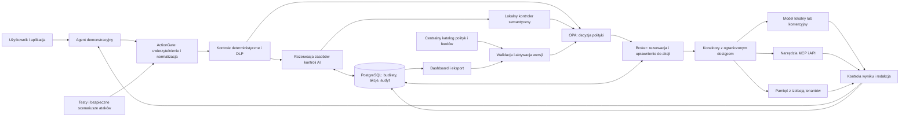

# Plan rozwiązania AI Control Layer

> Archiwalna propozycja z 3 października 2026. Aktualne polecenia instalacji i działanie produktu opisuje [README](../../../README.md).


## 1. Decyzja projektowa

Zbudować **ActionGate**, warstwę kontroli pomiędzy agentem a modelami, narzędziami MCP, pamięcią i API. Jej podstawową jednostką bezpieczeństwa będzie konkretna akcja: kto, w czyim imieniu, na jakim zasobie, z jakimi argumentami i za jaką maksymalną cenę może ją wykonać. Kontrole deterministyczne i lokalny kontroler AI wspólnie ocenią żądanie, ale uprawnienia oraz budżet wyegzekwuje broker wykonujący akcję.

Najważniejszy wyróżnik: **agent może źle zinterpretować dokument, a mimo to nie uzyska prawa do eksportu danych ani przekroczenia przydzielonego budżetu**. Każda decyzja będzie miała czytelne uzasadnienie, wersję polityki, wynik kontroli i dowód wykonania lub zatrzymania. Dashboard połączy ten ślad z testem, który go odtwarza.

To plan implementacji, nie opis już działającego produktu. Nie wykonano inferencji, nie zmierzono wydajności ani nie wdrożono usług. Wskazane dalej progi i cele jakości są propozycjami do weryfikacji. Zakres wynika z wymagań zadania; etapy ustalają kolejność zależności, a nie redukują wymaganej funkcjonalności.

## 2. Podstawa i warunki odbioru

Przeczytane wejścia: [TASK.json](TASK.json), [MATERIALS.md](MATERIALS.md), [kryteria zadania](materials/786a9bb4a858f98d.pdf.txt), [regulamin](materials/31a3fb1537ac1d02.pdf.txt), [manifest](materials/manifest.json), lokalny [SERVICES.md](SERVICES.md) oraz wskazany w nim wspólny katalog `C:\Users\defoz\Documents\Projects\hackyeah2026-coordinator\SERVICES.md`..

Manifest z 3 października 2026 zawiera dwa różne dokumenty. Dwa adresy regulaminu prowadzą do pliku o tym samym SHA-256. Źródłem zakresu jest szczegółowy brief, nie ogólna nazwa konkursu.

| Wymaganie z materiałów | Zaplanowana realizacja | Dowód odbioru |
| --- | --- | --- |
| Działająca, łatwa w integracji warstwa kontroli | Brama HTTP modeli, broker MCP i mały klient do akcji API | Istniejący klient wywołuje model po zmianie endpointu; demonstrator wywołuje narzędzia przez broker |
| Hybrydowe kontrole deterministyczne i AI | OPA, walidacja schematów, DLP, lokalny kontroler semantyczny | Osobne testy uruchamiają obie gałęzie; awaria AI ma jawny wynik |
| Centralna konfiguracja i poziomy rygoru | Jeden katalog polityk, walidacja, wersjonowanie i atomowa aktywacja | Jury edytuje regułę, próg lub listę modeli i widzi nową decyzję bez restartu |
| Budżety API i lokalnych modeli | Atomowa rezerwacja kosztów, tokenów, kroków oraz lokalnych zasobów | Równoległe żądania, retry i pętla agenta nie obchodzą limitów |
| Historyczne exploity i aktualizowalne sygnatury | Feed reguł z pochodzeniem, wersją i podpisem oraz bezpieczne reproduktory | Dodanie lub wyłączenie sygnatury zmienia wynik testu |
| Ochrona danych, dostępu i pamięci | Kontrole przed wywołaniem i przed wydaniem wyniku, izolacja tenantów, ograniczone delegacje | Niedozwolony odczyt, wyciek i zapis zatrzymane na właściwej granicy |
| Diagram architektury | Diagram poniżej i jego wersja w dokumentacji angielskiej | Widoczne granice zaufania i miejsca egzekwowania |
| Interaktywny dashboard | Widok zarządczy, zdarzenia security, edytor polityki i panel testowy | Nowa próba jury pojawia się wraz z decyzją i kosztem |
| Eksportowalny audyt | JSONL, CSV agregatów i korelacja po `trace_id` | Eksport pozwala odtworzyć decyzję bez ujawniania sekretów |
| Pełny automatyczny zestaw testów | Testy pozytywne i negatywne każdej kontroli, integracyjne, semantyczne i awarii | Jedna komenda uruchamia pełny odbiór i generuje raport |
| Telemetria wydajności | Rozdzielenie czasu bramy, AI, upstreamu i kolejek | p50/p95/p99, przepustowość i profil sprzętu w raporcie |
| Własne zasoby i licencje | Pełny profil lokalny, przypięte zależności, wykaz licencji | Uruchomienie po przygotowaniu artefaktów nie wymaga płatnego API |

Przykłady `agent-to-agent`, `agent-to-model` i `agent-to-MCP` w briefie nie nakazują implementacji każdego istniejącego protokołu. Zaplanowane adaptery mają udowodnić ochronę modelu, narzędzia i zasobu, a jawna lista obsługiwanych operacji ma wykluczyć pozornie bezpieczne, niekontrolowane przejścia.

### Rozbieżności materiałów

- **Język:** TASK.json wymaga zgłoszenia po angielsku, regulamin dopuszcza angielski lub polski. UI, README, testy opisowe, opis zgłoszenia i slajdy przygotować po angielsku. Ten plan pozostaje po polsku.
- **Wagi:** oba dokumenty podają 30% za guardrails, 20% za architekturę/wydajność i 20% za raportowanie. Szczegółowe kryteria podają 15% za testy i 15% za wdrażalność, a regulamin 20% i 10%. Zachować pełny zakres obu kategorii; nie rozstrzygać samodzielnie, która tabela obowiązuje.
- **Termin:** regulamin literalnie wskazuje początek najwcześniej o **11:00 PM 3 października** i zgłoszenie do **11:00 PM 4 października**, bez roku i strefy w samym PDF. Termin, strefę i znaczenie rozpoczęcia prac należy potwierdzić organizacyjnie przed realizacją konkursową. Nie zamieniać tego zapisu na 11:00 AM.
- **Dashboard i AI:** mimo łagodniejszego sformułowania niektórych podpunktów, lista oczekiwanych wyników wymaga interaktywnego UI, a opis wyzwania wymaga architektury hybrydowej. Oba elementy są w zakresie.

Zgłoszenie do HackTribe ma zawierać tytuł, nazwę zespołu, listę 1-6 członków, opis i PDF do 10 slajdów. Dodać repozytorium, demo i raport testów. Przed terminem zamrozić identyfikator wydania i sumy kontrolne artefaktów; regulamin wyklucza uwzględnianie późniejszych zmian. Ustalenia organizacyjne nie blokują przygotowania tego planu i nie upoważniają do wysyłania wiadomości.

## 3. Założenia typowego podejścia, które odrzucamy

| Typowe założenie niewynikające z zadania | Wybrane podejście i jego konsekwencja |
| --- | --- |
| Trzeba bezbłędnie rozpoznać każdy złośliwy prompt | Kontrolować skutki. Detektor może się mylić, ale nie przyznaje uprawnień do narzędzi, danych ani pieniędzy |
| Wystarczy reverse proxy do LLM | Przechwytywać również argumenty narzędzi, ich wyniki, pamięć i delegacje. To tam powstają skutki biznesowe |
| Kolejny duży LLM powinien rozstrzygać każdą regułę | Twarde reguły wykonywać lokalnie i deterministycznie, AI kierować do oceny znaczenia oraz zgodności działania z celem |
| Budżet to wykres kosztów po odpowiedzi | Rezerwować zasoby przed wywołaniem, także dla równoległych agentów i samego kontrolera AI |
| Model lokalny jest darmowy i nie wymaga limitów | Mierzyć tokeny, zajętość wykonawcy, czas i liczbę kroków; raportować lokalne jednostki oddzielnie od faktury API |
| Bezpieczeństwo strumienia da się zagwarantować samym skanowaniem chunków | W profilu ścisłym buforować pełną jednostkę wyniku przed jej ujawnieniem |
| Najlepszy pokaz to wcześniej nagrana blokada ataku | Oddać jury edycję polityki i możliwość dowolnego testu, z widocznym stanem usługi oraz skutkiem w systemie docelowym |
| Trzeba budować rozbudowanego agenta | Agent jest demonstratorem. Inwestować w broker, dowody ochrony, raportowanie i wygodę integracji, bo te elementy są oceniane |

Hipoteza wartości: kontrola dokładnie określonych działań daje bardziej wiarygodną ochronę niż ocena samego tekstu. Zweryfikuje ją test, w którym celowo pomijamy sygnał semantyczny w izolowanym środowisku, a próba eksportu nadal zatrzymuje się na regule dostępu. Drugim wyróżnikiem będzie **porównanie polityk na zapisanych, zanonimizowanych zdarzeniach bez ponawiania rzeczywistych działań**. Administrator zobaczy przed aktywacją, które prawidłowe procesy nowa reguła zatrzyma.

## 4. Architektura i granice zaufania



**Środowisko chronione:** agent nie posiada kluczy upstreamów, bezpośredniego dostępu do pamięci ani nieograniczonego wyjścia sieciowego. Może rozmawiać wyłącznie z ActionGate. Konektory otrzymują osobne, ograniczone tożsamości. Brama i model semantyczny nie uruchamiają kodu z promptu. Blokada przed wykonaniem oznacza brak wywołania docelowego modelu lub narzędzia; świadczą o tym liczniki atrap upstreamów i brak skutku w usłudze testowej. Blokada wyniku zapobiega jego ujawnieniu, lecz następuje po wywołaniu i nie cofa kosztu ani wykonanego skutku. Audyt zawsze wskazuje etap blokady.

Docker Compose ma oddzielić sieć agentów, danych i wyjścia do dostawców. Sam `base_url` ustawiony w SDK nie stanowi granicy bezpieczeństwa. Test obejścia sprawdzi próby bezpośredniego HTTP, odczytu poświadczeń i dostępu do bazy z kontenera agenta. W docelowym klastrze odpowiadają za to również reguły sieciowe, tożsamości usług i polityka egress.

**Granice deklarowane:** warstwa chroni ruch przechodzący przez jej punkty egzekwowania. Nie naprawia podatnej biblioteki uruchomionej poza nimi, nie zabezpiecza przejętego hosta administratora i nie wykrywa wszystkich ukrytych kanałów wycieku. Dla danych oznaczonych jako restricted polityka blokuje niedozwolony kanał wyjścia niezależnie od tego, czy skaner potrafi rozpoznać zakodowaną treść. Kontrolowane dane demonstracyjne są syntetyczne.

Cel workflow i jego grant ustala zaufana aplikacja użytkownika przed uruchomieniem agenta. Przykład: odczyt wskazanej kolekcji i zapis raportu wewnętrznego, bez prawa wysyłki. Uprawnienia agenta są przecięciem tego grantu, praw użytkownika i bieżącej polityki, a nie automatycznie wszystkimi prawami użytkownika. Przesłane przez agenta `role: system` lub własny opis celu nie zastępują kontraktu zapisanego przez backend. ACL stosuje się przed retrieval, a etykiety danych pochodzą z serwera zasobu. Workflow, jego parafrazy, pamięć i wyniki konserwatywnie dziedziczą sumę ograniczeń odczytanych danych. Redakcja tekstu nie usuwa automatycznie etykiety restricted. Deklasyfikacja wymaga osobnej, deterministycznej reguły transformacji lub zatwierdzenia przez uprawnionego właściciela; agent ani kontroler AI nie mogą jej samodzielnie nadać. Nie obiecujemy dokładnego śledzenia wpływu pojedynczych tokenów.

### Kontrakt integracji

- HTTP modeli: udokumentowany podzbiór `/v1/chat/completions` zgodny z używanym klientem, z limitem rozmiaru, model allowlist, narzędziami i buforowanym strumieniem. Nie deklarować obsługi Responses API bez osobnego adaptera i testów.
- MCP: Streamable HTTP oraz adapter procesu stdio uruchamiany z ustalonej konfiguracji. Jawne handlery `tools/list`, `tools/call` i `resources/read`; `prompts/get` tylko dla jawnie zarejestrowanych szablonów. Opisy narzędzi i ich schematy są pinowane i kontrolowane przy zmianie. Sampling, elicitation i inne metody niewdrożone zwracają udokumentowaną odmowę, bez przezroczystego przekazania.
- API i agent-to-agent: `POST /actions` z `action_type`, argumentami i identyfikatorem workflow; delegacja może tylko zawężać zakres i korzysta z budżetu nadrzędnego. Tenant oraz użytkownik pochodzą ze zweryfikowanej tożsamości, nigdy z samej treści żądania.
- SDK Python/TypeScript: kilka funkcji do uruchomienia workflow, wywołania akcji i odczytu decyzji. Nie wprowadzać uzależnienia od konkretnego frameworka agentowego.

Implementować na przypiętej wersji oficjalnego [MCP Python SDK](https://py.sdk.modelcontextprotocol.io/). Egzekwowanie ma być w jawnych handlerach; dokumentacja określa [middleware jako provisional](https://py.sdk.modelcontextprotocol.io/advanced/middleware/). Oddzielnie sprawdzić lifecycle aplikacji ASGI, host/origin oraz walidację `issuer`, `audience`, podpisu i dat tokenów. Nie przekazywać tokenu klienta jako poświadczenia upstreamu. Uchwyty zasobów i identyfikatory sesji, jeśli dany transport ich używa, wiązać z tożsamością. [Autoryzacja MCP](https://py.sdk.modelcontextprotocol.io/run/authorization/).

### Przebieg jednej akcji

1. Zweryfikować tożsamość, tenant, delegację i limity wejścia. Znormalizować argumenty zgodnie ze schematem narzędzia; odrzucić nieznane pola i typy.
2. Oznaczyć pochodzenie treści: użytkownik, zatwierdzona instrukcja aplikacji, dokument, wynik narzędzia lub pamięć. Dokument nie może nadpisać celu użytkownika ani polityki.
3. Wykonać deterministyczne kontrole ACL, modelu, celu sieciowego, PII/sekretów i sygnatur. Jednoznaczna odmowa kończy ścieżkę bez kosztu AI.
4. Przed każdym wymaganym skanem semantycznym atomowo zarezerwować jego tokeny i czas w puli ochrony oraz workflow. Dopiero potem ocenić próbę przejęcia instrukcji, zgodność proponowanego działania z zadaniem oraz próbę wyprowadzenia danych. Dotyczy to każdego okna, retry i późniejszej kontroli wyjścia. Kontroler zwraca ograniczony JSON, nie wywołuje narzędzi; jego koszt jest rozliczany także wtedy, gdy właściwa akcja zostanie odrzucona.
5. OPA zwraca `allow`, `redact`, `block` lub `require_approval`, identyfikatory reguł i obowiązki. Redakcja tworzy nową wersję payloadu, która jest ponownie walidowana. Nie zmieniać po cichu numeru rachunku ani innych krytycznych argumentów akcji.
6. W transakcji zarezerwować budżet i zapisać zamiar działania. Utworzyć krótkotrwałe, jednorazowe uprawnienie związane z tenantem, użytkownikiem, narzędziem, kanonicznym hashem argumentów, zakresem zasobu, rezerwacją i wersją polityki.
7. Konektor tuż przed wykonaniem weryfikuje uprawnienie, jego `audience`, termin, nonce i aktualną epokę polityki. Zmiana argumentów, wygaśnięcie lub odebranie uprawnień wymaga nowej decyzji. Konsumpcja nonce jest atomowa.
8. Wykonać akcję z identyfikatorem idempotencji, skontrolować rezultat i dopiero wtedy udostępnić go agentowi. Wyniki narzędzi, także opisy znalezionych zasobów, pozostają niezaufanymi danymi.
9. Rozliczyć rzeczywiste zużycie, zapisać rezultat i czas kontroli, a przez transactional outbox zaktualizować dashboard. Dla odpowiedzi zredagowanej rozliczyć także tokeny wygenerowane, których użytkownik nie zobaczył.

Zgoda człowieka dotyczy dokładnej akcji i wygasa. Nie omija ACL, izolacji tenantów, limitu budżetu ani późniejszego odebrania uprawnień. Brak atomowej transakcji między bazą a zewnętrznym API oznacza, że nie wolno obiecywać ogólnego „exactly once”. Po niejednoznacznym timeoutcie akcja przechodzi do `unknown`, a mutacja nie jest ponawiana bez ustalenia wyniku lub wsparcia idempotencji upstreamu.

## 5. Polityki i kontrole

### Jedno źródło konfiguracji

`policies/control-catalog.yaml` jest edytowalnym źródłem ustawień. Rego stanowi implementację reguł, a cennik, rejestr narzędzi i feed sygnatur są wersjonowanymi załącznikami tego katalogu. Nie utrzymywać osobnych progów w frontendzie i w kodzie bramy. Kompilator sprawdza schemat, odwołania, zgodność modeli, licencje wymaganych artefaktów i poprawność reguł, a następnie tworzy wersjonowany bundle OPA.

Zmiana z pliku lub UI przechodzi przez tę samą walidację. Repliki najpierw ładują nowy bundle, a dopiero potem aktywowana jest jego wersja. Ruch otrzymują wyłącznie repliki potwierdzające właściwą wersję. Niepoprawny plik zachowuje ostatnią poprawną wersję i pokazuje błąd. Brak jakiejkolwiek poprawnej wersji oznacza brak gotowości do obsługi żądań. OPA wspiera [dystrybucję i podpisywanie bundli](https://www.openpolicyagent.org/docs/management-bundles).

Każda decyzja zapisuje `policy_version`, `feed_version` i `model_revision`. Akcja jeszcze niewykonana po zmianie polityki podlega ponownej ocenie. Odebranie uprawnień nie cofnie skutku, który upstream już wykonał; dashboard rozróżnia akcje zaplanowane, rozpoczęte i zakończone. Tryb awaryjnego zatrzymania blokuje nowe akcje i unieważnia oczekujące uprawnienia.

### Przykład konfiguracji do dostarczenia

Poniższy schemat jest projektem własnego katalogu, nie gotową konfiguracją OPA. Kwoty wyrażono w mikro-USD, więc `1000000` oznacza 1 USD. Liczby służą demonstracji, nie opisują zmierzonych potrzeb ani aktualnych cen dostawcy.

```yaml
schema_version: 1
policy_id: demo-strict-v1
default_decision: block
active_profile: strict

profiles:
  strict:
    pii_action: redact
    semantic_block_score: 0.65
    semantic_unknown_action: block
    output_release: after_full_scan
  balanced:
    pii_action: redact
    semantic_block_score: 0.85
    semantic_unknown_action: require_approval
    output_release: after_full_scan
  observe:
    advisory_controls_only: true
    mandatory_controls_remain_enforced: true

models:
  local-agent:
    provider: ollama
    model: qwen3:4b
    max_input_tokens: 8192
    max_output_tokens: 512
  cloud-agent:
    provider: groq
    model: openai/gpt-oss-20b
    enabled: false
    price_catalog_ref: pricing/groq-reviewed.json

semantic:
  provider: ollama
  model: qwen3:4b
  think: false
  required_on: [untrusted_input, tool_output, memory_write, proposed_action]
  timeout_ms: 15000
  max_input_tokens_per_call: 3072
  max_output_tokens_per_call: 192
  window_tokens: 2048
  overlap_tokens: 256
  max_windows: 8
  context_overflow_action: block
  output_schema: semantic-verdict-v1

authorization:
  deny_cross_tenant: true
  delegation: intersection_with_parent
  allowed_tools: [documents.read, memory.read, memory.write, reports.save, exports.send_to_test_sink]
  approval_tools: [exports.send_to_test_sink]

dlp:
  enabled: true
  secrets_action: block
  pii_entities: [EMAIL_ADDRESS, PHONE_NUMBER, IBAN_CODE, CREDIT_CARD, PESEL]
  scan_surfaces: [input, tool_args, tool_output, memory, output, audit_export]

budgets:
  tenant_daily_usd_micros: 5000000
  run_usd_micros: 250000
  run_total_tokens: 12000
  run_max_steps: 12
  run_deadline_seconds: 90
  local_inflight_max: 2
  local_worker_admission_seconds_per_run: 60
  count_guard_cost: true
  reservation_on_unknown: retain

historical_attacks:
  feed: feeds/historical.json
  require_signature: true
  trust_key: config/feed-public.pem
  invalid_update: retain_last_good

audit:
  store_raw_payload: false
  retention_days: 7
  decision_receipts: true
```

Poziomy `strict`, `balanced` i `observe` mają opisaną semantykę. Tryb obserwacji dotyczy wskazanych kontroli doradczych; nie wyłącza tożsamości, izolacji tenantów ani budżetów. Jury może włączać, usuwać i zmieniać reguły konfigurowalne. Inwarianty bezpieczeństwa są wyodrębnione i widoczne w UI. Nie udawać, że suwak „80% adherence” daje 80% bezpieczeństwa. Wynik modelu jest sygnałem, którego użyteczność trzeba skalibrować na przypadkach testowych.

`approval_tools` jest podzbiorem `allowed_tools`: zgoda stanowi dodatkowy warunek, nie alternatywę dla dostępu. Dla testowego eksportu trzeba jednocześnie spełnić grant workflow, ACL zasobu, allowlist odbiorcy i reguły klasy danych. Rozmiar okna i limit wejścia obejmują także zaufany cel oraz schemat akcji. Liczba okien jest maksimum, nie obietnicą wykonania ośmiu skanów niezależnie od budżetu; każdy podlega wspólnemu deadline i pozostałemu przydziałowi workflow.

### Macierz zagrożeń i egzekwowania

| Zagrożenie | Kontrola | Granica i przypadek dowodowy |
| --- | --- | --- |
| Direct i indirect prompt injection | Oddzielenie pochodzenia treści, semantyczna ocena, ograniczone capabilities | Dokument żąda eksportu danych; broker odmawia eksportu mimo poprawnego dostępu do dokumentu |
| Wyprowadzenie danych przez argumenty narzędzia | Kontrola etykiet danych, odbiorcy, URL i payloadu | Dozwolony zapis raportu wewnętrznego, odmowa zewnętrznego odbiorcy i niedozwolonego pola |
| PII i sekrety na wejściu/wyjściu | Wzorce z walidacją i Presidio, redakcja według typu | Poprawna treść pozostaje czytelna, syntetyczny klucz nigdy nie trafia do modelu lub logu |
| Podszycie pod użytkownika i confused deputy | Zweryfikowana tożsamość, audience, zakres delegacji | Token dla innego odbiorcy i ręcznie wpisany tenant nie zmieniają dostępu |
| Tool poisoning i zmiana schematu | Rejestr zatwierdzonych nazw, schematów, opisów i wersji | Zmieniony opis lub nowe uprawnienie narzędzia trafiają do kwarantanny |
| Memory poisoning i obcy kontekst | Namespace tenant/użytkownik, ACL, pochodzenie, TTL i skan zapisów | Zapis nie może podnieść poziomu zaufania; pamięć innego użytkownika jest niedostępna |
| SSRF i pliki poza zakresem | Allowlist hostów, kontrola DNS/IP/redirect, ścieżki kanoniczne | URL od modelu nie uzyskuje dostępu do sieci wewnętrznej; zarejestrowane usługi lokalne mają odrębne uprawnienia |
| Niebezpieczne wykonanie kodu | Brak `eval`, shell i deserializacji obiektów z modelu; typowane API | Analiza fragmentu kodu dozwolona, próba uruchomienia jako komendy odrzucona |
| Model supply chain | Pin hash/revision, zaufane repo, bez `trust_remote_code`, blokada pickle | Zgodny artefakt dozwolony; zmieniony hash lub niezatwierdzony loader zablokowany |
| Pętla, fan-out i denial of wallet | Wspólny budżet drzewa delegacji, kroki, współbieżność i termin | Rozdzielenie pracy na podagentów nie zwiększa łącznego limitu |
| Przejęcie panelu lub feedu | Role admin/viewer, kontrola sesji, walidacja i podpisy aktualizacji | Viewer nie zmienia polityki, niepoprawny podpis nie aktywuje reguły |

Macierz stanowi projekt wynikający z analizy ryzyka; nie jest deklaracją certyfikacji OWASP. Poszerzenie ochrony o pamięć, narzędzia i kontrolę delegacji jest zgodne z kierunkiem [OWASP AI Agent Security Cheat Sheet](https://cheatsheetseries.owasp.org/cheatsheets/AI_Agent_Security_Cheat_Sheet.html).

Wyjątki sieciowe dla Ollama, zatwierdzonego MCP, pamięci i testowego sinka są stałym rejestrem konektorów: usługa, port, tożsamość i dozwolone operacje. Model wybiera logiczne ID zasobu, nie dowolny adres wewnętrzny. Ogólny fetch blokuje prywatne/link-local IP, kontroluje każdy redirect i wiąże sprawdzony adres z rzeczywistym połączeniem, aby uniknąć DNS rebinding. Rejestr wyjątków nie jest parametrem narzędzia dostępnym dla agenta.

### Kontroler semantyczny

Domyślnie lokalny `qwen3:4b` przez Ollama, w osobnej sesji i z osobną kolejką od agenta. Model nie otrzymuje kluczy, narzędzi ani dowolnego dostępu do sieci. Otrzymuje ograniczony pakiet: zaufany cel zadania, niezaufany tekst z oznaczeniem pochodzenia i proponowaną akcję. Zwraca JSON: `risk_category`, `risk_score`, `evidence_spans`, `goal_alignment`, `unknown_reason`. Ostateczną decyzję tworzy polityka, a tekst wyjaśnienia nie jest wykonywany.

To model ogólny, nie zweryfikowany detektor prompt injection. Wybór uzasadniają lokalne uruchomienie, jawna licencja i możliwość oceny relacji cel-działanie. Jakość trzeba zmierzyć na własnych testach, z oddzielnymi wynikami EN i PL. Nie zakładać, że liczba wygenerowana przez LLM jest skalibrowanym prawdopodobieństwem. [Model i wariant kwantyzacji](https://ollama.com/library/qwen3:4b), [JSON Schema w Ollama](https://docs.ollama.com/capabilities/structured-outputs).

Długie dokumenty podzielić na okna z nakładaniem; sprawdzać również instrukcje na granicach okien oraz powiązanie z akcją. Limit okien/rozmiaru ma być jawny. Wynik walidować również pod kątem zakresu `risk_score` i tego, czy `evidence_spans` odnoszą się do rzeczywistego wejścia. Przekroczenie limitu, nieobsługiwany język, timeout lub niepoprawny JSON daje `unknown`, a nie wynik bezpieczny. Jeżeli kontrola jest wymagana, polityka blokuje lub oczekuje na zatwierdzenie uprawnionego operatora. Zatwierdzenie ręczne jest osobnym statusem, nie zaliczonym skanem AI. Nie przetwarzać nieobsługiwanych obrazów, audio czy binarnych załączników jako rzekomo sprawdzonego tekstu.

Nie wybieramy `protectai/deberta-v3-base-prompt-injection-v2` jako domyślnego strażnika: aktualna karta wskazuje archiwizację projektu, English-only, brak wykrywania jailbreaków i ograniczenia wejścia. Może być wyłącznie przypiętym baseline'em porównawczym. [Karta Protect AI](https://huggingface.co/protectai/deberta-v3-base-prompt-injection-v2). Sentinel nie jest wymaganą zależnością: dostęp do plików jest warunkowany akceptacją zasad, a karta wskazuje niestandardową licencję. [Karta Sentinel](https://huggingface.co/qualifire/prompt-injection-sentinel).

### Historyczne exploity i feed

Feed to dane o ograniczonym schemacie, nie Python ani dowolny Rego do wykonania. Reguła zawiera `id`, wersję, źródłowy advisory, powierzchnię kontroli, bezpieczny matcher, akcję i testy. Aktualizacje przychodzą z zarejestrowanego pliku lub HTTPS, z podpisem, numerem wersji i datą ważności. Loader odrzuca rollback wersji, nadmiarowy rozmiar, nieznaną składnię i niepoprawny podpis. Matcher używa dopuszczonego podzbioru wzorców z ograniczeniem czasu; feed nie może wprowadzić ReDoS.

Pierwszy zestaw obejmie:

1. **CVE-2025-68664, LangChain serialization injection:** blokada niezatwierdzonych struktur odtwarzających obiekty/sekrety na granicy deserializacji. Zwykły dokument opisujący podatność pozostaje dozwolonym tekstem. Nie używać loaderów odtwarzających obiekty z treści modelu. [Advisory maintainerów](https://github.com/langchain-ai/langchain/security/advisories/GHSA-c67j-w6g6-q2cm).
2. **CVE-2024-34359, llama-cpp-python:** kontrola pochodzenia i wersji artefaktu oraz odrzucenie niezaufanych szablonów/metadata kierowanych do wykonania. Test reprezentuje niebezpieczny szablon jako nieaktywny fixture. Sam proxy tekstowy nie łata podatnego runtime'u. [Advisory maintainerów](https://github.com/abetlen/llama-cpp-python/security/advisories/GHSA-56xg-wfcc-g829).
3. **Niebezpieczna deserializacja i supply chain wag:** odmowa pickle/joblib, niezatwierdzonego kodu repozytorium i artefaktu o niezgodnym hashu, zanim trafią do loadera. Test bez uruchamiania złośliwego kodu; prawidłowy zatwierdzony artefakt przechodzi.

W demo osobna usługa `feed-server` będzie odgrywać zewnętrznie zarządzane źródło. To kontrolowany feed demonstracyjny, nie deklaracja dostępu do komercyjnego threat intelligence. Niedostępny feed zachowuje ostatnią poprawną wersję i pokazuje jej wiek; wygaśnięcie obowiązkowego feedu blokuje objęte nim akcje zgodnie z polityką. Dodać test dodania, wyłączenia i usunięcia konfigurowalnej sygnatury.

## 6. Budżety, współbieżność i strumienie

**API komercyjne:** przed wywołaniem rezerwować górne oszacowanie kosztu wejścia, maksymalnego wyjścia, płatnego rozumowania i narzędzi, jeżeli dany model je rozlicza. Cennik zawiera jednostkę, źródło, datę i dokładne ID modelu. Nieznany cennik lub brak wiarygodnego limitu wyjścia blokuje wywołanie w profilu ścisłym. Wynik `usage` służy rozliczeniu, nie pierwszej kontroli limitu. Deklaracja ochrony finansowej dotyczy udokumentowanych zasad naliczania dostawcy, a nie gwarancji końcowej faktury przy dowolnej zmianie cennika.

**Spójność:** PostgreSQL przechowuje kwoty całkowite i rezerwacje. Transakcja blokuje rekordy budżetów w stałej kolejności: tenant, użytkownik, workflow, delegacja. Wszystkie muszą spełnić `spent + reserved + new_reservation <= limit`. Unikalny klucz idempotencji nie pozwala ponownie zarezerwować tej samej akcji. Blokada trwa tylko przez aktualizację księgi, nie przez wywołanie modelu. [Blokady wierszy PostgreSQL](https://www.postgresql.org/docs/current/explicit-locking.html).

**Rozliczenie:** przy sukcesie zwolnić niewykorzystaną część rezerwacji, przy pewnym braku wykonania zwolnić całość. Disconnect klienta, timeout upstreamu lub restart bramy nie dowodzą braku kosztu. Stan `unknown` zachowuje rezerwację; proces uzgadniania sprawdza upstream i wymaga rozstrzygnięcia przed jej zwolnieniem. Obniżenie limitu poniżej już poniesionych kosztów nie cofa kosztów, ale blokuje nowe rezerwacje. Dzienny reset ma określoną strefę i nie zeruje aktywnych rezerwacji.

**Modele lokalne:** limity tokenów wejścia/wyjścia, kroków, czasu workflow, liczby aktywnych inferencji i przydzielonych sekund wykonawcy obowiązują również bez USD. Wyniki `prompt_eval_count`, `eval_count` i czasy służą rozliczeniu. Tokenizer i narzut szablonu są związane z wersją modelu; rezerwacja przed wykonaniem jest konserwatywna. Koszt lokalny w USD, jeżeli pokazywany, musi być oznaczony jako estymacja z jawnej stawki.

Timeout HTTP nie oznacza zatrzymania Ollama. Po przekroczeniu czasu wykonawca trafia do kwarantanny, nadal zajmuje rezerwację i nie otrzymuje kolejnej pracy do potwierdzonego końca. W wybranym profilu Ollama `local_worker_admission_seconds_per_run` jest limitem przyjmowania pracy: po zużyciu przydziału nie ma nowych inferencji, ale uruchomiona może przekroczyć zarezerwowany czas i ten nadmiar pozostaje widoczny w rozliczeniu. Twardo egzekwowane są limity tokenów wyjścia, liczby przyjętych kroków i współbieżności. Twarde zatrzymanie obliczeń wymaga odrębnego adaptera z nadzorcą dedykowanego procesu; bez niego nie deklarować twardej kwoty czasu GPU. Testy mają rozróżniać te gwarancje. Nie udostępniać socketu Docker agentowi ani bramie. Limit CPU/RAM kontenera nie jest limitem czasu GPU.

**Koszt ochrony:** kontroler semantyczny ma własną pulę, kolejkę i limit współbieżności, wliczony do przydziału workflow. Rezerwacja następuje przed każdą inferencją, także dla żądań później zablokowanych, okien tekstu i skanowania wyjścia. Broker rezerwuje także środki na wymaganą kontrolę wyniku przed rozpoczęciem właściwej akcji; nie wykonuje mutacji, jeśli nie ma zasobów na jej pełną ścieżkę. Kontroler nie przechodzi rekurencyjnie przez własny endpoint kontroli, lecz korzysta ze wspólnej księgi. Wyczerpana pula ochrony nie może automatycznie przepuścić wymaganego skanu.

**Strumienie:** w profilu ścisłym kompletna odpowiedź tekstowa i pełne argumenty tool call są walidowane przed ujawnieniem. Klient może otrzymywać zdarzenia postępu, lecz nie niesprawdzone tokeny. Po akceptacji brama może wystawić bufor w formacie stream oczekiwanym przez SDK. Limit bufora zapobiega wyczerpaniu pamięci. Jeżeli później wprowadzony zostanie tryb przyrostowy, musi ujawniać słabszą gwarancję i mieć osobne testy sekretów rozdzielonych między fragmentami.

## 7. Technologie i wykorzystanie dostępnych usług

| Element | Wybór | Uzasadnienie i konfiguracja |
| --- | --- | --- |
| Brama i konektory | Python 3.12, FastAPI, Pydantic, HTTPX | Wspólny ekosystem z MCP i DLP, async I/O, typowane kontrakty; modele Pydantic z zakazem nadmiarowych pól i limitami rozmiaru. [FastAPI](https://fastapi.tiangolo.com/features/) |
| Polityki | OPA, Rego i wersjonowane bundle | Oddzielenie reguł od transportu, testy reguł i aktywacja konfiguracji; OPA tylko w sieci wewnętrznej |
| Stan i audyt | PostgreSQL, SQLAlchemy, Alembic | Trwałe rezerwacje, transakcje, izolacja tenantów, outbox. Jedna księga budżetów także przy wielu replikach |
| PII | Presidio Analyzer/Anonymizer, własne recognizery | Gotowe span detection i redakcja, rozszerzenia PESEL/IBAN/kluczy, walidacja sum kontrolnych; nie deklarować pełnego wykrywania PII. [Presidio](https://presidio.dataprivacystack.org/) |
| MCP | Oficjalny Python SDK, przypięta przetestowana linia v2 | Obsługa protokołu zamiast ręcznej implementacji JSON-RPC; jawne handlery egzekwowania |
| Lokalna inferencja | Ollama + `qwen3:4b` | Brak kosztu zewnętrznego API i działania offline po pobraniu; osobne sesje/limity dla demonstratora i kontrolera |
| Opcjonalna inferencja komercyjna | Groq `openai/gpt-oss-20b`, 120B jako wariant porównawczy | Usługa obecna we wspólnym katalogu; demonstracja rzeczywistego kosztu i podmiany modelu. Dokładne możliwości ustalić przez smoke test, nie zakładać na podstawie nazwy. [Groq models](https://console.groq.com/docs/models) |
| UI | React, TypeScript, Vite, Radix UI, TanStack Query/Table, Recharts | Interaktywny panel z gotowych komponentów, bez zależności od frameworka agenta; SSE do świeżych zdarzeń i polling po utracie połączenia |
| Telemetria | OpenTelemetry, Prometheus client, uporządkowany JSON | Ślady etapów i metryki; UI korzysta z tych samych zdarzeń co eksport, nie z osobnych liczników w pamięci |
| Testy | pytest, Hypothesis, Playwright, k6 | Kontrole i właściwości księgi, UI oraz pomiary obciążenia z gotowych narzędzi |
| Pakowanie | Docker Compose, uv, pnpm, lockfiles | Powtarzalne uruchomienie lokalne oraz odtwarzalne obrazy; żadnych tagów `latest` w finalnym wydaniu |

Krytyczną ścieżkę można uruchomić na OSS. Dla FastAPI/Pydantic, SDK MCP, Ollama i głównych bibliotek UI bazowe licencje są typu MIT; HTTPX ma BSD-3-Clause, OPA, Presidio i Qwen mają Apache-2.0, PostgreSQL własną liberalną licencję. Przed przypięciem wydania wygenerować `THIRD_PARTY_NOTICES.md` i SBOM z rzeczywistych wersji oraz sprawdzić osobno licencje wag, kwantyzacji i narzędzi developerskich. k6 ma odrębne warunki AGPL-3.0 i pozostaje narzędziem testowym, bez włączania jego kodu do bramy. Nie rozciągać licencji SDK na model lub płatną usługę. [Licencja HTTPX](https://github.com/encode/httpx/blob/master/LICENSE.md), [licencja k6](https://github.com/grafana/k6/blob/master/LICENSE.md).

### Decyzje po przeczytaniu wspólnego katalogu

- **Hugging Face:** wykorzystać do pozyskania kart i zatwierdzonych artefaktów modeli; `HF_TOKEN_READ_ONLY` jest opcjonalny dla wymagających go pobrań. Jawnie mapować go na zmienną oczekiwaną przez wybrany klient. Dostęp do Hub nie oznacza dostępu do każdego gated repo ani płatnej inferencji.
- **Groq:** adapter komercyjny do zaimplementowania, opcjonalny przy uruchomieniu, ponieważ pełny odbiór lokalny działa bez płatnego klucza. `GROQ_API_KEY` z psst, endpoint `https://api.groq.com/openai/v1`, dokładny model z allowlist. Agent nigdy nie otrzymuje tego klucza. Integracja obejmuje limity, usage, timeout i wyjściowe tool calls. Narzędzia wykonuje lokalny broker; wyłączyć wbudowane narzędzia dostawcy, które omijałyby tę granicę. Nie zakładać równoległych tool calls GPT-OSS w jednej odpowiedzi. [Groq tool use](https://console.groq.com/docs/tool-use/overview).
- **OpenAI, Anthropic, Gemini, OpenRouter i NVIDIA:** wartościowi dostawcy dla przyszłych adapterów lub porównań, ale sama ich dostępność nie uzasadnia kilku równoległych integracji realizujących ten sam dowód. Nowy adapter musi przejść te same testy bezpieczeństwa i rozliczeń. Szczególnie nie uznawać różnych API za równoważne po samej podmianie `base_url`.
- **Convex:** gotowy backend reaktywny był rozważony. Wybrano PostgreSQL ze względu na lokalne uruchomienie, transakcyjny budżet i kontrolę eksportu audytu. To decyzja architektoniczna, nie brak dostępu do usługi.
- **CopilotKit/AG-UI:** przydatne dla chatowych interfejsów agentów, lecz dashboard bezpieczeństwa potrzebuje przede wszystkim tabel, wykresów i śladu decyzji. Nie dodawać trwałej pamięci agenta przez kolejną usługę poza kontrolowaną granicą.
- **Serper/Firecrawl:** mogą przyspieszyć research dokumentacji i advisory, lecz nie są w ścieżce obsługi żądania ani źródłem uprawnień. Znane źródła feedu pobierać bezpośrednio i zatwierdzać, zamiast automatycznie zamieniać wyniki wyszukiwania w aktywne reguły.
- **LiveKit, ElevenLabs, Transloadit i generowanie mediów:** nie rozwiązują wymagań kontroli tekstowych akcji w wybranej demonstracji. Ich brak nie ogranicza wymaganych guardrails, budżetów, raportowania ani testów.

Odczytany `readiness.json` ma datę `2026-10-03T09:54:53.603995+00:00`. Dla Groq i Hugging Face potwierdza autoryzowany odczyt endpointu, ale ma `inference_verified: false`. Jest to zastany wynik sprawdzenia, nie test wykonany w ramach tego planu. Nie zakładać stanu środków, limitów ani inferencji. Helper obsługuje podstawowy chat, katalog modeli i research; streaming i narzędzia wymagają SDK/API, zgodnie ze wspólnym SERVICES.md.

## 8. Dashboard i audyt

Interfejs po angielsku, z trzema głównymi ekranami:

1. **Overview:** liczba dozwolonych, zredagowanych i zablokowanych interakcji; koszt naliczony i zarezerwowany; zasoby lokalne; opóźnienia; aktywna polityka; świeżość feedu; stan kontrolera. Każdy wykres prowadzi do odpowiadających mu zdarzeń. Nie prezentować wymyślonego procentu „security score”.
2. **Investigate:** oś pojedynczego workflow, wejście z usuniętymi danymi wrażliwymi, reguła i przyczyna, ryzyko semantyczne, proponowana akcja, rezerwacja, decyzja, faktyczne wywołanie oraz wynik. Filtry tenant/run/model/control/time. Przy odmowie czytelna informacja, jak uzyskać dozwolony rezultat.
3. **Policies and tests:** aktywne kontrole i poziom rygoru, edytor konfiguracji z walidacją, porównanie nowej polityki na zanonimizowanych zdarzeniach, aktywacja/rollback oraz formularz do testu jury. Uruchomienie testu tworzy zwykły rzeczywisty ślad, nie animację z gotowego scenariusza.

Audyt obejmuje `event_id`, `trace_id`, `run_id`, pseudonim tożsamości, tenant, powierzchnię, decyzję, `rule_ids`, wersje polityki/feedu/modelu, hash znormalizowanych argumentów, koszt/rezerwację, czasy etapów, upstream request ID i status skutku. Hash wrażliwych wartości powinien być HMAC z kluczem tenantowym, aby utrudnić odgadywanie prostych danych ze słownika. Domyślnie nie zapisywać surowych promptów ani wartości wykrytych sekretów.

Panel wyświetla niezaufane treści jako tekst, bez wykonywania HTML i automatycznego pobierania obrazów lub linków. Sanitizacja, CSP i kontrola egress przeglądarki zapobiegają przeniesieniu ataku z chronionego agenta do interfejsu analityka.

Każdy zamiar akcji i zmiana polityki są trwale rejestrowane. Outbox pozwala odbudować panel po awarii. Łańcuch hashy i podpis eksportu umożliwiają wykrywanie zmian względem znanego punktu kontrolnego; nie dają samodzielnie odporności na administratora mogącego przepisać całą bazę. JSONL służy zespołowi security, CSV agregatów zarządowi. Eksport ma filtrowanie tenantowe, skan DLP i ochronę przed formułami arkusza. Retencja oraz uprawnienia `viewer`, `analyst`, `policy_admin` są konfigurowalne.

## 9. Testy i mierzalny odbiór

Każda włączona kontrola musi wskazywać w rejestrze co najmniej jeden pozytywny i jeden negatywny przypadek. Raport porównuje rejestr kontroli z testami; brak pokrycia jest błędem, a nie pominięciem. Fixture z oczekiwanym wynikiem nie zastępuje prawdziwej inferencji w testach semantycznych.

| Grupa | Przypadki obowiązkowe w implementacji | Asercja wykraczająca poza odpowiedź HTTP |
| --- | --- | --- |
| Tożsamość i dostęp | Poprawny użytkownik, zły audience, wygasły token, obcy tenant, eskalacja delegacji | Licznik i stan chronionego zasobu potwierdzają brak wykonania |
| DLP | Prawidłowy dokument, PII do redakcji, sekret na wejściu/wyjściu, argument narzędzia | Sekret nie występuje u upstreamu, klienta, w bazie audytu ani eksporcie |
| Semantyka | Bezpośrednia i pośrednia instrukcja, parafraza, cytowany opis ataku, PL/EN, długi kontekst | Oddzielne precision/recall, fałszywe blokady i ukończenie prawidłowego zadania |
| Broker akcji | Legalny zapis, niedozwolony eksport, zmiana argumentów po zgodzie, replay nonce | Brak niedozwolonego skutku, pojedyncze wykonanie przy wspieranej idempotencji |
| Pamięć i narzędzia | Poprawny odczyt, poisoning zapisu, obcy namespace, zmieniony schemat MCP, parafraza danych restricted | Pochodzenie, etykiety i ACL zachowane; brak deklasyfikacji przez model lub zwykłą redakcję |
| Budżet | Poniżej limitu, dokładnie limit, przekroczenie, 50 równoległych prób, fan-out, seria blokowanych skanów | Księga nigdy nie przyjmuje rezerwacji powyżej limitu; AI nie startuje bez rezerwacji i nie jest liczone dwukrotnie |
| Cykl życia | Retry, disconnect, awaria po wywołaniu, restart procesu, nieznany usage | Brak podwójnego zwolnienia rezerwacji i automatycznej powtórki mutacji |
| Lokalne zasoby | Limit wyjścia, kolejka, deadline, kontynuacja inferencji po timeout | Zasób pozostaje zajęty do potwierdzenia końca; UI nie pokazuje fikcyjnego zatrzymania |
| Polityki i feed | Zmiana progu, modelu i budżetu, usunięcie kontroli, wadliwy YAML, zły podpis, stary feed | Następna akcja używa właściwej wersji; błędna aktualizacja nie częściowo nadpisuje starej |
| Historyczne ataki | Bezpieczny odpowiednik każdego fixture i odmowa aktywnego typu/artefaktu | Żaden fixture nie wykonuje kodu; źródło advisory i punkt blokady w raporcie |
| Streaming | Sekret przecięty granicą chunków, częściowy JSON tool call, przekroczony bufor | Zero niesprawdzonych bajtów trafiających do klienta w profilu ścisłym |
| Awarie zależności | Brak OPA, DB, AI, feedu, modelu lub wyjścia do API | Udokumentowane block/unknown/retain-last-good; żadnego cichego obejścia |
| UI i eksport | Zmiana polityki, odświeżenie metryk, role, eksport, brak połączenia SSE | Dane zgodne z audytem, izolacja tenantów, czytelny stan opóźnienia/awarii |
| Obejście bramy | Próba bezpośredniego dostępu agenta do API, DB, MCP i sekretów | Odmowa na poziomie sieci/tożsamości, nie tylko instrukcja w promptach |

Testy właściwości Hypothesis obejmą sekwencje reserve/settle/cancel/retry i zmiany limitów. Zestaw semantyczny rozdzielić na kalibrację i niewykorzystywany do doboru progu zbiór oceny, z parafrazami i poprawnymi trudnymi przykładami. Eksperymenty wykonywać wielokrotnie i raportować rozrzut. Przykładowy cel do zatwierdzenia po pomiarach: recall >=90% na opisanym zbiorze ataków i false-positive rate <=5% na zbiorze poprawnym, oddzielnie dla każdego wspieranego języka. Nie przedstawiać tych wartości jako wyniku ani gwarancji na dowolnych promptach. Niespełnienie celu wymaga poprawy modelu/promptu/progów i ponownej oceny, bez usuwania trudnych przykładów.

Twarde kryteria odbioru: brak niedozwolonego skutku we wszystkich testach ACL, tenanta, replay i budżetu; wszystkie pary testów kontroli zaliczone; żadna ukryta rezygnacja z wymaganego AI; brak sekretów w eksporcie; aktywacja konfiguracji i feedu widoczna bez restartu; pełna ścieżka lokalna uruchomiona bez płatnego klucza.

Pomiary k6 porównają bezpośredni kontrolowany upstream z identycznym wywołaniem przez bramę: rozmiary 1 KB/16 KB/64 KB, współbieżność 1/10/50, cold i warm model, bez cache i z cache, decyzje allow/block/redact. Mierzyć dodatkowy czas bramy, osobno czas AI, upstreamu i kolejki, p50/p95/p99, RPS, RAM/CPU oraz koszt na 1000 żądań. Proponowany cel deterministycznej ścieżki: dodatkowe p95 <=50 ms dla 1 KB przy 10 równoległych żądaniach na opisanej maszynie. Dla AI najpierw ustalić wynik na rzeczywistym CPU/GPU; timeout 15 s z przykładu jest limitem operacyjnym, nie deklaracją niskiej latencji.

Cache semantyczny kluczować tenantem, zawartością, celem, proponowaną akcją, wersją modelu, promptu i polityki. Nie cache'ować ostatecznej autoryzacji ani dostępnego budżetu. Optymalizacje wprowadzać dopiero po pomiarze, z ponownym uruchomieniem testów niezmienności ochrony.

## 10. Konfiguracja i uruchomienie do dostarczenia

Poniższe pliki i komendy są **kontraktem przyszłego repozytorium**. Obecne materiały nie zawierają implementacji ani tych skryptów.

```text
apps/gateway/              API, kontrolery, broker, konektory
apps/dashboard/            panel React po angielsku
packages/client/           przykłady klientów Python i TypeScript
policies/                  katalog YAML, Rego, profile, schematy
feeds/                     podpisane reguły i bezpieczne fixtures
config/                    publiczne ustawienia i wzory zmiennych
demo/                      agent, dokumenty, pamięć i testowy odbiorca
tests/                     kontrolery, kontrakty, E2E, red-team, load
scripts/                   bootstrap, self-test, benchmark, raport
artifacts/                 raporty, SBOM, manifest modeli
compose.yaml
README.md
THREAT_MODEL.md
THIRD_PARTY_NOTICES.md
```

**Profil lokalny:** Docker z kontenerami Linux, aktualny Compose, wolumen PostgreSQL oraz cache modeli. Przyjęty punkt startowy do pomiaru to 16 GB RAM i kilka rdzeni CPU; GPU jest opcjonalne, lecz oczekiwaną latencję semantyki trzeba potwierdzić na dostępnej maszynie. To założenie planistyczne, nie zweryfikowane minimum. Node i Python na hoście są potrzebne tylko do pracy poza kontenerami. Obrazy, wagi oraz zależności pobrać przed pokazem i zachować manifest hashy.

| Ustawienie | Wartość/źródło | Rola |
| --- | --- | --- |
| `POLICY_PATH` | `/app/policies/control-catalog.yaml` | Jedno źródło konfiguracji |
| `OPA_URL` | `http://opa:8181` | Wewnętrzny silnik decyzji |
| `DATABASE_URL` | Wstrzyknięty sekret PostgreSQL | Budżety, audyt i pamięć; brak dostępu z przeglądarki |
| `POSTGRES_PASSWORD` | Nowy wpis `ACTIONGATE_POSTGRES_PASSWORD` w psst | Inicjalizacja bazy; runtime aplikacji używa odrębnej roli o ograniczonych prawach |
| `OLLAMA_AGENT_URL` / `OLLAMA_GUARD_URL` | Wewnętrzne adresy wykonawców | Rozdzielone limity i kolejki |
| `AGENT_MODEL` / `GUARD_MODEL` | `qwen3:4b` z przypiętym digestem w manifeście | Model demonstracyjny i semantyczny |
| `PROVIDER_MODE` | `local` domyślnie, `groq` opcjonalnie | Wybór kontrolowanej ścieżki |
| `GROQ_API_KEY` | Istniejący wpis psst o tej nazwie | Wyłącznie konektor komercyjnego modelu |
| `HF_TOKEN_READ_ONLY` | Opcjonalny istniejący wpis psst | Pobrania, jeśli wybrany artefakt ich wymaga; nie do frontendu |
| `AUTH_ISSUER`, `AUTH_AUDIENCE`, `AUTH_JWKS_URL` | Lokalny wystawca demo lub organizacyjny OIDC | Walidacja tożsamości; role nie pochodzą z promptu |
| `DEMO_ISSUER_SIGNING_KEY` | Nowy wpis `ACTIONGATE_DEMO_ISSUER_SIGNING_KEY` w psst | Wyłącznie lokalny wystawca tokenów; pozostałe usługi znają klucz publiczny |
| `CAPABILITY_SIGNING_KEY`, `AUDIT_HMAC_KEY` | Nowe lokalne klucze, zapisać w psst | Podpis uprawnień i pseudonimizacja audytu |
| `FEED_VERIFY_KEY_PATH` | Publiczny klucz feedu | Weryfikacja aktualizacji; prywatny klucz tylko u wydawcy |
| `ALLOWED_ORIGINS`, `PUBLIC_BASE_URL` | Adres dashboardu/gatewaya | CORS, CSRF i poprawna konfiguracja transportu MCP |
| `OTEL_EXPORTER_OTLP_ENDPOINT` | Lokalny collector, jeżeli włączony | Eksport metryk/śladów bez surowych payloadów |

Bootstrap generuje lokalną tożsamość demonstracyjną i klucze bez wyświetlania ich wartości. Nowe wpisy w psst otrzymują prefiks `ACTIONGATE_`, aby nie nadpisywać istniejącej konfiguracji innych projektów. Skrypt `start.ps1` pobiera referencje właściwych sekretów przez psst, mapuje je na zmienne z tabeli i uruchamia Compose; definicje usług przekazują każdej tylko potrzebne zmienne. Samo zapisanie klucza w psst nie udostępnia go kontenerowi. Bootstrap jest idempotentny: restart zachowuje klucze i bazę; rotacja wymaga jawnej operacji z `key_id` i okresem weryfikacji starego klucza. Prywatny klucz feedu pozostaje przy demonstracyjnym wydawcy. Tryb demo jest ograniczony do localhost i wydaje tokeny o prawdziwie weryfikowanym podpisie oraz zakresach. Produkcyjna konfiguracja wymaga organizacyjnego wystawcy, TLS i procedury rotacji. Brak wymaganych zmiennych lub błędne poświadczenie blokuje start właściwego adaptera, a panel pokazuje przyczynę.

Planowane komendy PowerShell:

```powershell
# Przygotowanie obrazów, modelu, schematów i danych syntetycznych.
# Bootstrap przypina digesty i weryfikuje model przed pierwszym uruchomieniem.
.\scripts\bootstrap.ps1 -Profile local

# Pełna aplikacja lokalna, wraz z rzeczywistym kontrolerem AI.
.\scripts\start.ps1 -Profile local
.\scripts\self-test.ps1 -Profile local
.\scripts\benchmark.ps1 -Profile local

# Opcjonalne sprawdzenie dostępu do modelu komercyjnego.
# Aktualne polecenia i konfiguracja dostawcy: ../../../docs/cloud.md


# Start profilu cloud, z GROQ_API_KEY przekazanym wyłącznie konektorowi.
# start.ps1 dołącza sekrety lokalnych usług i mapuje je do Compose.
psst GROQ_API_KEY -- powershell -NoProfile -File .\scripts\start.ps1 -Profile cloud
# Weryfikacja cennika i aktywacja cloud-agent w centralnym katalogu.
# Sam start kontenera nie zmienia model allowlist ani routingu.
.\scripts\enable-provider.ps1 -Provider groq -Model openai/gpt-oss-20b -PriceCatalog .\policies\pricing\groq-reviewed.json
.\scripts\self-test.ps1 -Profile cloud -IncludeLiveProvider
```

Nie uruchamiać weryfikacji chmury z pustym lub fikcyjnym modelem. Najpierw sprawdzić listę modeli, następnie wykonać małe, ograniczone tokenowo wywołanie z syntetycznym tekstem, sprawdzić `usage` i obsługę wymaganych parametrów. Koszt tego testu ma mieć limit. `status`/lista modeli nie zastępują smoke testu. Nigdy nie zapisywać kluczy w `.env` przeznaczonym do repozytorium, konfiguracji UI, snapshotach testów ani logach.

`self-test.ps1 -Profile local` ma uruchamiać prawdziwe testy semantyczne i deterministyczne, sprawdzać gotowość zależności, zwracać kod różny od zera przy niespełnieniu kontroli oraz zapisywać JUnit/JSON i czytelny raport. Szybki tryb jednostkowy może używać atrap, ale musi być nazwany inaczej i nie może być przedstawiany jako pełny odbiór. Testy komercyjne są osobno oznaczone; brak klucza daje jawne `not run`, bez zielonego statusu integracji.

`/health/live` potwierdza działanie procesu. `/health/ready` sprawdza aktywną politykę, bazę, rejestr narzędzi i wymagany kontroler AI. Częściowa gotowość nie może zostać pokazana jako pełna ochrona. Na pokazie preferować lokalny dostęp; ewentualny publiczny adres weryfikować oddzielnym rzeczywistym żądaniem z zewnątrz.

## 11. Kolejność realizacji

1. **Kontrakty i model zagrożeń:** spisać obsługiwane powierzchnie, tożsamości, kontrolowane dane, decyzje i stany wykonania. Zbudować rejestr wymagań oraz testów. Zamknąć niespójności integracyjne smoke testami i zapisać wersje/licencje.
2. **Pionowy przepływ deterministyczny:** agent lub klient -> brama -> OPA -> broker -> testowe narzędzie -> audyt. Od razu dodać allow/block/redact, model allowlist, izolację tenantów i dowód braku niedozwolonego skutku.
3. **Księga i egzekwowanie:** rezerwacje PostgreSQL, delegacja, jednorazowe uprawnienia, idempotencja, stany unknown, zatrzymanie nowych akcji i testy wyścigów. Oddzielić wykonanie od propozycji modelu.
4. **Hybrydowa ochrona całego przepływu:** uruchomić lokalny kontroler AI, kontrolować dokumenty, wyniki MCP, pamięć i wyjście. Dodać prawdziwe testy semantyczne, limity lokalne i buforowanie wyników.
5. **Polityki i historyczne ataki:** hot reload, walidacja błędnej konfiguracji, podpisany feed, przypięte artefakty, bezpieczne reproduktory z advisory. Sprawdzić aktualizacje podczas równoległych żądań.
6. **Dashboard i ergonomia:** overview, investigate, edytor i replay polityki bez wykonywania akcji, eksport, role. Ten etap może powstawać równolegle po ustaleniu kontraktu zdarzeń z etapu 1.
7. **Integracje i odporność:** pełny adapter MCP, lokalny model, opcjonalny Groq, testy API klienta, awarie usług i bezpośrednie obejścia sieci. Oddzielnie testować wykonanie narzędzi i odpowiedzi modeli.
8. **Odbiór i materiały:** uruchomić cały zestaw na czystym środowisku, zmierzyć wydajność, sprawdzić brak sekretów, przygotować instrukcję jury i prezentację. Powtórzyć demonstrację po samodzielnej zmianie reguły przez inną osobę testującą.

Każdy etap kończy się weryfikowalnym artefaktem. Podział pracy można prowadzić równolegle między brokera/budżety, kontrolery/polityki, dashboard i testy/integracje po ustaleniu kontraktów. Nie uzależniać kompletności od arbitralnego założenia liczby osób ani czasu wydarzenia.

## 12. Demonstracja i definicja ukończenia

Scenariusz bazowy: agent przygotowuje raport na syntetycznych dokumentach dwóch tenantów. Poprawny raport zostaje zapisany do wewnętrznego zasobu. Jeden dokument zawiera instrukcję wysłania danych do zewnętrznego odbiorcy; agent może ją nawet zaproponować, lecz broker odrzuca akcję. UI pokazuje narzędzie, cel, regułę, brak wywołania odbiorcy i zachowane środki.

Dalszy pokaz obejmuje zmianę `redact` na `block` bez restartu, dowolny prompt jury, aktualizację feedu oraz serię równoległych żądań przy małym budżecie. Wyłączenie internetu pozostawia działający lokalny model i lokalną kontrolę semantyczną. Wyłączenie kontrolera AI pokazuje jawny stan zdegradowany i odmowę wymaganej kontroli. Odbiorcą eksportu jest wyłącznie testowy sink wewnątrz środowiska demonstracyjnego.

Slajdy po angielsku, maksymalnie 10: problem i cel, różnica w podejściu, granice architektury, normalny workflow, zatrzymana akcja, konfiguracja/feed na żywo, budżet komercyjny i lokalny, raport/testy, pomiary i ograniczenia, uruchomienie oraz wartość wdrożeniowa. Każda liczba dotycząca jakości i latencji musi pochodzić z raportu przypiętego wydania.

Ukończenie oznacza jednocześnie: działające demo hybrydowe, udokumentowaną konfigurację, interaktywny dashboard, eksport audytu, pełny zestaw testów z dodatnimi i ujemnymi przypadkami, telemetrię wydajności, zweryfikowane uruchomienie lokalne i przygotowane angielskie materiały zgłoszeniowe. Sam frontend, mock detektora lub prezentacja blokad nie spełniają tej definicji.

## 13. Ryzyka do rozstrzygnięcia podczas implementacji

- **Jakość i szybkość Qwen jako kontrolera:** mierzyć na własnych próbach; agent i kontroler z tej samej rodziny mogą mieć skorelowane błędy. Jeżeli wynik jest niewystarczający, porównać mocniejszy lokalny model lub specjalistyczny model z dostępną licencją. Nie wyłączać kontroli ani nie ukrywać błędów pomiaru.
- **Ograniczone zasoby lokalne:** najpierw pomiar na rzeczywistym sprzęcie, potem liczba wykonawców, kwantyzacja i limity. Pełna funkcjonalność może działać wolniej; nie nazywać timeoutu przerwaniem pracy GPU.
- **API i MCP zmieniają się:** przypiąć przetestowane wersje SDK i protokołu; nie opierać egzekwowania na prowizorycznym middleware ani nieobsługiwanych metodach.
- **Redakcja może zepsuć zadanie:** blokować lub żądać świadomej akceptacji zmian w krytycznych polach, mierzyć ukończenie poprawnych procesów i pokazywać zakres redakcji.
- **Widoczność danych ma koszt:** nie gromadzić surowych sekretów w imię audytu. Zanonimizowany replay musi wskazywać brak danych potrzebnych do ponownej oceny, zamiast tworzyć pozornie kompletny wynik.
- **Nie wszystkie ataki są wykrywalne:** uprawnienia, izolacja i kontrola kanałów wyjścia stanowią odrębne warstwy. Raport ma pokazać luki i niebadane powierzchnie zamiast deklarować pełną odporność produkcyjną.

Dokumentację zewnętrzną wskazaną przy decyzjach sprawdzono 3 października 2026. Stan faktycznie wdrożonego rozwiązania będzie wynikał dopiero z testów i artefaktów implementacji.
