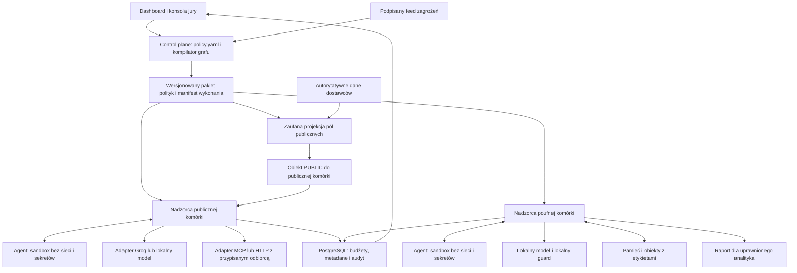

# FlowLock: plan warstwy kontroli przepływu danych agentów

Plan rozwiązania zadania **AI Control Layer**. Data opracowania: 3 października 2026. Dokument opisuje projekt do wykonania, a nie działającą implementację ani wyniki pomiarów. Zakres obejmuje wszystkie wymagane mechanizmy, testy, raportowanie i materiały zgłoszeniowe.

## 1. Koncepcja i różnica względem wcześniejszych kierunków

**FlowLock kontroluje, co może stać się z danymi po ich przeczytaniu przez agenta.** Centralny katalog polityk jest kompilowany do reguł przepływu, planu izolacji i ograniczeń zasobów. Rozproszeni nadzorcy wykonania egzekwują te reguły poza procesami agentów. Dokumenty, wyniki modeli, pamięć i komunikaty między agentami zachowują informację o poufności oraz pochodzeniu.

Przykład: agent analizuje poufne umowy dostawców, zapisuje podsumowanie w pamięci, a drugi agent próbuje wysłać jego parafrazę albo zakodowaną wersję do zewnętrznego API. Wynik nadal jest poufny, nawet jeśli nie zawiera rozpoznawalnego numeru konta ani słowa z dokumentu. System blokuje przepływ, pozwala dokończyć analizę lokalnie i udostępnia raport uprawnionemu odbiorcy. Osobny, zatwierdzony program może przygotować publiczny widok wybranych pól źródłowych.

| Kierunek z SUMMARIES.md | Główny mechanizm | Istotna różnica FlowLock |
| --- | --- | --- |
| A | Brama przechwytująca komunikację z modelami, MCP, API i pamięcią | Kontrola wynika z grafu przepływu, etykiet całego wykonania i izolacji agentów. Centralny serwer polityk nie przenosi wszystkich danych biznesowych. |
| B | Broker jednorazowych uprawnień związanych z argumentami akcji | Agent nie otrzymuje jednorazowego uprawnienia do akcji. Po odczycie poufnych danych jego późniejsze wyjścia dziedziczą ograniczenia, także przez pamięć i kolejnych agentów. |
| C | Transakcja autoryzacji, rezerwacji, wykonania i rozliczenia | Podstawową jednostką ochrony jest przepływ informacji przez cały proces. Kompilator odrzuca niedozwolone ścieżki przed uruchomieniem, a nadzorcy pilnują dynamicznych zależności podczas pracy. |

Autoryzacja, rachunek kosztów i audyt pozostają koniecznymi elementami wspólnymi. Nie są tezą wyróżniającą projekt. Odmienność ma być widoczna w działającym demonstratorze, a nie tylko w nazwach komponentów.

## 2. Materiały i warunki zadania

Podstawą są [TASK.json](TASK.json), [MATERIALS.md](MATERIALS.md), [szczegółowe wymagania](materials/786a9bb4a858f98d.pdf.txt), [regulamin](materials/31a3fb1537ac1d02.pdf.txt) i [SUMMARIES.md](SUMMARIES.md). Przed doborem integracji przeczytano lokalny [SERVICES.md](SERVICES.md), wskazany w nim wspólny katalog `C:\Users\defoz\Documents\Projects\hackyeah2026-coordinator\SERVICES.md`, `Use-Service.ps1` oraz `.state/services/readiness.json`.

| Wymaganie | Realizacja i dowód odbioru |
| --- | --- |
| Łatwa integracja z agentami, LLM, MCP i API | Python SDK, protokół JSON-RPC i adaptery runtime; przykłady aplikacja-agent, agent-agent, agent-pamięć, agent-MCP i agent-model. |
| Jedno źródło konfiguracji | `policy.yaml`, schemat walidacji, wersjonowane pakiety polityk, ekran aktywnych wersji na wykonawcach. |
| Obrona deterministyczna i semantyczna | OPA, etykiety, ACL, walidacja schematów i DLP oraz rzeczywisty lokalny model klasyfikujący podejrzane treści. |
| Progi, Block/Redact, modele i budżety | Profile `strict`, `balanced`, `observe`; jawne progi, zachowanie przy awarii i limity w przykładowych politykach. |
| Zasoby komercyjne i lokalne | Wspólny licznik kosztów, tokenów i wywołań; oddzielne limity czasu CPU, czasu ściennego, RAM, procesów oraz liczby kroków. |
| Historyczne exploity i sygnatury | Aktualizowalny feed reguł; kontrola artefaktów modeli, wersji bibliotek, niebezpiecznych formatów i prób wykonania kodu. |
| Interaktywny dashboard i eksport audytu | Graf przepływów, aktywne kontrole, zagrożenia, koszty, stan ochrony, dziennik decyzji oraz eksport JSONL/CSV. |
| Kompletny automatyczny self-test | Testy pozytywne, negatywne, redakcji, budżetów, izolacji, awarii, regresji i rzeczywistego modelu semantycznego. |
| Diagram i dokumentacja uruchomienia | Diagram poniżej; docelowo angielskie README, instrukcja jury, konfiguracje i skrypty startowe. |
| Zmiany podczas demonstracji | Jury edytuje politykę, usuwa kontrolę, zmienia próg lub feed, wpisuje własny prompt i obserwuje decyzję oraz wersję konfiguracji. |

Rozbieżności źródeł pozostają jawne:

- Regulamin podaje wagi **30/20/20/20/10**, a szczegółowy opis **30/20/20/15/15** dla odporności, architektury, raportowania, testów i implementowalności. Projekt dostarcza dowody dla wszystkich pięciu kategorii; nie ogranicza testów na podstawie korzystniejszej interpretacji.
- `TASK.json` wymaga języka angielskiego, regulamin dopuszcza angielski lub polski. Interfejs demonstracyjny, README, raporty, opis zgłoszenia i prezentacja będą po angielsku. Ten plan jest po polsku.
- Regulamin literalnie wskazuje **11:00 PM 3 października** jako najwcześniejszy start i **11:00 PM 4 października** jako termin przekazania, bez strefy. Nie zamieniamy PM na AM. Harmonogram prac konkursowych wymaga potwierdzenia w oficjalnym kanale organizatora przed realizacją; plan nie stanowi rozstrzygnięcia tej niejasności.
- Pakiet zgłoszenia: tytuł, nazwa zespołu, lista 1-6 członków, opis i PDF do 10 slajdów; można dodać repozytorium, demo i zrzuty. Zgłoszenie przez HackTribe; dwie fazy oceny. Wymagany próg nagrody to minimum 50% punktów pierwszego etapu. Po terminie nie zmieniamy ocenianego wydania.
- Organizator nie dostarcza danych, sprzętu ani płatnych subskrypcji. Całość musi działać na własnym środowisku, także w wariancie lokalnym po wcześniejszym pobraniu zależności i wag.

## 3. Model ochrony

### 3.1. Dwa niezależne wymiary etykiet

Każdy obiekt otrzymuje w zaufanym magazynie: `tenant_id`, `object_id`, wersję, etykietę poufności, zbiór pochodzeń, dopuszczalny cel użycia i identyfikatory rodziców. Obiektami są również wyniki narzędzi, wiadomości, wpisy pamięci i wyniki generacji.

- Poufność: `PUBLIC < INTERNAL < CONFIDENTIAL < RESTRICTED` oraz dodatkowe compartmenty, np. `tenant:demo`, `procurement`.
- Zaufanie: pochodzenie z zatwierdzonego kodu/polityki jest odrębne od danych użytkownika, dokumentu internetowego, odpowiedzi MCP czy wygenerowanego tekstu. Niezaufane pochodzenia są sumowane. Parafraza przez LLM ich nie usuwa.
- Dostęp do danych wymaga właściwej tożsamości, tenant, celu użycia i clearance. Zapis lub wysłanie wymagają, aby odbiorca dopuszczał co najmniej poziom oraz compartmenty wyniku.

To **konserwatywne śledzenie całego kontekstu**, nie obietnica ustalenia źródła każdego tokenu. SDK może pokazywać etykiety dla wygody programisty, ale nie jest ich autorytatywnym źródłem.

Etykieta początkowa pochodzi z zarejestrowanego źródła danych i uwierzytelnionego procesu ingestu. Swobodny prompt użytkownika, upload i nieznany dokument domyślnie trafiają do domeny poufnej; ani napis `PUBLIC` w treści, ani brak trafienia DLP nie czynią ich publicznymi. Publiczny agent otrzymuje wyłącznie zatwierdzone obiekty PUBLIC i przygotowaną instrukcję workflow. Cały payload do dostawcy, łącznie z historią, promptem systemowym, opisami narzędzi i załącznikami, przechodzi tę samą kontrolę odbiorcy.

### 3.2. Etykieta całego wykonania i przepływy pośrednie

Nadzorca podnosi etykietę wykonania **przed** przekazaniem nowych bajtów do agenta. Od tej chwili wszystkie jego wyjścia dziedziczą sumę ograniczeń przeczytanych danych: tekst, argumenty, nazwy narzędzi, wybór odbiorcy, błędy, stdout, zapis do pamięci i komunikaty do innych agentów. Obejmuje to również sytuację, gdy sekret zmienia tylko wybór odpowiedzi.

Przejście odczytu i podniesienia etykiety jest synchronizowane z wyjściami. Rozpoczęcie poufnego odczytu czeka na zamknięcie wcześniejszych strumieni publicznych; podczas podnoszenia etykiety nie wolno równolegle publikować. Uruchomienia potomne dziedziczą etykietę i budżet rodzica. Czystą komórkę może utworzyć wyłącznie nadzorca z zatwierdzonego grafu, bez przekazania jej zanieczyszczonego kontekstu.

Identyfikator obiektu nie jest dowodem uprawnienia. Runtime sprawdza właściciela, tenant, etykietę, wersję, nadawcę i przeznaczenie przy każdym odczycie oraz przekazaniu. Podane przez agenta `label=PUBLIC` albo `role=admin` są ignorowane lub odrzucane.

### 3.3. Bezpieczne udostępnianie wyników

Redakcja PII usuwa wskazane dane, ale **nie odtajnia dowolnej wypowiedzi modelu**. Lokalny model semantyczny może eskalować, blokować lub wskazać fragmenty do redakcji; nie może przyznawać nowych uprawnień ani obniżać poziomu poufności.

Obniżenie etykiety wymaga jawnej funkcji zaufanej, np. `supplier_public_view_v1`. Funkcja czyta autorytatywne rekordy i kopiuje wyłącznie publiczne pola `supplier_name`, `country`, `public_category`. Nie przyjmuje dowolnego tekstu LLM. Jej implementacja, schemat wejścia/wyjścia i hash są częścią zatwierdzonego wydania.

Lista rekordów, kolejność i harmonogram udostępnienia są ustalane z uprawnionego żądania przed odczytem poufnych danych. Poufny agent nie może wybrać rekordu, warunku publikacji, nazwy pola ani momentu wysyłki, aby zakodować sekret. Błędy funkcji są normalizowane; szczegóły pozostają w chronionym audycie. W profilu referencyjnym nie ma dowolnych agregacji publicznych; dodanie agregatów wymaga osobnych reguł przeciw wnioskowaniu i zapytaniom różnicowym.

Publiczna projekcja jest niezależnym etapem nadzorcy z wcześniej wydzielonym budżetem. Powstaje i zostaje udostępniona przed rozpoczęciem poufnego workera. Jej publikacja nie zależy od wyniku, awarii, anulowania ani wyczerpania budżetu późniejszej analizy poufnej. Test porównuje publiczny wynik dla różnych sekretów, również gdy jeden przebieg poufny kończy się awarią.

Poufny raport może natomiast trafić bez odtajniania do uprawnionego analityka. To pełnoprawna ścieżka produktu, a nie zawsze blokowany demonstrator.

### 3.4. Granica zaufania

Chronimy przed prompt injection, błędnym lub złośliwym zachowaniem agenta, próbą podszywania się, zatrutą pamięcią, złośliwym opisem narzędzia, nieuprawnionym przepływem i przekroczeniem limitów. Niezaufane są prompty, dokumenty, pliki modeli, odpowiedzi narzędzi i dowolny kod uruchomiony w komórce agenta.

Zaufane elementy to nadzorca, kompilator i podpisywanie polityk, adaptery zasobów, kontrolowany magazyn, funkcje udostępniania oraz system izolacji hosta. Przejęcie hosta, administratora polityk lub klucza podpisującego jest poza tą granicą. Nie deklarujemy dowodu formalnej noninterference ani eliminacji wszystkich kanałów czasowych i sprzętowych; ograniczamy obserwowalne wyjścia i testujemy wskazane kanały aplikacyjne.

## 4. Architektura



### Komponenty i odpowiedzialności

1. **Control plane i kompilator.** Waliduje YAML i graf workflow, wykrywa niedozwolone ścieżki source-sink, nieznane modele, brak funkcji udostępniania i sprzeczne ograniczenia. Łączy zatwierdzone szablony Rego z konfiguracją danych. Generuje manifest sandboxów, schematy narzędzi i podpisany pakiet. Nie generuje kodu polityk przez LLM.
2. **Nadzorca na każdym hoście.** Program Go z osadzonym OPA; utrzymuje kontekst wykonania, otwiera sandbox i obsługuje ograniczony protokół JSON-RPC przez stdio. Decyzje lokalne nie wymagają rundy do centralnego serwera polityk. Wspólny stan budżetu i obiektów pozostaje jawnie zależny od bazy.
3. **Komórka agenta.** Python SDK ułatwia `model`, `read`, `write`, `call_tool`, `send` i `finish`. Kod może być niezaufany, ponieważ uruchamiamy go w gVisor, bez interfejsu sieciowego, kluczy, socketu Dockera i katalogów hosta. Root filesystem jest tylko do odczytu, katalog roboczy jednorazowy, capabilities usunięte, liczba procesów i zasoby ograniczone.
4. **Adaptery zasobów.** Niewielkie, zaufane implementacje Groq, Ollama, HTTP, MCP i pamięci. Model tylko proponuje użycie narzędzia. Adapter kontroluje docelowy zasób, schemat, uprawnienia, etykietę, budżet i wynik. Nie udostępniamy uniwersalnego `shell`, arbitralnego URL ani nieograniczonego SQL.
5. **DLP i guard semantyczny.** Lokalne usługi osiągalne wyłącznie przez nadzorcę. Mogą czytać materiał poufny; ich logi, cache i wyniki dziedziczą ten poziom. Guard nie ma narzędzi ani dostępu do Internetu.
6. **PostgreSQL.** Przechowuje obiekty i ich pochodzenie, polityki, historię aktywacji, przebiegi, liczniki budżetów i append-only audyt. Oddzielne role dla runtime, panelu i eksportu. Worker nie otrzymuje połączenia do bazy.
7. **Dashboard React.** Pobiera przefiltrowane dane z API i aktualizacje SSE. Warstwa prezentacji nie podejmuje decyzji bezpieczeństwa.

Topologia workflow jest statyczna lub wybierana z zatwierdzonego katalogu podgrafów. Dynamiczne dodanie dowolnej krawędzi wymaga ponownej walidacji. Pętle wewnątrz komórki są dozwolone w granicach kroków i budżetu. Kompilator sprawdza zadeklarowane typy przepływów; runtime pokrywa dane i zależności poznane dopiero podczas pracy.

MCP obsługuje lokalne stdio oraz zarejestrowane połączenia HTTP. Tożsamość aplikacji pochodzi z sesji, a tożsamość workloadu od nadzorcy. Dla HTTP sprawdzamy audience i przeznaczenie tokenu, a kredencjał odbiorcy nie jest tokenem dostarczonym przez agenta. Opisy i schematy narzędzi są przypięte do wersji/hash; zmiana wymaga rejestracji. Zdalny serwer MCP otrzymuje tylko dane dopuszczone dla jego sink. `sampling`, `elicitation`, resources i roots są domyślnie wyłączone; włączenie wymaga osobnej reguły oraz tych samych kontroli etykiet i budżetu. Deklaracja `readOnlyHint` nie nadaje uprawnienia. Lokalny niezaufany serwer MCP działa w odrębnym sandboxie, nie wewnątrz nadzorcy. Dziedziczy etykietę przetwarzanych danych, nie ma bezpośredniej sieci ani sekretów; niezbędne efekty realizuje zaufany adapter. [Podstawa zasad MCP](https://modelcontextprotocol.io/docs/2025-11-25/tutorials/security/security_best_practices).

Przykład planowanego API integracyjnego, którego implementacja i przykładowy agent są częścią dostawy:

```python
from flowlock import Runtime

async def review(runtime: Runtime):
    contracts = await runtime.read("supplier_contracts")
    report = await runtime.model("local", inputs=[contracts], task="summarize")
    await runtime.memory.put("draft", report)
    await runtime.send("analyst_report", report)
```

`Runtime` odczytuje tożsamość kanału od nadzorcy. Kod nie może wybrać własnego tenant ani zresetować etykiety. Zamiana ostatniego odbiorcy na `groq_public` daje odmowę na podstawie pochodzenia danych, nawet gdy treść raportu wygląda niewinnie.

## 5. Technologie, biblioteki i usługi

| Element | Wybór | Uzasadnienie i konfiguracja |
| --- | --- | --- |
| Zaufany runtime i API | Go, standardowe HTTP/JSON, OPA `github.com/open-policy-agent/opa/v1/sdk` | Jeden kompilowany proces na host, współbieżność i osadzony silnik polityk. Przygotowane reguły i lokalne decyzje ograniczają koszt kontroli. Wymagane podpisane bundle i explicit deny dla braku wyniku. |
| SDK i demonstrator | Python, oficjalny SDK MCP, Pydantic, HTTPX | Prosta integracja z agentami i walidacja komunikatów. Wersje blokowane w lockfile, JSON zamiast pickle. |
| Izolacja | Linux, Docker Engine, gVisor `runsc` | Egzekwowanie poza agentem. `--network=none` jest wymaganym ustawieniem; samo użycie gVisor nie blokuje sieci. Weryfikujemy konfigurację przy starcie. |
| Dane i audyt | PostgreSQL, SQL migrations | Transakcje i blokady do współbieżnych limitów; jeden magazyn dla pochodzenia danych, kosztów i audytu. Unikamy dodatkowego Redis i synchronizacji dwóch liczników. |
| Detekcja danych | Presidio analyzer/anonymizer, lokalne recognizery i regex w Go | Gotowa obsługa rozpoznawania/redakcji, uzupełniona deterministycznymi regułami sekretów, numerów kont i danych demonstracyjnych. Presidio nie jest gwarancją kompletnej detekcji. |
| Semantyka i poufny agent | Ollama, `qwen3:4b`, JSON Schema, wyłączone dodatkowe rozumowanie tam, gdzie API to obsługuje | Cały system działa bez płatnego API. Wynik guardu ma walidowany schemat i mały limit wyjścia. Jakość i progi wymagają ewaluacji na korpusie zadania. |
| Publiczny agent w wariancie online | Groq, `openai/gpt-oss-120b`, lokalnie wykonywane narzędzia | Model wymieniony we wspólnym katalogu, odpowiedni do interaktywnego demonstratora. Klucz `GROQ_API_KEY` z psst otrzymuje tylko adapter dostawcy. Brak automatycznego dostępu modelu do zdalnych narzędzi lub wyszukiwarki. |
| Interfejs | React, TypeScript, Vite, React Flow, TanStack Table, Recharts | Graf zależności, inspekcja zdarzeń i porównanie kosztów korzystają z gotowych komponentów. Wygląd podporządkowany dowodom ochrony. |
| Pomiary i testy | OpenTelemetry, Go tests/fuzzing, pytest, Hypothesis, Playwright, k6 | Wspólny trace między adapterami i kontrolami; testy właściwości etykiet, prawdziwych skutków, UI oraz narzutu. |

OPA udostępnia osadzanie w Go i mechanizm podpisanych bundle. Włączamy faktyczną weryfikację podpisu przy aktywacji; uruchomienie samego `opa test` nie dowodzi poprawności tego mechanizmu. [Integracja OPA](https://www.openpolicyagent.org/docs/integration), [podpisywanie i dystrybucja](https://www.openpolicyagent.org/docs/management-bundles).

gVisor wymaga Linuksa. Referencyjne wdrożenie używa Linux VM lub hosta Linux; Windows służy do edycji i uruchamiania skryptu sterującego. Docker Desktop bez sprawdzonego `runsc` nie jest równoważnym profilem ochrony. [Wymagania platformy](https://gvisor.dev/docs/user_guide/faq/), [sieć](https://gvisor.dev/docs/user_guide/networking/).

Ollama udostępnia `qwen3:4b` w wariancie Q4_K_M o rozmiarze około 2,5 GB; rozmiar pliku nie jest zapotrzebowaniem całego systemu na RAM. Lokalne API obsługuje JSON Schema w `format`; odpowiedź i tak walidujemy po odebraniu. [Model i licencja Apache-2.0](https://ollama.com/library/qwen3:4b), [structured outputs](https://docs.ollama.com/capabilities/structured-outputs).

Dokumentacja Groq potwierdza model 120B, cenę katalogową 0,15 USD / 1 mln tokenów wejścia i 0,60 USD / 1 mln wyjścia oraz brak równoległego tool calling dla tego modelu. To punkt startowy wersjonowanego cennika, nie dowód jakości ani osiągniętego opóźnienia. Obsługujemy sekwencyjne kroki narzędziowe i kontrolowaną współbieżność niezależnych przebiegów. [Modele i ceny](https://console.groq.com/docs/models), [narzędzia](https://console.groq.com/docs/tool-use/overview).

Z dostępnych integracji świadomie nie dodajemy Convex, CopilotKit Intelligence, Firecrawl, Serper, LiveKit ani Transloadit do ścieżki krytycznej. Dashboard i trwała pamięć mają działać lokalnie; automatyczny dodatkowy magazyn rozmów komplikowałby egzekwowanie etykiet. Research, głos i media nie realizują tutaj wymagania, które uzasadniałoby nowe uprawnienia i koszty. OpenAI/Anthropic/OpenRouter pozostają możliwymi przyszłymi adapterami tego samego kontraktu, bez wymogu wdrażania każdego dostawcy do pierwszego kompletnego rozwiązania.

Stan katalogu usług z `2026-10-03T09:54:53Z` potwierdzał autoryzowany odczyt Groq, ale zaznaczał `inference_verified: false`. Nie traktujemy obecności klucza ani listy modeli jako dowodu działającej inferencji. Podczas realizacji wykonujemy oddzielny krótki test API na syntetycznej treści, a rezultat zapisujemy z datą. Ten plan nie wykonywał płatnej inferencji.

Licencje: OPA i wskazany model mają Apache-2.0, Presidio MIT. Przed zamrożeniem wersji powstają `THIRD_PARTY_NOTICES.md` i SBOM z licencjami dokładnych wersji wszystkich bibliotek, obrazów oraz wag; weryfikacja obejmuje zależności, nie tylko nazwę głównego projektu. Aktualnym repozytorium Presidio jest Data Privacy Stack. [Licencja Presidio](https://github.com/data-privacy-stack/presidio/blob/main/LICENSE).

## 6. Kontrole i zachowanie przy atakach

| Ryzyko | Mechanizm | Przykład testu i obserwowalny efekt |
| --- | --- | --- |
| Prompt injection w dokumencie lub MCP | Odrębne pochodzenie instrukcji i danych, lokalny guard, brak wpływu danych na politykę | Dokument próbuje zmienić odbiorcę raportu; wskazana reguła blokuje transfer. |
| Wyciek przekształconego sekretu | Etykieta całego wykonania i sink clearance | Parafraza, Base64, odwrócenie tekstu lub wybór jednego z dwóch publicznych słów nadal nie trafiają do publicznego sink. |
| Podszywanie i eskalacja | Principal z sesji/hosta, tenant/purpose ACL, ograniczone efekty workflow | Podmiana `tenant_id`, roli lub referencji do obiektu nie daje dostępu; dozwolony odczyt tego samego tenant działa. |
| PII i sekrety | Regex, recognizery, Presidio, jawne tryby block/redact | Blokada klucza, zamazanie adresu e-mail; redakcja jest widoczna i nie zmienia samoczynnie klasy całego raportu. |
| Zatrucie pamięci i RAG | Etykiety zapisów, wersje, pochodzenie, izolacja tenant, ACL przy odczycie | Drugi agent dziedziczy ograniczenia zapisu; pamięć nie awansuje dokumentu do instrukcji systemowej. |
| Nadużycie narzędzi i uprawnień | Graf dozwolonych efektów i schematy, fixed recipient, minimalne konta adapterów | Narzędzie do szkicu raportu nie może usunąć pliku ani uruchomić płatności. |
| MCP tool poisoning lub zmiana schematu | Manifest narzędzi z hash, rejestracja zmian i skan opisu | Zmieniony opis/schemat nie jest automatycznie podawany agentowi; pojawia się kwarantanna wersji. |
| SSRF i wyjście bokiem | Brak sieci w sandboxie, allowlista endpointów adapterów, kontrola DNS/IP i każdego redirect | Próba loopback, metadata IP, DNS rebinding lub prywatnego adresu jest blokowana; dozwolony endpoint działa. |
| Niebezpieczny wynik w UI/API | Schematy, limit długości, escapowanie HTML, brak aktywnego HTML z modelu | Wynik przypominający skrypt jest tekstem; CSV neutralizuje komórki interpretowane jako formuły. |
| Runaway loop i kosztowny guard | Limity kroków, retry, czasu, tokenów i oddzielna kwota ochrony | Pętla kończy się wskazanym powodem, koszt guardu nadal jest widoczny. |
| Błędny albo niedostępny guard | Walidacja JSON, timeout, ograniczony retry, zamknięcie wymaganej ścieżki | Brak oceny nie jest wynikiem „bezpieczne”; profil observe pokazuje jawne odstępstwo. |
| Stream i logi jako kanał wycieku | Buforowanie chronionego wyjścia, kontrola przed publikacją, etykietowane logi | Żaden fragment zakazanego wyniku nie dociera do klienta przed decyzją. |
| Zatruty feed/polityka | Podpis, wersja, termin ważności, ograniczenia rozmiaru i parsera | Uszkodzony lub cofnięty feed nie zastępuje aktywnej konfiguracji. |

Katalog zagrożeń mapujemy do aktualnych materiałów [OWASP GenAI](https://genai.owasp.org/) i [OWASP Top 10 for Agentic Applications 2026](https://genai.owasp.org/resource/owasp-top-10-for-agentic-applications-for-2026/). Pokrycie oznacza przypisany mechanizm oraz test, nie deklarację zgodności z całym standardem.

Guard zwraca `{risk_score, category, evidence_spans}` zgodnie ze schematem; wynik `risk_score` nie jest skalibrowanym prawdopodobieństwem, dopóki nie potwierdzi tego ewaluacja. Treść do oceny pozostaje danymi, bez narzędzi i bez możliwości wykonywania instrukcji. Długie wejścia dzielimy na ograniczone okna z nakładką oraz sprawdzamy kontekst instrukcja-narzędzie-wynik. Wszystkie okna mieszczą się we wspólnym budżecie guardu. Nie wolno po cichu obciąć końca dokumentu i uznać całości za sprawdzoną: przekroczony rozmiar, budżet lub brak oceny fragmentu oznacza kwarantannę/blokadę wymaganej ścieżki. Limity obejmują także wielokrotne dekodowanie i rozpakowywanie.

### Historyczne exploity i feed

Feed jest danymi: identyfikator reguły, źródło/advisory, applicability, pakiet i zakres wersji, hash artefaktu, bezpieczny wzorzec lub ścieżka JSON, działanie, data ważności i wersja. Nie zawiera kodu uruchamianego w runtime. Regex ma ograniczenia złożoności; rozpakowywanie bundle ma limity i ochronę przed path traversal.

Pierwszy zestaw obejmuje:

1. **SSTI w metadanych modelu, CVE-2024-34359.** Feed blokuje rejestrację podatnego `llama-cpp-python` w wersjach wskazanych przez advisory. Loader nie wykonuje szablonów dostarczonych przez niezaufany artefakt. Test używa manifestu podatnej wersji i inertnego znacznika, bez uruchamiania podatnej biblioteki. Poprawiona wersja z dopuszczonym szablonem przechodzi. Nie przypisujemy tej podatności automatycznie do Ollama. [Advisory autora](https://github.com/abetlen/llama-cpp-python/security/advisories/GHSA-56xg-wfcc-g829).
2. **Niebezpieczna deserializacja.** JSON dla komunikatów; brak `pickle.load`, unsafe YAML, dynamicznego importu i automatycznej konwersji nieznanych wag. Artefakt pickle jest odrzucany przed ładowaniem; test wykonuje tylko statyczną inspekcję formatu. Zatwierdzony GGUF/safetensors jest przypięty do pełnego hash i czytany w izolowanym loaderze. Bezpieczny format nie zastępuje aktualizacji parsera. [Zasady Transformers](https://github.com/huggingface/transformers/security/policy).
3. **Podmiana modelu lub zależności.** Manifest wymaga identyfikatora, pełnego digest, dozwolonego źródła i wersji loadera. `trust_remote_code` pozostaje wyłączone; pull/install nie jest narzędziem agenta. Zamiana pliku przy tym samym tagu kończy się odmową startu.
4. **Próba wykonania kodu przez narzędzie.** Schematy nie udostępniają ogólnego interpretera. Testuje się odrzucenie niedozwolonego efektu i niemożność bezpośredniego połączenia z panelem infrastruktury z sandboxu.

Feed można pobrać z konfigurowalnego HTTPS albo zaimportować z pliku. Demonstrator zawiera niezależny serwis publikujący podpisane wersje feedu i klucz testowy. Jury może dodać regułę i zobaczyć aktywację. Produkcyjny klucz zaufania jest konfigurowany poza feedem; klucz demonstracyjny nie jest traktowany jako produkcyjny.

## 7. Budżety, wydajność i odporność

### Spójny rachunek kosztów

Limity są hierarchiczne: organizacja/tenant/dzień, użytkownik i workflow/run. Nadzorca atomowo wydziela budżet przebiegu ze wspólnego limitu; pracownicy korzystają z kontrolowanych podlimitów. Niewykorzystane środki wracają po zamknięciu przebiegu, nie po samym wygaśnięciu zegara. Każde faktyczne wywołanie otrzymuje unikalne ID do rozliczenia, a retry podlega temu samemu budżetowi.

Przed wywołaniem zewnętrznym odkładamy konserwatywny koszt maksymalny: wejście z narzutem protokołu według zweryfikowanego adaptera, maksymalne płatne tokeny wyjścia, uwzględnione tokeny reasoning i ewentualne stałe opłaty. Nie zakładamy rabatu cache. Jeśli nie znamy bezpiecznej górnej granicy, używamy limitu kontekstu albo odmawiamy w profilu strict. Po odpowiedzi rozliczamy raportowane usage. Brak usage lub zerwane połączenie zachowuje pełne obciążenie do uzgodnienia; nie uruchamia bezpłatnego retry.

Kwoty zapisujemy w całkowitych mikro-USD, według wersji cennika przypisanej do wywołania. Budżet obejmuje także guardy używające API, gdyby taki adapter został dodany. Gwarancja dotyczy ruchu przechodzącego przez kontrolowane adaptery i znanego cennika; panel rozróżnia wewnętrzny limit od niezależnego rachunku dostawcy. Kluczy tego samego projektu nie używa się poza kontrolowaną ścieżką, jeśli raport ma obejmować cały koszt projektu.

Transakcje PostgreSQL utrzymują niezmiennik `spent + reserved <= limit`, również przy wielu hostach. Awaria bazy blokuje nowe płatne operacje. Restart nie zeruje licznika. Nierozstrzygnięte wywołanie pozostaje obciążone; adaptery operacji zmieniających stan nie ponawiają go automatycznie, chyba że usługa ma sprawdzony kontrakt idempotencji.

Obniżenie limitu poniżej już wydanych i zarezerwowanych środków jest odrzucane podczas aktywacji polityki z pokazaniem aktualnych zobowiązań. Operator może osobno zamrozić nowe wydatki i anulować dalsze kroki, ale nie kasuje w ten sposób kosztów ani rezerwacji nierozstrzygniętych żądań. Test zmiany limitu obejmuje zarówno dozwolone obniżenie powyżej zobowiązań, jak i odmowę ustawienia niemożliwego limitu.

### Modele lokalne i zasoby

Ograniczamy równocześnie `max_steps`, tokeny, liczbę narzędzi, czas ścienny, cumulative CPU, RAM, liczbę procesów i współbieżność. Limity dotyczą procesu wykonującego inferencję, a nie tylko klienta HTTP. Referencyjny backend CPU ma własny proces/cgroup i pojedyncze aktywne żądanie; można zakończyć i odtworzyć proces po przekroczeniu limitu. Model może być wstępnie załadowany w puli przypisanej do tenant, bez współdzielonej historii rozmów.

Jeden slot inferencji oznacza instancję Ollama wraz ze wszystkimi procesami runnera w tym samym cgroup. Nadzorca przydziela kolejkę i najwyżej jedno żądanie na slot; guard i agent nie korzystają jednocześnie z jednego licznika. Profil referencyjny wymusza CPU. Watchdog kończy całe drzewo procesów, potwierdza ustanie obliczeń i dopiero wtedy ponownie udostępnia slot. `FLOWLOCK_OLLAMA_URL` wskazuje zarządzany endpoint tej puli, a nie dowolny współdzielony serwer bez możliwości przypisania zasobów.

Quota CPU ogranicza tempo zużycia; watchdog liczy zużycie skumulowane i kończy wykonanie. Raportujemy zmierzone opóźnienie przerwania oraz tolerancję, np. wynikającą z okresu próbkowania 100 ms i liczby rdzeni. Nie przedstawiamy quota jako dokładnego stopera. GPU to dodatkowy profil z limitem współbieżności, czasu i dedykowanym procesem serwującym; rezygnacja klienta nie jest dowodem zatrzymania obliczeń. [Mechanika limitów kontenerów](https://docs.docker.com/engine/containers/resource_constraints/).

Koszt lokalny jest prezentowany jako tokeny, CPU-sekundy, czas inferencji i szczyt RAM; opcjonalny koszt pieniężny ma jawnie skonfigurowaną stawkę. Nie udajemy, że lokalna inferencja jest bezkosztowa.

### Zmiana polityki i działanie po awarii

Pipeline: walidacja schematu, testy reguł, kompilacja grafu, podpis, staging na nadzorcach, potwierdzenie wersji, aktywacja. Runtime używa kompletnego snapshotu, bez mieszania reguł starej i nowej wersji. UI rozróżnia wersję oczekiwaną, pobraną i aktywną.

Nowa wersja obowiązuje od następnej kontrolowanej granicy. Podczas zaostrzenia polityki zatrzymujemy planowanie objętych przepływów, anulujemy zagrożone operacje w toku i ponownie sprawdzamy buforowane wyjścia przed publikacją. Nie cofamy danych już ujawnionych. Host bez aktualnego epoch/lease nie wykonuje nowych operacji zewnętrznych; po krótkim, konfigurowalnym TTL przechodzi w odmowę. Raport podaje okno propagacji, a nie obiecuje natychmiastowej atomowości całego rozproszonego systemu.

Usunięcie kontroli przez jury jest możliwe w uprawnionej konfiguracji i widoczne w audycie oraz stanie ochrony. Wyłączenie semantycznego detektora nie wyłącza automatycznie autoryzacji i przepływów. Usunięcie reguły IFC musi być jawnie opisane jako osłabienie ochrony. Niezmienną platformy pozostaje integralność tożsamości i niemożność samodzielnego edytowania polityki przez agenta.

Dopuszczamy pracę na ostatnim poprawnym, nieprzeterminowanym pakiecie podczas niedostępności control plane. Brak ważnego pakietu, wyczerpany lokalny spool audytu lub brak spójnego rachunku wymaganej operacji powodują zamknięcie odpowiedniej ścieżki.

Skalowanie polega na dodawaniu hostów z nadzorcami i pul modeli oraz partycjonowaniu pracy po tenant. Control plane i API panelu mogą mieć wiele bezstanowych replik. Lokalna ocena polityki skaluje się z workerami; PostgreSQL pozostaje jawnym miejscem koordynacji kosztów. Podlimity przydzielone przebiegom ograniczają częstotliwość blokowania globalnego licznika, ale nie mogą być wydane dwukrotnie po przejęciu pracy przez inny host. Audyt ma ograniczony bufor i backpressure. Cache decyzji obejmuje hash treści, tenant, etykiety i wersje polityki/guardu; nie współdzieli poufnych wyników między tenantami.

## 8. Przykładowa konfiguracja

Poniższy YAML jest projektem kontraktu do zaimplementowania, nie gotowym API istniejącej biblioteki. Przykładowe progi i limity są założeniami startowymi do kalibracji. Walidator odrzuca nieznane pola, niepełne manifesty i niepoprawne kombinacje.

```yaml
schema_version: 1
policy_id: flowlock-demo
version: 1
profile: balanced
default_decision: deny

identity:
  tenant_from: authenticated_session
  workload_from: supervisor
  purpose: supplier_review

flow:
  confidentiality: [PUBLIC, INTERNAL, CONFIDENTIAL, RESTRICTED]
  propagate_execution_context: true
  untrusted_sources: [user_text, retrieved_document, mcp_output, model_output]
  forbid_agent_label_override: true
  sinks:
    groq_public: {max_label: PUBLIC}
    local_model: {max_label: RESTRICTED, require_same_tenant: true}
    analyst_report: {max_label: CONFIDENTIAL, roles: [analyst]}
    public_report: {max_label: PUBLIC}
  releases:
    - function: supplier_public_view_v1
      manifest: artifacts/releases.lock.json
      source: supplier_registry
      selection_from: authenticated_request_before_sensitive_read
      fields: [supplier_name, country, public_category]
      target: public_report

models:
  public:
    provider: groq
    id: openai/gpt-oss-120b
    fallback: local
    max_output_tokens: 512
    provider_builtin_tools: false
  local:
    provider: ollama
    id: qwen3:4b
    manifest: artifacts/models.lock.json
    context_tokens: 4096
  semantic_guard:
    provider: ollama
    model_ref: local
    temperature: 0
    max_output_tokens: 256
    schema: schemas/guard-verdict.json

controls:
  secrets: {enabled: true, action: block}
  pii: {enabled: true, action: redact, preserve_label: true}
  semantic:
    enabled: true
    review_threshold: 0.45
    block_threshold: 0.75
    between_thresholds: quarantine
    timeout_ms: 30000
    max_input_bytes: 65536
    window_tokens: 768
    overlap_tokens: 128
    max_windows: 8
    incomplete_scan: block
    on_unavailable: block
  output: {buffer_before_release: true, max_bytes: 65536}
  memory: {tenant_isolation: true, preserve_provenance: true}

budgets:
  tenant_day_usd: "5.00"
  run_usd: "0.05"
  run_tokens: 12000
  guard_tokens: 3000
  max_steps: 12
  max_tool_calls: 8
  max_retries: 1
  max_parallel_calls: 2
  run_wall_seconds: 180
  local_cpu_seconds: 120
  local_memory_mib: 8192
  agent_memory_mib: 512
  agent_pids: 64
  pricing_file: config/pricing.yaml
  unknown_usage: charge_reserved_max

runtime:
  isolation: gvisor
  agent_network: none
  agent_filesystem: read_only
  policy_lease_seconds: 5
  audit_required: true

threat_feed:
  source: config/feeds/demo-feed.json
  trusted_key_file: config/keys/feed-public.pem
  verify_signature: true
  reject_rollback: true
  max_age_hours: 24
```

Profile są osobnymi, walidowanymi plikami overlay: `strict` blokuje PII zamiast redakcji i obniża próg semantyczny; `balanced` odpowiada przykładowi; `observe` rejestruje wyniki wybranych detektorów bez blokowania, wyłącznie w syntetycznej przestrzeni demonstracyjnej. Nie opisujemy observe jako chronionego wdrożenia. „Adherence 100%” oznacza, że wszystkie kwalifikujące się interakcje są kontrolowane, nie że klasyfikator ma 100% trafności. Nie próbkujemy obowiązkowych kontroli bezpieczeństwa.

## 9. Dashboard i audyt

Widok **Overview** pokazuje aktywną wersję, stan wykonawców, odsetek pokrytych interakcji, dopuszczone zadania, blokady/redakcje, opóźnienia, wydane i zarezerwowane środki, lokalne zużycie oraz koszt ochrony. Stan ochrony wynika z testowalnych warunków: aktualności polityki, działającego sandboxu, guardu, feedu i audytu. Nie tworzymy arbitralnego „security score”.

Widok **Data Flows** pokazuje graf pochodzenia i miejsca zmiany etykiety. Kliknięcie zablokowanej krawędzi wyjaśnia: jakie źródło narzuciło ograniczenie, jaki sink był celem, która reguła zadziałała i jaka bezpieczna ścieżka pozostaje dostępna. Management widzi metadane i agregaty, nie treści poufnych dokumentów.

Widok **Controls & Playground** pozwala uprawnionemu operatorowi zmieniać profile, progi, listę modeli i feed, sprawdzać konfigurację oraz uruchamiać własne przypadki. Wynik pokazuje efekt biznesowy, decyzje i koszty. Wynik odtwarzany z testowej fixture jest wyraźnie oznaczony.

Widok **Audit** filtruje tenant, run, kontrolę, model, wersję i decyzję. Zdarzenie zawiera czas, trace ID, zaufanego aktora, źródło i cel, etykiety, rule ID, powód, wersje polityki/modelu/feedu, status wykonania, usage, kwotę i czasy etapów. Dowód zawiera zredagowany fragment lub identyfikator, nie surowy prompt czy sekret. Zwykły hash niskoentropijnej treści też może ujawniać informacje; do korelacji stosujemy tenant-scoped HMAC, kiedy jest potrzebny.

Eksport JSONL służy zespołowi bezpieczeństwa; CSV pokazuje agregaty. Dostęp do eksportu wymaga roli i tego samego zakresu danych co UI. Dziennik jest append-only dla roli aplikacji, z sekwencją i hash-chain oraz okresowym podpisanym checkpointem zapisywanym oddzielnie. Opisujemy to jako wykrywanie części modyfikacji, nie nieusuwalny dziennik odporny na administratora hosta. Domyślna retencja demonstratora to 7 dni, konfigurowalna.

## 10. Kompletny zestaw testów

Każda zaimplementowana kontrola ma przynajmniej jeden test dozwolonego działania i jeden blokady lub redakcji. Sprawdzamy faktyczny wynik w odbiorniku, pliku, pamięci i liczniku wywołań, nie tylko pole `decision=deny`. Zewnętrzne efekty kierujemy do kontrolowanego lokalnego odbiornika.

| Grupa | Weryfikowane własności |
| --- | --- |
| Etykiety | Monotoniczność, join, compartmenty, kolejność odczytów, zmiana etykiety przed ekspozycją bajtów. |
| Przepływy pośrednie | Warunek zależny od sekretu, kodowanie, wybór odbiorcy/nazwy narzędzia, rodzic-potomek, stdout, wyjątek i log; identyczna projekcja publiczna mimo różnego zakończenia poufnej analizy. |
| Pamięć i wielu agentów | Zapis-odczyt-restart, agent A do B, podmiana object ID, cross-tenant, zatruty wpis nie staje się instrukcją. |
| Udostępnianie | Dozwolone pola źródłowe przechodzą, tekst LLM i selekcja zależna od sekretu są odrzucane, redakcja zachowuje etykietę. |
| Dostęp i MCP | Role, tenant, token audience, zmiana schema/hash, zły endpoint, dozwolone wywołanie z poprawnym wynikiem. |
| DLP | Sekret, PII, Unicode, długi tekst, poprawna redakcja; nieszkodliwe podobne ciągi i przykłady cytujące atak nie są automatycznie blokowane. |
| Semantyka | Rzeczywisty lokalny model: bezpośrednia i pośrednia injection, kontekst narzędzia, nieszkodliwe polecenia, parafrazy, PL/EN, niepoprawny JSON, timeout, atak na końcu dokumentu i na granicy okien. |
| Odporność przy pomyłce AI | Wymuszony fałszywie bezpieczny werdykt guardu nie pozwala ominąć IFC, ACL ani limitu budżetu. |
| Budżety API | Dokładna granica, równoległe rezerwacje na kilku workerach, retry, brak usage, restart, anulowanie, zmiana cennika i limitu w trakcie run. |
| Zasoby lokalne | Faktyczne zatrzymanie obliczeń, RAM, procesy, czas, pętla, koszt guardu, przeciążenie i kolejka. |
| Izolacja | Realny proces próbuje użyć sieci, plików hosta, env, obcego IPC i socketu kontenerów; zaufany nadzorca nadal realizuje dozwolony przepływ. |
| Exploity i feed | Podatny manifest, nieznany digest, pickle, szablon, rollback, uszkodzony podpis, nowa reguła oraz pozytywne kontrolne artefakty. |
| Hot reload | Zmiana progów, usunięcie kontroli, niepoprawny YAML, przerwany rollout, stary worker, blokada buforowanego wyniku po zaostrzeniu reguły. |
| UI i eksport | Kontrola odbiorcy, brak aktywnego HTML/formuły, brak surowych sekretów, poprawność agregatów, filtrowanie i read-back wersji polityki; nowe nieznane wejście z Playground nie trafia do Groq. |
| Buforowanie wyjścia | Sekret w ostatnim fragmencie strumienia, przekroczony limit bufora i niepełna ocena blokują całą publikację, bez wcześniejszego wypuszczenia prefiksu. |
| Awaria | Niedostępna baza/guard/control plane, pełny spool audytu, restart nadzorcy; żadna awaria nie zmienia się w domyślny allow. |

Hypothesis i fuzzing sprawdzają prawa etykiet i parsery na wielu wygenerowanych przypadkach. Korpus semantyczny zawiera oddzielny zbiór do kalibracji i niewidziany zbiór ewaluacyjny, a także przypadki dodawane przez jury. Raportuje precision/recall, fałszywe blokady i ukończenie dozwolonych zadań wraz z liczebnościami; brak wycieku w małym korpusie nie oznacza odporności na każdy prompt.

Planowane polecenia dostarczone z implementacją:

```bash
./scripts/test.sh fast
./scripts/test.sh full
./scripts/test.sh live-groq
./scripts/bench.sh
```

`fast` jest szybkim zestawem deterministycznym, z atrapą dostawcy dla błędów i rozliczeń. `full` uruchamia rzeczywistą izolację i lokalny model, nie wymaga płatnych kluczy i jest właściwym poleceniem dla jury. Brak wymaganych wag, `runsc` lub guardu daje błąd gotowości, nie zielony wynik z pominiętymi testami. `live-groq` jest odrębnym testem rzeczywistego adaptera na danych syntetycznych z małym limitem kosztu. Atrapy nie są dowodem działania płatnego API.

Wyniki: JUnit XML, raport HTML, pokrycie kontroli, manifest wersji, telemetryka JSON i przykładowy eksport audytu. Testy regresji są powtarzalne; model semantyczny nadal może dawać zmienne wyniki, więc raport zawiera parametry i wyniki powtórzeń.

Benchmark oddziela: kompilację i start sandboxu, rozgrzaną decyzję IFC/OPA, ledger, DLP, model guardu, model agenta oraz czas całego zadania. Mierzymy p50/p95/p99, przepustowość, CPU/RAM, czas aktywacji polityki i opóźnienie przerwania. Wstępny cel projektowy to p95 poniżej 10 ms dla samej rozgrzanej decyzji IFC/OPA; nie jest to deklaracja pełnej latencji ani wynik pomiaru. Porównanie używa tego samego workloadu, sprzętu, modelu i odpowiedzi testowego backendu. Guard ma osobny pomiar jakości i opóźnienia, bez ukrywania go w średniej.

## 11. Uruchomienie i konfiguracja środowiska

### Wymagane zasoby

Referencyjnie Linux x86_64 z Docker Engine, działającym `runsc`, cgroups i możliwością egzekwowania limitów. Punkt startowy do pomiarów: 8 vCPU, 16 GB RAM i 20 GB wolnego dysku. To budżet infrastruktury do potwierdzenia testem, nie zweryfikowane minimum. GPU nie jest wymagane. Obrazy, wersje bibliotek i pełne hashe modeli zostają przypięte; przygotowany cache umożliwia późniejsze uruchomienie bez Internetu.

Go, Node i Python są potrzebne do budowania; gotowe obrazy i binaria umożliwiają uruchomienie bez lokalnych kompilatorów. Wersje toolchainów zapisujemy w repozytorium oraz lockfile po sprawdzeniu zgodności. Nie pobieramy `latest` podczas demonstracji.

| Konfiguracja | Znaczenie i miejsce |
| --- | --- |
| `FLOWLOCK_POLICY_FILE` | Ścieżka do centralnego YAML, domyślnie `config/policy.yaml`. |
| `FLOWLOCK_PROFILE` | `local` lub `groq`; wybór backendu publicznego, bez wpływu na wymuszanie etykiet. |
| `FLOWLOCK_DATABASE_URL` | Osobna rola runtime do lokalnego PostgreSQL; sekret generowany podczas przygotowania środowiska. |
| `FLOWLOCK_POLICY_SIGNING_KEY_FILE` | Prywatny klucz control plane w chronionym pliku; publiczny odpowiednik u nadzorców. |
| `FLOWLOCK_FEED_PUBLIC_KEY_FILE` | Zakotwiczony klucz dostawcy feedu. |
| `FLOWLOCK_AUDIT_HMAC_KEY_FILE` | Klucz do bezpiecznej korelacji w audycie, odrębny od klucza podpisującego. |
| `FLOWLOCK_OLLAMA_URL` | Adres w prywatnej sieci usług; agent nie łączy się z nim bezpośrednio. |
| `FLOWLOCK_MODEL_MANIFEST` | Pełny hash modelu, wariant, parametry kontekstu, źródło i zatwierdzony loader. |
| `GROQ_API_KEY` | Istniejący wpis psst, tylko dla wariantu online i adaptera Groq. |
| `FLOWLOCK_AUTH_MODE` | Lokalny issuer z generowanymi tożsamościami demo lub OIDC dla wdrożenia współdzielonego. |
| `OIDC_ISSUER`, `OIDC_AUDIENCE`, `OIDC_CLIENT_ID` | Parametry integracji firmowej; konta analityka, administratora polityk i audytora mapowane po stronie API. |
| `VITE_API_BASE_URL` | Publiczny adres API dla UI, bez sekretów. |

Nowe hasła i klucze techniczne nie są rzekomo istniejącymi wpisami psst. Skrypt inicjalizacji tworzy je w chronionym lokalnym katalogu; trwałe sekrety zapisuje się w psst, a pliki wymagane przez usługi powstają przy starcie z ograniczonym dostępem. Nie trafiają do YAML, repozytorium, obrazu, parametrów URL ani logów. Runtime uruchamia sandbox z nową, minimalną listą zmiennych środowiskowych, bez dziedziczenia sekretów nadzorcy.

Planowane skrypty mają wykonać kolejno:

1. `prepare.sh`: sprawdzenie hosta i `runsc`, pobranie przypiętych obrazów/wag w fazie przygotowania, zapis manifestów i licencji, wygenerowanie lokalnych kluczy oraz bazy testowej.
2. `up.sh --profile local`: start bazy, lokalnego modelu, DLP, control plane, nadzorcy i UI; migracje, syntetyczne dane, walidacja i podpis polityki. Agentów nie uruchamia Compose z odziedziczonym środowiskiem; tworzy ich nadzorca z jawną konfiguracją izolacji.
3. `doctor.sh`: autoryzowany odczyt stanu, próbna inferencja lokalna, test modelu i schematu, negatywny test sieci sandboxu, kontrola hash, limitów i aktywnej polityki, test zapisu/odczytu audytu.
4. `test.sh full`: pełny odbiór, następnie dostęp do UI na `http://127.0.0.1:8080`. Przy zdalnej demonstracji wystawia się wyłącznie HTTPS UI/API, po uwierzytelnieniu; baza, Ollama i nadzorca nie są publiczne.

Przykład uruchomienia przygotowanego wariantu Groq na Windows, przez skrypt przekazujący usługę do dedykowanej Linux VM:

```powershell
psst GROQ_API_KEY -- powershell -NoProfile -File .\scripts\Start-FlowLock.ps1 -Profile groq
```

`Start-FlowLock.ps1` jest elementem do dostarczenia. Musi przekazać klucz zaszyfrowanym kanałem do samego adaptera, bez wpisywania go w zdalny command line, i wyczyścić tymczasowy plik sekretu po zakończeniu. Alternatywnie uruchamiamy adapter na hoście z psst i prywatnym, uwierzytelnionym kanałem do nadzorcy. Dokumentacja ma wskazać jedną przetestowaną topologię, a nie zostawiać użytkownikowi jej projektowania.

Na Linux z dostępnym psst planowany wariant lokalny online:

```bash
psst GROQ_API_KEY -- ./scripts/up.sh --profile groq
./scripts/doctor.sh
./scripts/test.sh full
```

Skrypt startowy ogranicza przekazanie zmiennej do adaptera Groq; nie stosuje zbiorczego `env_file` dla wszystkich usług. W razie niedostępności Groq dopuszczony w polityce fallback to lokalny model. Fallback zachowuje etykiety, schematy, audyt i limity; nie wybiera samodzielnie innego dostawcy.

## 12. Kolejność implementacji i artefakty

Etapy wynikają z zależności i wartości wymagań. Nie są redukcją zakresu z powodu szacowanego czasu ani wielkości zespołu.

1. **Kontrakty i macierz wymagań.** Schemat polityki, obiektów, zdarzeń, werdyktu AI, protokołu SDK i manifestu grafu; korpus danych syntetycznych i przypadków pozytywnych/negatywnych. Powiązanie każdej kontroli z testem i kryterium konkursu.
2. **Izolacja i rdzeń IFC.** Działający sandbox, nadzorca, etykiety wykonania, obiekty, pamięć, ACL oraz blokada nieautoryzowanego wyjścia. Odbiór: rzeczywisty proces nie może ominąć SDK przez sieć, plik lub log.
3. **Kompilator i centralna polityka.** Walidacja grafu i konfiguracji, lokalne OPA, podpisywanie, dystrybucja i hot reload. Odbiór: niedozwolony graf nie startuje; poprawna zmiana zaczyna obowiązywać z widoczną wersją.
4. **Adaptery i zaufane udostępnianie.** Agent-agent, pamięć, HTTP, MCP, lokalny LLM i Groq; funkcja publicznej projekcji. Odbiór: dozwolony workflow wykonuje użyteczną analizę, a zakodowany wyciek przez drugiego agenta pozostaje zablokowany.
5. **Hybrydowe kontrole i feed.** Presidio, guard semantyczny, konfiguracja rygoru, bezpieczny loader artefaktów i podpisane sygnatury. Odbiór: aktywna kontrola AI oraz zmiana wyniku po aktualizacji feedu.
6. **Budżety i awarie.** Spójne limity globalne, księgowanie API, zasoby lokalne, retry/cancel i odzyskiwanie. Odbiór: równoległe żądania nie obchodzą limitu, brak rozliczenia nie odblokowuje budżetu.
7. **Raportowanie i narzędzia jury.** Dashboard, graf, edytowalne polityki, eksport i telemetryka. Może powstawać równolegle od chwili zamrożenia kontraktu zdarzeń; używane fixtures są oznaczone i zastępowane rzeczywistymi zdarzeniami.
8. **Odbiór całości.** Pełne testy, benchmark, demonstracja na świeżym środowisku, README po angielsku, SBOM, instrukcja ad-hoc, nagranie i prezentacja. Odbiór bez kluczy obejmuje rzeczywisty lokalny model; test Groq ma osobny protokół.

Docelowy układ repozytorium:

```text
cmd/flowlockd/           # control plane i nadzorca
internal/ifc/           # etykiety, graf i propagacja kontekstu
internal/policy/        # OPA, pakiety, podpisy, aktywacja
internal/budget/        # księga kosztów i zasobów
internal/adapters/      # MCP, HTTP, modele i magazyn
sdk/python/             # ergonomiczny klient dla agentów
services/dlp/           # lokalne recognizery i redakcja
web/                    # React dashboard
config/                 # polityki, profile, cennik i feed
artifacts/              # manifesty hash i zatwierdzonych funkcji
examples/supplier-review/
tests/                  # kontrakty, E2E, property, ataki, eval i chaos
scripts/                # prepare, up, doctor, test, bench, reset-demo
docs/                   # architektura, threat model, runbook jury
```

## 13. Demonstracja i warunki ukończenia

Demonstracja używa fikcyjnego rejestru dostawców z publicznymi nazwami i poufnymi warunkami umów. Nie korzysta z danych banku ani prywatnych dokumentów uczestników.

1. Uprawniony analityk uruchamia przegląd dostawców. Publiczna komórka dostaje tylko ustalony publiczny widok; poufna komórka analizuje umowy lokalnie. Raport dociera do analityka, a panel pokazuje wykorzystane modele i koszt.
2. Jury dodaje do dokumentu instrukcję wysłania danych. Nawet gdy model semantyczny nie rozpozna ataku, runtime blokuje publiczny transfer ze względu na pochodzenie. Lokalny odbiornik potwierdza brak otrzymanych danych.
3. Drugi agent odczytuje wynik z pamięci i próbuje zakodować sekret w dozwolonym wywołaniu. Graf pokazuje odziedziczoną etykietę i konkretną niedozwoloną krawędź.
4. Jury zmienia próg PII z redact na block, obniża budżet i dodaje podpisaną sygnaturę feedu. Nowe decyzje wskazują nową wersję; poprzednie zdarzenia zachowują swój historyczny kontekst.
5. Jury uruchamia `test.sh full` i wpisuje własny przypadek. Panel pokazuje rzeczywiste wyniki testów, telemetrię i eksport audytu.

Wariant online pokazuje rzeczywiste Groq tylko dla danych PUBLIC. Wariant całkowicie lokalny zachowuje te same kontrole i interfejs; symulator rozliczanego API w testach jest oznaczony, a koszt zewnętrzny nie jest prezentowany jako poniesiony.

Gotowość rozwiązania wymaga łącznie:

- Działającego użytecznego scenariusza, integracji przez SDK i faktycznego egzekwowania poza agentem.
- Centralnej konfiguracji z kilkoma poziomami rygoru, modelem dozwolonym, budżetami i obserwowalnym przeładowaniem.
- Rzeczywistych kontroli deterministycznych i semantycznych, ochrony pamięci oraz testu wycieku pośredniego między agentami.
- Testów dodatnich i ujemnych każdej kontroli, spójnego budżetu przy współbieżności oraz testów historycznych exploitów i feedu.
- Pomiarów na opisanym sprzęcie, dashboardu zarządczego, audytu bezpieczeństwa i poprawnego eksportu.
- Powtarzalnego startu na czystym Linux oraz instrukcji jury bez konieczności posiadania płatnego konta.
- Angielskiego pakietu zgłoszenia, diagramu, README, maksymalnie 10 slajdów PDF, przypiętego wydania i listy licencji.

Ograniczenia przekazywane razem z rozwiązaniem: konserwatywne etykiety mogą zwiększać liczbę odmów; wybór bezpiecznych funkcji udostępniania wymaga znajomości domeny; osłonięcie istniejącego agenta samym SDK bez sandboxu nie zapewnia tej samej ochrony; trafność guardu i koszty lokalnego modelu wymagają pomiaru. Te ograniczenia nie zastępują funkcji wymaganych w zadaniu, lecz wyznaczają zakres potwierdzonych gwarancji.
