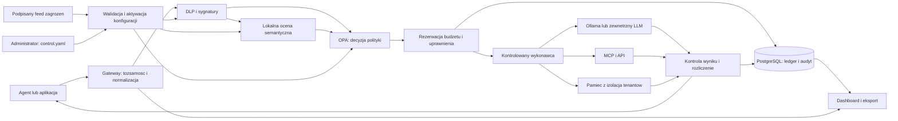

# Plan rozwiązania AI Control Layer

> Archiwalna propozycja z 3 października 2026. Aktualne polecenia instalacji i działanie produktu opisuje [README](../../../README.md).


Data opracowania: 3 października 2026. Nazwa robocza produktu: **ActionGate**.

Zbudować warstwę egzekwowania zasad pomiędzy aplikacją lub agentem a modelami, narzędziami MCP, API i pamięcią. Każde wywołanie ma otrzymać sprawdzalną decyzję, rezerwację zasobów i zapis audytowy. Połączyć szybkie kontrole deterministyczne z rzeczywistą analizą semantyczną, zapewniając lokalne uruchomienie, dashboard, aktualizację polityk i feedów bez restartu oraz wykonywalny zestaw testów.

Wyróżnikiem będzie przeniesienie mechanizmu preautoryzacji płatności na działania agentów: **sprawdź uprawnienia, zarezerwuj limit, dopuść dokładnie określoną operację, rozlicz wynik**. Bezpieczeństwo działania nie będzie zależeć wyłącznie od rozpoznania podejrzanego tekstu przez model.

To plan implementacji, a nie opis gotowego systemu. Wskazane poniżej moduły, komendy projektu i wyniki pomiarów są do przygotowania. Zakres obejmuje pełne wymagania zadania; kolejność prac wynika z zależności, a nie z założonego czasu lub liczby wykonawców.

## 1. Podstawa planu i rozbieżności materiałów

Przeczytane wejścia:

- [TASK.json](TASK.json), [MATERIALS.md](MATERIALS.md), manifest i opis zadania w `materials`.
- [Szczegółowy brief](materials/786a9bb4a858f98d.pdf.txt), w szczególności rozdziały 2-8.
- [Regulamin](materials/31a3fb1537ac1d02.pdf.txt), w szczególności punkty 5, 11 i 13.
- [Lokalny SERVICES.md](SERVICES.md), opis integracji i zarządzania sekretami.

Wspólny katalog jest zaktualizowany 3 października 2026. Odczytany raport gotowości ma datę `2026-10-03T09:54:53.603995+00:00`: dla Groq i Hugging Face potwierdza uwierzytelniony odczyt, lecz **nie potwierdza inferencji**, przepustowości ani dostępu do każdego modelu. Przygotowanie planu nie wymaga pobierania wartości sekretów ani płatnych wywołań.

| Kwestia | Ustalenie i decyzja |
| --- | --- |
| Język | TASK.json wymaga angielskiego; regulamin dopuszcza angielski lub polski. UI, README dla jury, raporty, opis i prezentacja będą po angielsku. Ten plan pozostaje po polsku. |
| Wagi oceny | Guardrails 30%, architektura 20%, reporting 20% w obu dokumentach. Testy i skalowalność: regulamin 20% i 10%, brief 15% i 15%. Plan pokrywa oba warianty. |
| Termin | Regulamin literalnie podaje 11:00 PM 3 października do 11:00 PM 4 października, bez roku i strefy. Potwierdzić termin oraz moment dozwolonego rozpoczęcia na HackTribe przed realizacją harmonogramu, bez samodzielnego poprawiania godzin. |
| Zasoby | Organizator nie zapewnia sprzętu, datasetów ani płatnych API. Zapewnić własne dane testowe i kompletne uruchomienie lokalne. Własne API może rozszerzyć demonstrację. |
| Zgłoszenie | Tytuł, nazwa zespołu, lista 1-6 członków, opis, PDF do 10 slajdów. Repozytorium, demo i pozostałe materiały jako uzupełnienie. Po terminie zamrozić zgłoszoną wersję. |

Nie ma w tym katalogu `proposals` ani `SUMMARIES.md`. Rozwiązanie opiera się na dostarczonym briefie, katalogu usług i dokumentacji źródłowej przywołanej niżej.

## 2. Produkt i scenariusz użytkownika

Deweloper kieruje klienta LLM na adres gateway i używa kontrolowanego endpointu MCP lub adaptera HTTP dla narzędzi. Administrator definiuje zasady w jednym katalogu polityk. Zespół bezpieczeństwa widzi przyczynę decyzji i eksportuje zdarzenia. Kierownik widzi koszty, wykorzystanie limitów, niezawodność i odsetek blokad bez dostępu do surowych poufnych danych.

Agent demonstracyjny przygotowuje raport z syntetycznych dokumentów firmowych. Korzysta z `search_documents`, `read_document`, `memory_get`, `memory_put`, `create_report` i `publish_report`. Ostatnia operacja zapisuje raport do kontrolowanej skrzynki odbiorczej w aplikacji demo. Nie wysyła rzeczywistych wiadomości ani płatności.

Przebieg obejmuje legalny odczyt i utworzenie raportu, redakcję danych osobowych, próbę odczytu dokumentu innego tenanta, instrukcję atakującego ukrytą w wyniku wyszukiwania, zmianę odbiorcy raportu po autoryzacji oraz wyczerpanie budżetu. Jury może dopisać własny prompt, zmienić próg albo feed i obserwować rzeczywistą decyzję oraz stan narzędzia.

## 3. Inspiracja z obsługi płatności

W płatnościach autoryzacja i rezerwacja środków mogą poprzedzać ich ostateczne pobranie. Przenosimy ten podział na przyznawanie uprawnień i rozliczanie pracy AI. Jest to inspiracja architektoniczna, bez integracji z operatorem płatności. Źródło mechanizmu: [Stripe, oddzielna autoryzacja i capture](https://docs.stripe.com/payments/place-a-hold-on-a-payment-method).

| Mechanizm płatniczy | Zastosowanie w ActionGate |
| --- | --- |
| Autoryzacja konkretnej transakcji | Zgoda na narzędzie, zasób, odbiorcę, znormalizowane argumenty i maksymalny koszt. |
| Rezerwacja środków | Atomowa rezerwacja tokenów, kosztu i slotu obliczeniowego przed wywołaniem. |
| Identyfikator operacji | Klucz idempotencji związany z tenantem i hashem żądania; ponowienie nie tworzy drugiego skutku. |
| Rozliczenie | Zamiana rezerwacji na rzeczywiste użycie, osobno koszt modelu i kontroli bezpieczeństwa. |
| Wygasająca autoryzacja | Krótkotrwałe, jednorazowe uprawnienie; zmiana argumentów lub polityki wymaga ponownej kontroli. |
| Niepewny wynik transakcji | Status `outcome_unknown`, zatrzymanie automatycznych powtórzeń i uzgodnienie stanu z wykonawcą. |

Przykład wartości: dokument zawiera polecenie przekazania poufnego raportu obcemu odbiorcy. Nawet jeżeli analiza semantyczna przeoczy atak, uprawnienie do publikacji wewnątrz organizacji nie pozwala zmienić odbiorcy. Próba jest blokowana przed skutkiem ubocznym.

Nie obiecujemy transakcji ACID obejmującej dowolne zewnętrzne API ani cofnięcia wysłanej wiadomości. Gwarancja jednokrotnego skutku wymaga idempotencji po stronie narzędzia. Demo ma takiego wykonawcę; przy pozostałych narzędziach stan niepewny wymaga sprawdzenia. Rezerwacje w bazie korzystają z krótkich transakcji i blokad wierszy, opisanych w [dokumentacji PostgreSQL](https://www.postgresql.org/docs/17/explicit-locking.html).

## 4. Architektura i granice zaufania



Gateway jest punktem egzekwowania. OPA wylicza decyzje; sama odpowiedź OPA nie wykonuje operacji. Wykonawca sprawdza aktualność zgody i dopiero wtedy używa sekretu dostawcy. Kontrola obejmuje również wynik LLM, argumenty narzędzi, odpowiedź MCP i operacje pamięci, zanim te dane trafią do następnego odbiorcy.

Wdrożenie separuje sieć agentów od upstreamów. Agent nie posiada kluczy usług, dostępu do bazy ani bezpośredniej trasy do Ollama, MCP i Internetu. Dopuszczone wyjście odbywa się przez wykonawcę i listę dozwolonych celów. Sam wrapper SDK bez tej izolacji daje integrację, lecz nie gwarantuje ochrony przed obejściem. Lokalna sieć Docker `internal` oraz osobny kontrolowany egress pozwalają ten warunek pokazać w testach.

Zaufane są proces gateway, jego administrator i magazyn kluczy. Prompt, odpowiedź modelu, tool description, dokument, wynik API i dostarczony URL są niezaufane. Tożsamość i tenant pochodzą z uwierzytelnienia, nie z nagłówka dowolnie wpisanego przez agenta ani tekstu promptu. Gdy podagent otrzymuje delegację, zakres może się tylko zawęzić.

## 5. Technologie i dobór integracji

Najpierw uwzględniono wspólny SERVICES.md. Z katalogu wykorzystujemy możliwość lokalnego pobrania modeli przez Hugging Face oraz opcjonalne Groq. Pozostałe komponenty dobieramy do wymagań egzekwowania i samodzielnego uruchomienia.

| Element | Wybór i uzasadnienie |
| --- | --- |
| API i adaptery | Python 3.12, FastAPI, Pydantic, HTTPX. Jeden język dla kontroli, modeli, testów i MCP; walidacja kontraktów i asynchroniczne wywołania. Kontener aplikacji budowany z oficjalnego obrazu Python zgodnie z [zaleceniami FastAPI](https://fastapi.tiangolo.com/deployment/docker/). |
| Polityki | OPA i Rego jako lokalny proces usługowy. Oddziela reguły od kodu transportu, pozwala testować decyzje i przyjmować wersjonowane pakiety. Lokalny [REST API OPA](https://www.openpolicyagent.org/docs/rest-api) ogranicza zależności od implementacji językowej. |
| Stan, budżety, audyt | PostgreSQL, SQLAlchemy, asyncpg i Alembic. Wspólne transakcje zapewniają spójność wielu procesów; ta sama baza przechowuje historię decyzji i audyt aktywacji. Osobne role i tabele dla danych demo, audytu i ledgeru. |
| DLP | Presidio Analyzer/Anonymizer z własnymi recognizerami dla sekretów, PESEL i IBAN. Gotowe rozpoznawanie encji i redakcja przyspieszają implementację; [Presidio](https://github.com/data-privacy-stack/presidio) nie daje gwarancji wykrycia każdej danej osobowej. Wzorce feedu sprawdza RE2; istniejące recognizery ograniczamy czasem i długością wejścia. |
| Bezpieczne wzorce | `google-re2`: ograniczony, jawny język regex, bez wykonywania kodu. [RE2](https://github.com/google/re2) unika kosztownego backtrackingu; nie wszystkie konstrukcje PCRE są obsługiwane, co walidator musi komunikować. |
| Semantyka bazowa | Lokalny `qwen3:4b` w wydzielonym runtime `ollama-guard`, osobny kontekst reviewera, schemat JSON, brak narzędzi i sieci. Model nie otrzymuje sekretów. [Ollama Structured Outputs](https://docs.ollama.com/capabilities/structured-outputs) zapewnia format, a poprawność oceny wymaga własnej ewaluacji. |
| Agent demo lokalnie | Ten sam model Qwen w oddzielnym runtime `ollama-agent`, obsługującym wywołania wyłącznie przez gateway. Dostępne [tool calling Ollama](https://docs.ollama.com/capabilities/tool-calling) pozwala uniknąć zależności od rozbudowanego frameworka agentowego. |
| Semantyka przyspieszona | Adapter `meta-llama/Llama-Prompt-Guard-2-22M` przez Transformers jako opcja po uzyskaniu dostępu i ewaluacji. [Karta modelu](https://huggingface.co/meta-llama/Llama-Prompt-Guard-2-22M) wskazuje gating, licencję Llama 4 i okno 512 tokenów. Nie jest warunkiem uruchomienia bazowego. |
| Zewnętrzny model | Opcjonalnie Groq `openai/gpt-oss-20b`, REST zgodny z Chat Completions; `openai/gpt-oss-120b` jako jawnie wybrany wariant jakościowy. [Katalog Groq](https://console.groq.com/docs/models) potwierdza identyfikatory. Własny klucz `GROQ_API_KEY` z psst; brak automatycznego przełączania dostawcy. |
| MCP | Oficjalny [Python SDK MCP](https://github.com/modelcontextprotocol/python-sdk), przypięty do przetestowanej wersji. Proxy jako serwer dla agenta i klient względem zaufanych konfiguracji upstream; Streamable HTTP, opcjonalny most stdio. |
| Dashboard | React, TypeScript, Vite, Radix UI, TanStack Query/Table i Recharts. Gotowe [prymitywy dostępności Radix](https://www.radix-ui.com/primitives/docs/overview/introduction) oraz [stan tabel TanStack](https://tanstack.com/table/latest/docs/overview) skracają budowę filtrów i szczegółów decyzji. Aktualizacje przez SSE z odtworzeniem po reconnect. |
| Telemetria | OpenTelemetry dla śladów i pomiarów, `prometheus-client` dla `/metrics`. [Python OTel](https://opentelemetry.io/docs/languages/python/) umożliwia rozdzielenie czasu gateway, kontroli i upstreamu. Audyt bezpieczeństwa zapisujemy niezależnie od próbkowania trace'ów. |
| Testy | pytest, pytest-asyncio, HTTPX/respx, Hypothesis, Playwright i Locust. Testy kontraktu, stanu, przeglądarki, awarii oraz narzutu wydajności. |
| Pakowanie | Docker Compose, `uv.lock`, lockfile npm, przypięte digesty obrazów i modeli. Gotowe profile lokalny i online, jedna instrukcja startu dla jury. |

Wybór lokalnego Qwen usuwa konieczność przekazywania analizowanego promptu zewnętrznemu detektorowi. Jest to kandydat do sprawdzenia, nie potwierdzony najlepszy model bezpieczeństwa. Qwen3-4B ma publiczną [kartę modelu i licencję Apache 2.0](https://huggingface.co/Qwen/Qwen3-4B). Prompt Guard można włączyć dopiero po ustaleniu progów na naszym korpusie; wyniki producenta na innym sprzęcie nie są naszym benchmarkiem. ProtectAI DeBERTa v2 nie będzie domyślną zależnością, ponieważ jego [karta](https://huggingface.co/protectai/deberta-v3-base-prompt-injection-v2) wskazuje archiwizację i ograniczenie do angielskiego.

Convex był rozważany dla reaktywnego dashboardu, ale lokalny ledger PostgreSQL lepiej łączy offline, audyt i rezerwacje. CopilotKit nie jest potrzebny do kontrolowanego formularza testowego; agent obsługujący własny panel bezpieczeństwa zwiększałby zakres uprawnień. Firecrawl i Serper mogą pomagać podczas researchu, ale runtime nie potrzebuje wyszukiwania Internetu. OpenRouter nie będzie domyślną trasą, ponieważ zmiana hostingu wymagałaby ponownego zatwierdzenia celu przetwarzania i cennika. Audio, obrazy, LiveKit, Transloadit i embeddings nie rozwiązują obowiązkowych punktów tego zadania.

Sprawdzić licencje faktycznie przypiętych zależności i modeli, wygenerować `THIRD_PARTY_NOTICES.md` oraz SBOM. Nie utożsamiać publicznych wag z licencją bezwarunkową. Zachować wymagane atrybucje; nie dołączać cudzych kluczy ani gated wag do paczki dla jury.

## 6. Przepływ decyzji i zabezpieczenia

### 6.1 Kontrakt wywołania

Każda operacja otrzymuje `tenant_id`, `actor_id`, `agent_id`, `run_id`, `parent_run_id`, `request_id`, `idempotency_key`, cel, narzędzie/model, argumenty, etykiety danych i wersję polityki. Pierwsze identyfikatory nadaje lub weryfikuje backend. Nieznane pola bezpieczeństwa i nieobsługiwane modalności powodują jawną odmowę zamiast przejścia bez kontroli.

Wynik decyzji: `allow`, `redact`, `deny` albo `require_approval`, z kodem przyczyny, `rule_ids`, `policy_version`, `feed_version`, `request_id` i informacją o ograniczeniach. To bezpieczne metadane; szczegółowa diagnostyka jest dostępna tylko właściwej roli. Schemat wyniku semantycznego zawiera ryzyka, ocenę i krótkie uzasadnienie, nie wewnętrzny tok rozumowania.

### 6.2 Kolejność egzekwowania

1. Uwierzytelnienie JWT lub konta usługi, weryfikacja `issuer`, `audience`, czasu ważności i dozwolonego algorytmu. Ograniczenia liczby żądań, długości i głębokości JSON, protokołu oraz typu treści.
2. Przypięcie snapshotu polityki i feedu. Kanonizacja URL, JSON i danych do inspekcji. Zachować mapowanie wykrytych fragmentów na oryginał; gdy nie da się bezpiecznie zredagować obfuskacji, odmówić.
3. Deterministyczna kontrola modelu, zasobu, tenanta, celu sieciowego, delegacji, podpisu narzędzia i wzorców PII/sekretów. Jasna odmowa nie uruchamia kosztownego modelu.
4. Wstępna rezerwacja limitu pracy reviewera. Analiza semantyczna niezaufanych tekstów, wyników narzędzi i kontekstu działania. Również reviewer podlega limitom czasu, tokenów i współbieżności.
5. OPA łączy sygnały i reguły. Semantyczne `benign` nie może uchylić zakazu dostępu, limitu kosztu ani dozwolonego odbiorcy. Wysoki wynik ryzyka może spowodować odmowę mimo braku wzorca deterministycznego.
6. Redakcja zmienia tylko dopuszczone pola danych. Zmiana odbiorcy, kwoty, ścieżki lub innego pola decydującego o skutku powoduje nową autoryzację, a nie cichą podmianę operacji. Ponownie zwalidować schemat i pozostałe kontrole.
7. Dla dozwolonej operacji atomowo zarezerwować limity wykonania i obowiązkowej kontroli wyjścia. Dla operacji wymagającej zgody pokazać dokładny efekt i argumenty uwierzytelnionemu człowiekowi z prawem `approve` dla danego tenanta i narzędzia. Token agenta ani podagenta nie posiada tego prawa. Zgoda nie uchyla ACL, zakazu odbiorcy, budżetu ani aktualnej polityki. Oczekiwanie na zgodę nie blokuje długiej transakcji w bazie; rezerwacja wykonania powstaje dopiero przed wykonaniem.
8. Wykonawca sprawdza jednorazowy identyfikator zgody, hash argumentów i schematu narzędzia, odbiorcę, wygasanie, zakres, rewizję intencji oraz najnowszy numer unieważnień. Przed skutkiem ponownie ocenia aktualną politykę. Jedna krótka transakcja weryfikuje aktywną rewizję, zużywa zgodę i oznacza operację `executing`. Dopiero wtedy wykonawca używa sekretu upstreamu. Identyfikator zgody jest losowym nieprzewidywalnym odnośnikiem do rekordu w bazie, bez projektowania własnego tokenu kryptograficznego.
9. Sprawdzić wynik pod kątem PII, sekretów, instrukcji i etykiet poufności. Rozliczyć użycie także wtedy, gdy wynik trzeba zablokować. Zapisać zdarzenie i dopiero potem udostępnić dopuszczoną treść.

### 6.3 Kontrole deterministyczne

- Wzorce kluczy API, bloków klucza prywatnego, syntetycznych sekretów testowych, adresów email i numerów identyfikacyjnych. PESEL/IBAN z walidacją sumy kontrolnej, a nie tylko długości. Presidio może dołożyć NER, ale odrębne reguły deterministyczne pozostają rzeczywiście bez AI.
- RBAC i atrybuty zasobu: tenant, właściciel, klasyfikacja, cel, rodzaj operacji. Role `developer`, `security_analyst`, `policy_admin`; prawo do edycji polityki nie pochodzi z uprawnień agenta.
- Lista dozwolonych modeli, narzędzi, metod API, hostów i ścieżek. Blokada SSRF do metadanych chmurowych, loopback i prywatnych adresów poza konkretnymi usługami wewnętrznymi; ponowna kontrola DNS i redirectów przez kontrolowany egress.
- JSON Schema dla argumentów; parametryzowane zapytania; brak dowolnego shella, `eval`, SQL i deserializacji obiektów dostarczonych przez model. Ewentualny kalkulator używa parsera dopuszczonych działań liczbowych.
- Limity kroków, czasu sesji, wielkości kontekstu, współbieżności, rozmiaru odpowiedzi i głębokości delegacji. Powtarzane hashe narzędzia z tymi samymi argumentami zatrzymują pętlę według konfigurowalnego progu.

### 6.4 Semantyka i pochodzenie danych

Reviewer analizuje oddzielnie polecenie użytkownika, dane zewnętrzne i proponowany efekt. Ocenia zmianę celu, pośrednią instrukcję, próbę ujawnienia informacji i wymuszenie użycia narzędzia. Jego wynik jest niezaufanym sygnałem sprawdzanym przez Pydantic, z limitem wartości i uzasadnienia. Nie ma narzędzi ani uprawnienia do publikacji czy modyfikacji zasad. Atak na sam reviewer jest osobną kategorią testów. Wewnętrzny adapter reviewera zachowuje uwierzytelnienie, kontrole deterministyczne, limity i audyt, ale nie uruchamia kolejnego semantycznego review własnego wywołania. Dostęp do tej ścieżki ma wyłącznie kontroler; pole ani nagłówek klienta nie może włączyć tego wyjątku.

Zastosować etykiety `public`, `internal`, `confidential`, `untrusted_external` i zachować źródła dokumentów. Wynik modelu konserwatywnie dziedziczy sumę etykiet wejść widzianych w danej operacji. Nie deklarować odtworzenia wpływu każdego tokenu. Redakcja nie usuwa automatycznie etykiety poufności; jej obniżenie wymaga jawnej reguły i uprawnionego procesu.

Pamięć ma ACL przy odczycie i zapisie, tenant oraz właściciela wpisu, etykiety źródła i czas życia. Agent nie może zapisać treści dokumentu jako nowej nadrzędnej instrukcji ani przenieść historii do obcego tenanta. Brak filtra w UI nie ma wpływu na te ograniczenia.

Progi semantyczne są parametrami do kalibracji, nie prawdopodobieństwem bezpieczeństwa. Długie wejścia dzielić w granicach kontekstu modelu z nakładaniem fragmentów i zachowaniem instrukcji użytkownika. Nie ucinać końca bez kontroli. Nieobsługiwany język lub przekroczony limit analizy daje jawny brak pokrycia i odmowę albo skierowanie do zatwierdzenia według profilu.

### 6.5 MCP, LLM i strumieniowanie

Proxy MCP filtruje `tools/list`, kontroluje `tools/call`, `resources/read` i treści promptów. Zapamiętuje hash opisów i schematów narzędzi. Zmiana definicji wymaga ponownego zatwierdzenia rejestru. Token klienta nie jest przekazywany dowolnemu upstreamowi. Nieobsługiwane żądania serwera, w tym sampling/elicitation bez odpowiedniego adaptera, są jawnie odrzucane.

Adapter LLM ma wspólny kontrakt wewnętrzny i przetestowane adaptery Ollama oraz Groq Chat Completions. Nie deklarować kompatybilności ze wszystkimi API. Model wybiera narzędzie, ale jego wykonanie jest kolejną osobną operacją przez gateway. Wyłączyć funkcje wykonywane u dostawcy poza kontrolowaną ścieżką, np. wbudowany interpreter lub wyszukiwanie, jeśli nie ma dla nich adaptera egzekwowania.

We wszystkich dostarczonych profilach, również domyślnym `balanced`, buforować cały wynik do określonego limitu przed wydaniem treści. SSE może wcześniej pokazywać etapy i metadane, lecz nie niesprawdzone tokeny. Narzędzie nie zostaje wykonane na podstawie niepełnego streamu argumentów. Zapewnia to testowalną ochronę sekretu rozbitego na fragmenty kosztem czasu do pierwszej treści. W telemetryce oddzielić ten czas od czasu do pierwszego zdarzenia.

## 7. Budżety i zachowanie przy awariach

Budżety przypisujemy do organizacji, użytkownika i uruchomienia, oddzielnie dla generowania, narzędzi oraz ochrony. Minimalna zasada księgowa: `spent + reserved + requested_reservation <= limit` dla każdego stosowanego limitu. Kwoty w całkowitych mikro-USD z zaokrągleniem w górę; okna czasu według zegara bazy i jawnej strefy UTC. Rezerwacje rozpoczęte przed zmianą dnia zachowują swoje okno rozliczenia.

Dla zewnętrznego LLM rezerwacja obejmuje tokeny wejścia oraz maksymalną rozliczalną generację, w tym reasoning, jeśli jest płatny, plus znany koszt narzędzi. Adapter musi znać tokenizer lub konserwatywną granicę, semantykę limitu wyjścia i wersję cennika. Brak tych danych wyklucza model z profilu twardego limitu. Retry jest nowym potencjalnym kosztem upstreamu i wymaga rezerwacji; sam identyfikator klienta nie dowodzi idempotencji dostawcy.

Przed wykonaniem upstreamu zarezerwować również maksymalny koszt i czas wymaganej kontroli jego wyjścia na podstawie limitu odpowiedzi. Scheduler gwarantuje dla tej kontroli miejsce w wydzielonej kolejce reviewera w ramach deadline. Niewykorzystaną rezerwację rozliczyć po kontroli. Brak pojemności powoduje odmowę przed generowaniem; błąd już uruchomionej kontroli nadal blokuje wydanie wyniku. Zapobiega to zużyciu całego budżetu przez generowanie bez środków na jego sprawdzenie.

W PostgreSQL blokować odpowiednie wiersze budżetów w stałej kolejności i tworzyć rezerwację w krótkiej transakcji. Nie trzymać blokady podczas inferencji. Po odpowiedzi rozliczyć `usage`, uwolnić niewykorzystaną część i zapisać dowód rozliczenia. Po awarii procesu odtworzyć stan z bazy; rezerwacji `in_flight` nie zwalniać automatycznie tylko dlatego, że skończył się lease.

Timeout po wysłaniu żądania nie oznacza braku naliczenia. Utrzymać konserwatywną rezerwację jako `usage_unknown`, uruchomić uzgodnienie, pokazać niepewność w raporcie. Gwarancja braku przekroczeń dotyczy kosztów z ograniczonym i zweryfikowanym kontraktem dostawcy. Opłaty spoza kontraktu, zmiana cennika oraz użycie klucza poza gateway wymagają oddzielnych limitów konta dostawcy i nie są kontrolowane samym ledgerem.

Lokalny model ma limity tokenów, czasu zajęcia slotu, liczby współbieżnych wywołań, czasu kolejki, pamięci procesu i kroków agenta. Nie traktować go jako zasobu bez kosztu. Bazowa jednostka to `inference_slot_seconds`, jawnie odróżniona od zmierzonych GPU-sekund. Zużycie cgroup i ewentualne metryki GPU są osobnymi obserwacjami. Ollama udostępnia liczniki tokenów i czasy w [odpowiedzi API chat](https://docs.ollama.com/api/chat).

Kontrolowany lokalny worker ma deadline i nadzorowany cykl życia. `ollama-agent` oraz `ollama-guard` mają oddzielne limity i po jednym slocie; zwiększanie liczby slotów oznacza kolejne odizolowane workery. Anulowanie HTTP jest żądaniem przerwania, a nie dowodem zatrzymania obliczeń. Slot zwolnić dopiero po potwierdzeniu końca; po deadline bez potwierdzenia worker wycofać z obsługi i zatrzymać przez nadzorcę, bez przerywania drugiego runtime. Osobny proces nadzorczy ma minimalne prawa; gateway nie otrzymuje gniazda Docker. Limity pamięci i CPU narzuca runtime kontenerów. Współdzielony GPU wymaga osobnego pomiaru konkurencji o pamięć i czas; dwa procesy nie zapewniają fizycznej izolacji GPU.

| Awaria | Zachowanie |
| --- | --- |
| OPA lub brak aktywnej polityki | Odmowa nowych operacji, bez automatycznego allow. |
| Baza budżetu/audytu | Brak nowych wykonanych operacji; zwrócić błąd dostępności i metrykę. Wyniki operacji już rozpoczętych trafiają do ograniczonego, zaszyfrowanego dziennika awaryjnego do uzgodnienia. |
| Reviewer: timeout, błąd JSON, brak modelu | `guard_unavailable`, blokada tam, gdzie analiza jest wymagana; jawny profil obserwacyjny może dopuścić tylko wskazane bezpieczne operacje. |
| Zewnętrzny API: 429/5xx | Ograniczone retry z backoff i kontrolą budżetu. Nie przełączać na niezatwierdzonego dostawcę. |
| Błędny lub niedostępny feed | Zachować ostatni poprawny snapshot, pokazać wiek; po jego wygaśnięciu blokować operacje wymagające aktualnych sygnatur. |
| Zerwanie streamu/timeout narzędzia | Anulowanie, status niepewny, brak automatycznej ponownej publikacji; sprawdzenie wyniku po identyfikatorze. |

## 8. Centralna konfiguracja i aktualizacja na żywo

Jednym źródłem zasad organizacji jest katalog `policy/` z `control.yaml`, schematem i rejestrem zatwierdzonych narzędzi. Panel edytuje wersję roboczą tego samego źródła; nie ma niezależnego zestawu reguł w przeglądarce. Sekrety i adresy infrastruktury są poza polityką. Zewnętrzny feed jest wersjonowanym wejściem do snapshotu, a nie drugim miejscem nadawania uprawnień.

Przykład docelowego `control.yaml`. Wartości liczbowe są ustawieniami demonstracyjnymi do walidacji, nie wymaganiami organizatora ani zmierzonymi progami jakości.

```yaml
schema_version: 1
policy_id: actiongate-demo
revision: 1
active_profile: balanced
profiles:
  strict:
    pii_action: deny
    semantic_review_threshold: 0.40
    semantic_block_threshold: 0.70
  balanced:
    pii_action: redact
    semantic_review_threshold: 0.65
    semantic_block_threshold: 0.90
  observe:
    pii_action: redact
    semantic_mode: report_only
    restrict_to: [public_read_only]
models:
  agent_default: local_qwen
  semantic_reviewer: local_qwen
  allowed:
    local_qwen: {provider: ollama, model: "qwen3:4b"}
    groq_small:
      provider: groq
      model: "openai/gpt-oss-20b"
      enabled: false
      pricing_ref: groq-gpt-oss-20b-reviewed
controls:
  pii: {enabled: true}
  secrets: {enabled: true, action: deny}
  semantic: {enabled: true, failure_action: deny}
  provenance: {enabled: true, confidential_external: deny}
  historical_attacks: {enabled: true, failure_action: deny}
tools:
  default_action: deny
  registry: tool-registry.json
  require_approval: [publish_report]
budgets:
  organization_daily_usd: "5.00"
  run_usd: "0.20"
  run_tokens: 12000
  request_input_tokens: 4096
  request_output_tokens: 1024
  run_max_steps: 8
  delegation_max_depth: 2
  repeated_tool_call_limit: 3
local_resources:
  agent_slots: 1
  guard_slots: 1
  run_slot_seconds: 180
  request_deadline_seconds: 45
  guard_deadline_seconds: 30
  queue_wait_seconds: 10
transport:
  max_request_bytes: 262144
  max_response_bytes: 65536
  output_release: after_full_inspection
feed:
  source_ref: approved-threat-feed
  signature_required: true
  max_age_hours: 24
audit:
  raw_payloads: false
  retention_days: 7
```

Każde pole musi mieć opis, zakres, wartość domyślną i test. `review_threshold` kieruje do jawnej decyzji człowieka, `block_threshold` blokuje; redakcja PII ma oddzielny mechanizm. Progi działają na skali konkretnego modelu i nie mogą zostać przeniesione do innego modelu bez kalibracji. Profil `observe` nie wyłącza uwierzytelnienia, izolacji tenantów, budżetów ani zasad wykonania narzędzi.

Przepływ zmiany: odczyt lub edycja pliku, walidacja schematu, kompilacja Rego i wzorców, testy kontraktu, podgląd różnicy decyzji, podpisanie i atomowa aktywacja pełnego snapshotu. OPA obsługuje [podpisane snapshot bundles](https://www.openpolicyagent.org/docs/management-bundles); nie używać delta bundles do tej ścieżki, ponieważ nie mają tych samych możliwości podpisywania i utrwalenia. Klucz publikujący pakiety jest oddzielony od procesu podejmującego decyzje.

Panel pokazuje aktywne wersje polityki, feedu i modelu reviewera. Nieprawidłowa wersja nie zastępuje ostatniej poprawnej. Zmiana pliku oraz dodanie/usunięcie opcjonalnej kontroli mają zmieniać działanie w widoczny sposób. Dla wielu replik aktywacja wymaga potwierdzenia snapshotu; replika ze starą wersją nie obsługuje nowych działań. Operacja oczekująca na zgodę przechodzi kontrolę ponownie. Cel projektowy to aktywacja poprawnej zmiany w ciągu 2 sekund w lokalnym demo, do zmierzenia.

Atomowość obejmuje OPA, skanery i parametry reviewera. Publisher nadaje generację `G`, umieszcza jej dane i reguły Rego w wersjonowanej przestrzeni OPA oraz przygotowuje niezmienny zestaw lokalnych skanerów. Dopiero po potwierdzeniu wszystkich komponentów przełącza aktywny wskaźnik `G`. Żądanie odpytuje konkretną generację, a odpowiedź musi ją potwierdzić. Poprzednie generacje pozostają w pełnym podpisanym pakiecie i pamięci skanerów do zakończenia odwołujących się do nich analiz. Rozbieżność oznacza odmowę lub ponowienie całej analizy, bez łączenia starych i nowych wyników. Kontrola przed wykonaniem używa aktualnej generacji; zmiana może wymagać ponownego skanowania. Sam mechanizm hot reload OPA nie zastępuje tego protokołu.

## 9. Historyczne ataki i zewnętrzny feed

Oprócz ruchu LLM/MCP potrzebny jest punkt kontroli importu modeli i danych. Endpoint `artifact-admission` oraz proces przygotowania modeli sprawdzają źródło, niezmienny revision/digest, hash wag i konfiguracji, format, wersję loadera i listę dozwolonych pól. Model dopuszczony do runtime jest montowany tylko do odczytu. Proces inferencji nie pobiera samodzielnie kodu z dowolnego repozytorium.

| Historyczny przypadek | Mechanizm ochrony i bezpieczna regresja |
| --- | --- |
| CVE-2024-5998, niezaufana deserializacja pickle w integracji FAISS LangChain. [Poprawka producenta](https://github.com/langchain-ai/langchain/commit/77209f315efd13442ec51c67719ba37dfaa44511), [advisory](https://github.com/advisories/GHSA-f2jm-rw3h-6phg). | Odrzucać niezaufany pickle i żądanie niebezpiecznej deserializacji przed loaderem. Fixture zawiera nieszkodliwe dane, także pod zmienionym rozszerzeniem; spy potwierdza zero wywołań loadera. Dozwolony JSON przechodzi. |
| CVE-2023-29374, wykonywanie kodu wygenerowanego w LLMMathChain. [Zmiana producenta](https://github.com/langchain-ai/langchain/pull/1119), [advisory](https://github.com/advisories/GHSA-fprp-p869-w6q2). | Typowany kalkulator z ograniczonym AST. Żądanie `python.exec` i import w wyrażeniu blokowane przed wykonaniem. `2*(3+4)` daje 14, a zwykła rozmowa o funkcji `exec` pozostaje dozwolona. |
| CVE-2026-4372, niebezpieczne referencje w konfiguracji Transformers. [Poprawka producenta](https://github.com/huggingface/transformers/commit/a7f8e7ff37d87d1a1a0c8cf607971c607741452f), [advisory](https://github.com/advisories/GHSA-29pf-2h5f-8g72). | Aktualny załatany loader, przypięte źródło oraz kontrola pól konfiguracji, m.in. `_attn_implementation_internal`. Statyczny JSON z niezatwierdzoną referencją jest odrzucany bez pobrania kodu i bez `from_pretrained`. |
| Rzeczywisty incydent PyTorch nightly/torchtriton, grudzień 2022. [Raport PyTorch](https://pytorch.org/blog/compromised-nightly-dependency/). | Przypięte źródła pakietów i hashe, kontrola artefaktów przed instalacją. Test używa wyłącznie wskaźnika z manifestu, bez pobierania złośliwego pliku. Pokazuje granicę między kontrolą ruchu a ochroną procesu budowania. |

Feed zawiera dane: `schema_version`, `feed_id`, monotoniczne `revision`, `issued_at`, `expires_at` oraz reguły z `id`, `rule_version`, `scope`, `selector`, `operator`, `value`, `action`, `severity` i `source_urls`. Operatory ograniczyć do sprawdzenia obecności, równości, listy, hasha i RE2. Brak kodu Python, importów i dowolnych wywołań sieci. URL źródła w regule jest opisem dowodu, nie poleceniem pobrania strony.

Osobny publisher dostarcza podpisany pełny snapshot reguł z przypiętym kluczem weryfikującym. Importer sprawdza podpis, daty i numer rewizji, a następnie schema, unikalność ID, duplikaty kluczy JSON, limity rozmiaru/głębokości i poprawność wzorców. Publisher polityki łączy zaakceptowaną wersję z konfiguracją organizacji. Ten sam snapshot ma zasilać OPA i lokalne skanery. Feed nie może nadać nowych uprawnień, zmienić klucza zaufania ani zwiększyć budżetu.

Demo ma oddzielny lokalny serwer feedu i klucz testowy. Jury edytuje regułę, uruchamia polecenie publikacji nowej wersji i widzi zmianę decyzji bez restartu. Usunięcie sygnatury jest nową podpisaną rewizją; nie akceptujemy cofnięcia do starego pakietu. Produkcyjny publisher działa oddzielnie od gateway, z rotacją kluczy, audytem i kontrolą dostępu.

Test regresyjny dowodzi blokady określonej operacji w kontrolowanej ścieżce. Nie dowodzi odporności całego środowiska na wszystkie warianty RCE. Gateway nie naprawia instalacji wykonanej poza nim. Bezpieczniejszy format wag nie usuwa ryzyka błędów loadera ani backdoorów; [Hugging Face opisuje ograniczenia skanowania pickle](https://huggingface.co/docs/hub/security-pickle).

Model zagrożeń i macierz pokrycia uwzględniają również przejęcie celu, nadużycie tożsamości, zatrucie pamięci, niebezpieczne użycie narzędzi, eskalację delegacji oraz nieograniczone zużycie. Punktem odniesienia są [OWASP Agentic Applications](https://genai.owasp.org/2025/12/09/owasp-genai-security-project-releases-top-10-risks-and-mitigations-for-agentic-ai-security/) i [OWASP MCP Top 10](https://owasp.org/projects/mcp-top-10). Jest to mapowanie kontroli, a nie certyfikacja OWASP.

## 10. Dashboard, raportowanie i model danych

Panel ma pięć widoków, wszystkie oparte na rzeczywistych zdarzeniach:

1. **Overview**: aktywne/wyłączone/niedostępne kontrole, świeżość feedu, liczby decyzji, trend naruszeń, wykorzystanie budżetu, rezerwacje nierozliczone, p50/p95 opóźnienia. Bez arbitralnego wskaźnika typu „99% safe”.
2. **Live decisions**: oś przebiegu od tożsamości przez kontrolę i rezerwację do narzędzia oraz wyniku; reguły, bezpieczne uzasadnienie, wersje i dokładna przyczyna odmowy. Filtry tenanta, kategorii, agenta i `run_id`. Osoba z prawem `approve` widzi oczekujące operacje z dokładnymi argumentami i może zatwierdzić lub odrzucić wskazaną rewizję.
3. **Policies and feeds**: edycja robocza, diff, walidacja, aktywacja, stan replik, historia i ponowna publikacja wcześniejszych treści jako nowej rewizji. Zmiany dostępne tylko administratorowi.
4. **Budgets**: spent/reserved/available, tokeny, praca lokalna i praca reviewera osobno, przekroczenia, nierozliczone operacje, aktywne limity i data cennika.
5. **Test lab and evidence**: dowolny prompt, wybór danych scenariusza, uruchomienie stałego zestawu testów w izolowanym tenancie, wyniki i eksport. Przycisk testu nie przyjmuje dowolnej komendy shell.

Security otrzymuje NDJSON z identyfikatorami, decyzją, kategorią, kontrolą, modelem, wersjami, czasami i kosztami. Management otrzymuje CSV i widok do wydruku z agregatami, trendami oraz ograniczeniami danych. Eksport CSV neutralizuje formuły; panel renderuje payloady jako tekst, z CSP i bez wykonywania HTML/Markdown z narzędzia. Konkretny wynik testu ma prowadzić do zdarzenia i do stanu narzędzia, nie tylko do koloru w tabeli.

Surowe prompty, wyniki i nagłówki autoryzacji nie trafiają domyślnie do logów, trace'ów ani eksportu. Przechowywać typ wykrytej encji, bezpiecznie zredagowany fragment oraz HMAC korelacyjny zamiast zwykłego hasha krótkich danych osobowych. Dostęp do audytu filtrowany serwerowo. Retencja konfigurowalna; dane testowe syntetyczne. Klucz HMAC jest oddzielony od kluczy dostawców.

Tabele: `principals`, `runs`, `operations`, `approvals`, `budget_accounts`, `reservations`, `usage_events`, `policy_versions`, `feed_versions`, `tool_registry`, `audit_events`, `memory_records`, `artifact_manifests`, `test_runs`. Wszystkie rekordy użytkowe mają tenant oraz niezmienne identyfikatory operacji. Ledger ma unikalność klucza idempotencji, a approval wiąże użytkownika, intencję, hash schematu narzędzia, argumentów i rezerwację.

Audyt zapisuje również odmowy, zmiany zasad i błędy kontroli. Łańcuch hashy i podpisany eksport mogą wykrywać zmiany względem zachowanego checkpointu. Administrator tej samej bazy może przepisać niezakotwiczony łańcuch, dlatego nie nazywać go niezmiennym. Wdrożenie organizacyjne eksportuje checkpointy do osobnego magazynu z retencją; dostarczenie eksportu pozostaje niezależne od krytycznej ścieżki.

## 11. Testy i mierzalne kryteria odbioru

Zestaw dla jury uruchamia testy kontroli przez działający gateway, a nie wyłącznie funkcje pomocnicze. Każdy przypadek zawiera `case_id`, wymaganie, wejście, oczekiwaną decyzję, stan narzędzia i spodziewane zdarzenie. Każda kontrola ma co najmniej parę allowed/blocked lub allowed/redacted.

| Grupa | Przypadki i dowód poprawności |
| --- | --- |
| Tożsamość i zasoby | Poprawny dostęp; brak/wygaśnięcie tokenu, obcy tenant, podrobiony aktor w promptcie, niedozwolony model, odczyt i zapis cudzej pamięci. Odmowa przed upstreamem. |
| DLP wejścia/wyjścia | Email, PESEL, IBAN i sztuczny sekret w promptcie, odpowiedzi LLM i MCP. Redakcja/block zgodnie z profilem; brak wartości w logach i odebranych danych upstreamu. |
| Semantyka | Bezpośrednie i pośrednie injection, zmiana celu, instrukcja w narzędziu, obfuskacja, angielski/polski, legalne cytowanie ataku. Oddzielnie false positives i false negatives. Dodatkowy test wymusza błędne `benign` reviewera i sprawdza, że ACL oraz związanie odbiorcy nadal blokują skutek. |
| Zgody i delegacja | Poprawna zgoda wykonuje jeden skutek. Podmiana odbiorcy, argumentów, narzędzia, użytkownika, schematu, replay i zaostrzenie polityki blokują wykonanie. Podagent nie poszerza uprawnień. |
| Budżety | Równość z limitem i przekroczenie o najmniejszą jednostkę, 50 równoległych rezerwacji, dwa procesy gateway, retry, zmiana okna, restart, brak usage i timeout po przyjęciu żądania. Stan bazy uzgadnia wszystkie rezerwacje. |
| Zasoby lokalne | Limit tokenów, slotów, kolejki, czasu i kroków; niepotwierdzone anulowanie nie zwalnia slotu. Pętla oraz rekursja zatrzymywane z widocznym powodem. Brak rezerwy na kontrolę wyjścia blokuje upstream, a restart workera agenta nie przerywa reviewera. |
| MCP i egress | Zmiana tool description, nieobsługiwana metoda, SSRF/redirect, nielegalny zasób, próba połączenia z upstreamem poza gateway. Odrzucony ruch nie dociera do wykonawcy. |
| Historyczne ataki | Regresje z rozdziału 9 na statycznych fixture; zero wywołań niebezpiecznego loadera/interpretera po odmowie. Legalne podobne wejścia przechodzą. |
| Feed i konfiguracja | Poprawna aktualizacja/usunięcie reguły, nowy próg, obniżenie budżetu, zła sygnatura, bitflip, stara wersja, wygaśnięcie, duplikaty pól, błędny regex, nadmiar danych i przerwanie aktualizacji. Brak mieszanych wersji w jednej decyzji. |
| Stream i awarie | Sekret podzielony pomiędzy chunki, niedokończony tool call, błąd OPA, bazy, reviewera, dysku i API. Brak częściowego wycieku; jawny stan błędu i brak nieautoryzowanego skutku. |
| UI i audyt | Playwright sprawdza widoczny wynik, korelację z bazą, odseparowanie tenantów, uprawnienia do polityk, eksport, reconnect SSE, XSS i CSV injection. |

Testy stanowe [Hypothesis](https://hypothesis.readthedocs.io/en/latest/stateful.html) generują sekwencje rezerwacja/wykonanie/anulowanie/restart/rozliczenie. Ograniczone fuzzowanie obejmuje parsery, Unicode, limity struktur i wielkość feedu. Równoległość sprawdzać na prawdziwym PostgreSQL, a nie bazie w pamięci.

Warstwy wykonania:

- `unit`: walidacja, polityki OPA, obliczenia i automat stanów. Wyniki modeli oraz upstreamu kontrolowane przez fixtures, aby awarie były powtarzalne.
- `integration`: prawdziwy gateway, OPA, baza, feed i narzędzia lokalne, ze sterowanym upstreamem dla edge cases.
- `semantic-local`: rzeczywisty reviewer Ollama na wersjonowanym zbiorze, osobne dane kalibracyjne i testowe. Niedostępny model oznacza błąd wymaganej części, nie zielony „skip”.
- `e2e-local`: prawdziwy model, agent, odczyt dokumentu, decyzja i stan narzędzia, plus UI. Bez płatnego API po pobraniu zależności i modeli.
- `live-provider`: opcjonalny rzeczywisty Groq, limit testowego wydatku i weryfikacja usage; raport jasno odróżnia go od emulacji faktury.

Przygotować co najmniej 100 własnych przypadków semantycznych, z podziałem na legalne i atakujące oraz osobną oceną języków. Zbiór testowy zamrozić przed strojeniem końcowym; nie poprawiać etykiet pod wynik modelu. Raport zawiera confusion matrix, recall, false-positive rate, niepewność małej próbki, wersję wag/promptu/progów i wszystkie nieudane przypadki. Cele projektowe na tym zbiorze: recall co najmniej 90% i false-positive rate nie więcej niż 5%; nie przedstawiać ich jako gwarancji dla nowych ataków. Jeżeli kandydat ich nie spełnia, porównać dostępny Prompt Guard lub inny lokalny reviewer i ponownie zmierzyć, zachowując wyniki poprzedniego modelu.

Wymagania bezwzględne dla kontroli deterministycznych: zero obejść w przygotowanych testach uprawnień, brak ujawnienia sekretu z fixture, brak przekroczeń ledgeru wskutek wyścigu, odmowa wykonania wszystkich zablokowanych operacji i pełna korelacja zdarzeń. Liczba zablokowanych promptów sama w sobie nie jest dowodem jakości.

Pomiar wydajności porównuje ten sam upstream bez warstwy i z warstwą w odizolowanym środowisku testowym, na tych samych wejściach. Zmierzyć cold/warm, p50/p95/p99, przepustowość, kolejkę, koszt ochrony oraz wpływ długości tekstu. Cele początkowe: narzut ścieżki deterministycznej p95 do 50 ms dla 4 KiB i 20 jednoczesnych klientów; dashboard do 1 s od zapisu zdarzenia. Czas semantyki mierzyć osobno na opisanym CPU/GPU, z deadline zamiast nieudowodnionej obietnicy niskiego opóźnienia. Wyniki zapisać wraz ze sprzętem, liczbą prób i profilem.

## 12. Konfiguracja i uruchomienie

### 12.1 Wymagane zasoby i ustawienia

Docelowy pakiet startuje na Docker Engine/Compose lub Docker Desktop z WSL2. Wstępna konfiguracja referencyjna: 8 wątków CPU, 24 GB RAM i 20 GB wolnego dysku dla dwóch runtime modeli oraz usług pomocniczych. To założenie do sprawdzenia pomiarem, nie gwarantowane minimum. GPU jest opcjonalne dla funkcjonalności; może być potrzebne do krótszej analizy semantycznej. Obrazy, zależności i wagi pobierane podczas przygotowania; późniejsze testy lokalne mają działać bez Internetu.

Domyślnie UI na `http://127.0.0.1:3000`, API na `http://127.0.0.1:8080`, pozostałe porty niepublikowane. Kontenery: `gateway`, `web`, `opa`, `postgres`, `ollama-agent`, `ollama-guard`, `demo-tools`, `feed-server`; oddzielne zadania `prepare`, `publisher`, `tests`. Opcjonalny profil online dodaje kontrolowane wyjście do Groq. Wystawienie poza localhost wymaga TLS, własnego wystawcy tożsamości i jawnej listy originów.

| Parametr | Przeznaczenie i źródło |
| --- | --- |
| `POLICY_PATH`, `TOOL_REGISTRY_PATH` | `/app/policy/control.yaml` i rejestr narzędzi montowane do odczytu; edycja przez proces publikacji. |
| `DATABASE_URL` | Połączenie roli aplikacyjnej do PostgreSQL; oddzielna rola migracyjna. Hasło pobrane z magazynu sekretów lub wygenerowane wyłącznie dla lokalnego demo. |
| `OPA_URL` | `http://opa:8181`; niewystawione API zarządzania. |
| `OLLAMA_AGENT_URL`, `OLLAMA_GUARD_URL` | `http://ollama-agent:11434` i `http://ollama-guard:11434`; niedostępne bezpośrednio dla aplikacji agenta i przeglądarki. |
| `ARTIFACT_MANIFEST_PATH` | Zatwierdzone digesty modeli, konfiguracji i wersji loaderów. Tag `qwen3:4b` przy pobraniu rozwiązać do zapisanego digestu. |
| `THREAT_FEED_URL`, `FEED_VERIFY_KEY_FILE` | Lokalny feed demo lub zatwierdzony HTTPS; zaufany klucz publiczny poza pobranym pakietem. |
| `BUNDLE_VERIFY_KEY_FILE` | Klucz weryfikacji pakietu organizacyjnego. Klucz podpisujący tylko w publisherze. |
| `JWT_ISSUER`, `JWT_AUDIENCE`, `JWT_JWKS_URL` | Docelowy dostawca tożsamości. W demo lokalny issuer i generowane testowe klucze, bez praw do prawdziwych zasobów. |
| `AUDIT_HMAC_KEY`, `SPOOL_ENCRYPTION_KEY` | Osobne sekrety audytu i dziennika awaryjnego, niewidoczne dla modelu/frontendów. |
| `GROQ_API_KEY` | Istniejący wpis psst, wyłącznie dla opcjonalnego profilu online i wykonawcy dostawcy. |
| `HF_TOKEN_READ_ONLY` | Istniejący wpis psst dla przygotowania wymagających go wag. Gated Prompt Guard wymaga dodatkowo przyznanego dostępu, którego sama obecność tokenu nie potwierdza. |
| `GROQ_BASE_URL` | `https://api.groq.com/openai/v1`; modele i ich dozwolenie pozostają w polityce. |
| `OTEL_EXPORTER_OTLP_ENDPOINT`, `CORS_ORIGINS`, `PUBLIC_BASE_URL` | Opcjonalny collector, jawne originy i adres interfejsu. Bez sekretów w zmiennych `VITE_*`. |

`pricing.json` w wersjonowanym katalogu polityki zawiera walutę, datę, źródło i zasady rozliczania każdego aktywnego modelu. Stan obecny katalogu usług wskazuje dla Groq 20B 0,075/0,30 USD za milion tokenów wejścia/wyjścia, ale przed włączeniem profilu online odświeżyć stawki i sprawdzić semantykę usage. Nie kodować cennika w logice aplikacji. Rejestr narzędzi zawiera endpointy, schemas, hash definicji, dozwolone zasoby i koszt lub limit pracy.

Poniższe komendy są **kontraktem skryptów do dostarczenia w implementacji**. Nie istnieją jeszcze w tym katalogu. Wszystkie mają kończyć się niezerowym kodem przy błędzie, raportować gotowość bez wartości sekretów i działać na odizolowanej przestrzeni demo.

```powershell
# Przygotowanie obrazów, kluczy demo, manifestów, wag i migracji.
pwsh -File .\scripts\bootstrap.ps1 -Profile local

# Start Compose, seed syntetycznych danych, kontrola readiness wszystkich usług.
pwsh -File .\scripts\start.ps1 -Profile local

# Pełny zestaw wymagany dla jury, łącznie z rzeczywistą semantyką lokalną.
pwsh -File .\scripts\verify.ps1 -Suite all-local

# Publikacja edytowanej polityki i podpisanej rewizji feedu przez testowego publishera.
pwsh -File .\scripts\publish-policy.ps1 -Input .\policy\control.yaml
pwsh -File .\scripts\publish-feed.ps1 -Input .\feeds\demo-rules.json

# Opcjonalny model komercyjny. psst wstrzykuje klucz tylko do uruchamianego procesu.
psst GROQ_API_KEY -- pwsh -File .\scripts\start.ps1 -Profile online
psst GROQ_API_KEY -- pwsh -File .\scripts\verify.ps1 -Suite live-provider
```

Skrypt startowy przekazuje nazwane sekrety jedynie odpowiednim kontenerom. Nie zapisuje pełnego środowiska, komendy `docker compose config` z sekretami ani kluczy do repozytorium. `.env.example` dokumentuje nazwy i publiczne wartości. Klucze testowego issuera i publishera powstają lokalnie w ignorowanym katalogu z ograniczonym dostępem; produkcyjne sekrety pochodzą z psst. Paczka dla jury nie zawiera danych z psst ani działającego dostępu do kont autora.

`/health/live` sprawdza proces. `/health/ready` sprawdza migracje, aktywną politykę, akceptowany feed, bazę, rejestr narzędzi i dostępność wymaganego reviewera. Oddzielna kontrolowana próba inferencji podczas przygotowania potwierdza, że model faktycznie odpowiada. Raport health nie zastępuje testu poprawnej decyzji i stanu narzędzia.

### 12.2 Docelowy układ projektu

```text
apps/web/                  dashboard i scenariusz demonstracyjny
services/gateway/          adaptery, kontrole, autoryzacje i wykonawca
services/policy-publisher/ walidacja i podpisywanie snapshotow
services/demo-tools/       MCP, HTTP, pamiec i skrzynka raportow demo
policy/                    control.yaml, schema, Rego, ceny, tool registry
feeds/                     sygnatury, zrodla, fixture i klucze publiczne
models/                    manifesty i instrukcje pobrania, bez sekretow
tests/                     unit, integration, semantic, e2e, failure, load
scripts/                   bootstrap, start, publish, verify, reset-demo
docs/                      threat model, architektura, konfiguracja, runbook
artifacts/                 raporty testow, benchmarki, eksport i PDF zgloszenia
compose.yaml
uv.lock
package-lock.json
THIRD_PARTY_NOTICES.md
```

## 13. Kolejność realizacji i odbiór etapów

| Etap | Praca i zależności | Warunek zakończenia |
| --- | --- | --- |
| 1. Kontrakty i uruchomienie | Model zagrożeń, schemat operacji/polityki, format audytu, Compose, lockfile, zweryfikowane manifesty i syntetyczne dane. | Czyste środowisko uruchamia bazę, gateway, OPA i lokalny model; znane są wersje oraz faktyczny dostęp. |
| 2. Pełne przechwycenie | Adapter LLM, MCP/HTTP, pamięć i egress; tożsamość, ACL, DLP, policy decision. | Legalny przebieg działa, odmowa nie dociera do upstreamu; próba obejścia izolacji jest zablokowana. |
| 3. Transakcje działań | Ledger, jednorazowe zgody, idempotencja, ograniczenia lokalne, stan unknown i uzgadnianie. | Testy konkurencyjności, restartów i podmiany argumentów przechodzą na prawdziwej bazie i narzędziach. |
| 4. Hybrydowa obrona | Reviewer, etykiety pochodzenia, inspekcja wyników, bufory, kalibracja i testy ataku na reviewer. | Rzeczywisty model wpływa na decyzje; raport jakości zawiera także porażki i mierzy koszt kontroli. |
| 5. Konfiguracja i historia ataków | Hot reload, podpisany publisher, artifact-admission i komplet regresji. | Jury może edytować regułę, próg i budżet; błędna lub stara wersja nie zastępuje aktywnej. |
| 6. Raportowanie | Dashboard, filtry, role, eksporty, SSE, korelacja testów i kosztów. | Dane w UI i eksporcie odpowiadają stanowi gateway/bazy i nie zawierają sekretów testowych. |
| 7. Walidacja i przekazanie | all-local, online jeśli włączone, awarie, benchmarki, licencje, README, demo i PDF. | Odtwarzalny start na czystym środowisku, komplet raportów i materiałów angielskich, zamrożony commit. |

Po ustaleniu kontraktów równolegle można budować kontrolki UI, fixtures, adaptery i publisher. Odbiór pozostaje wspólny: wszystkie korzystają z tych samych schematów operacji i wersji polityki. Etapy nie oznaczają rezygnacji z późniejszych punktów.

Skalowanie: stateless gateway poza sesjami negocjowanymi przez konkretny transport, wspólny ledger, lokalna instancja OPA na replikę, osobna pula workerów semantycznych i ograniczona kolejka. Blokady budżetów rozdzielone per tenant; stan zgody i nonce wspólny. Cache może przechowywać wynik analizy identycznej treści z kluczem obejmującym tenant, kontekst, model i wersję kontroli. Nie cache'ować ostatecznej zgody, salda ani autoryzacji zasobu. Przy przeciążeniu odrzucać nadmiar pracy i zachować egzekwowanie.

## 14. Pokrycie wymagań i demonstracja dla jury

| Wymaganie briefu | Artefakt lub dowód |
| --- | --- |
| Działająca warstwa i diagram | Gateway, klient przykładowy, adaptery LLM/MCP/API, diagram w README. |
| Jedno źródło zasad i poziomy restrykcyjności | `control.yaml`, schema, profile strict/balanced/observe, live reload i diff. |
| Deterministyczne oraz AI-based guardrails | OPA, DLP, kontrola zasobów, rzeczywisty lokalny reviewer i raport jego jakości. |
| Budżety komercyjne i lokalne | Ledger, cennik, tokeny, slot-seconds, rezerwacje, reconciliation, testy współbieżności. |
| Historyczne zagrożenia i feed | Podpisane reguły, artifact-admission, wskazane CVE/incydent i bezpieczne regresje. |
| Dashboard i audyt | Widoki zarządcze i security, drill-down, eksport NDJSON/CSV, mierzalne opóźnienia. |
| Pełne self-tests i działania ad hoc | `verify.ps1 -Suite all-local`, formularz własnego promptu, test zmiany zasad/feeda, raporty JUnit/JSON/HTML. |
| Implementowalność i skalowanie | Compose, manifesty, SDK example, izolacja sieci, wymagania środowiska, awarie i opis replikacji. |

Demonstracja powinna pozwolić jury samodzielnie sprawdzić następujący ciąg:

1. Legalny raport powstaje, a audyt pokazuje koszty i dozwolone narzędzia.
2. Dane osobowe podlegają redakcji; przełączenie profilu na strict blokuje tę samą próbkę.
3. Dokument zawiera próbę wyprowadzenia informacji. Widać sygnał semantyczny oraz niezależną odmowę nieuprawnionego odbiorcy.
4. Zatwierdzona operacja ze zmienionymi argumentami nie zostaje wykonana. Zgodna operacja zapisuje dokładnie jeden raport w skrzynce demo.
5. Równoległe wywołania wyczerpują budżet bez wyścigu; lokalna pętla zatrzymuje się na limicie pracy.
6. Jury edytuje feed i próg, publikuje nową wersję, podaje własny prompt oraz uruchamia testy.
7. Eksport audytu wyjaśnia konkretne decyzje i wskazuje aktywne wersje; benchmark pokazuje narzut.

Przygotować przycisk resetujący wyłącznie dedykowany tenant demo, żeby każdy przebieg zaczynał się od znanego stanu. Nagranie awaryjne opisane jako nagranie, a raport wcześniejszy jako wcześniejszy; nie przedstawiać ich jako działania live.

PDF do 10 slajdów: problem; przykład ataku; inspiracja transakcyjna; architektura; polityki i semantyka; budżety lokalne/komercyjne; feed i historyczne przypadki; dashboard/audyt; testy i pomiary; uruchomienie, ograniczenia oraz dalsze zastosowania. Dodać tytuł, zespół, członków i opis wymagany przez platformę.

Gotowość oznacza przejście pełnego zestawu lokalnego, potwierdzoną zmianę zasad bez restartu, faktyczną kontrolę skutków narzędzia, poprawny eksport i odtworzony start z instrukcji. Nie oznacza dowiedzionej odporności na każdy przyszły atak. Pozostałe warunki do sprawdzenia podczas implementacji to sprzęt i opóźnienie reviewera, osiągnięte progi jakości, ewentualny dostęp do Prompt Guard, kontrakt naliczania Groq oraz formalny termin zgłoszenia.
